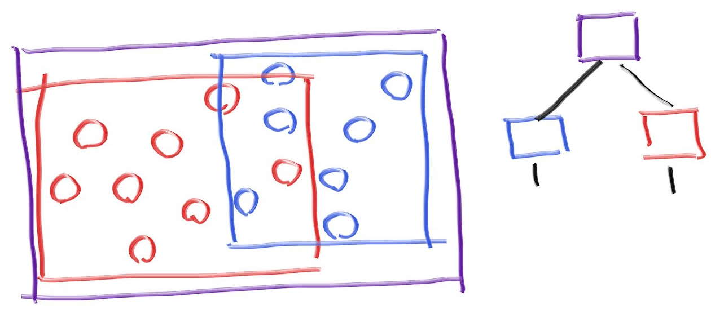
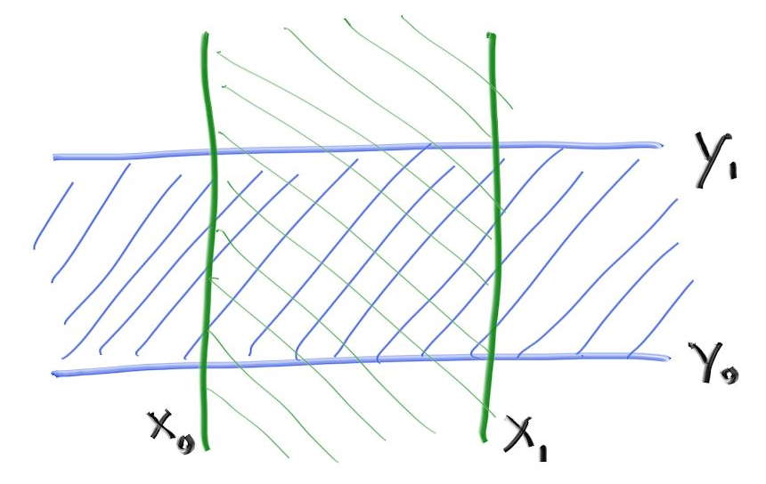
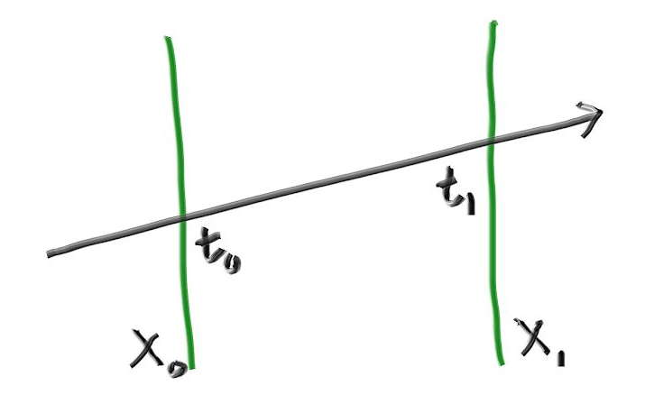
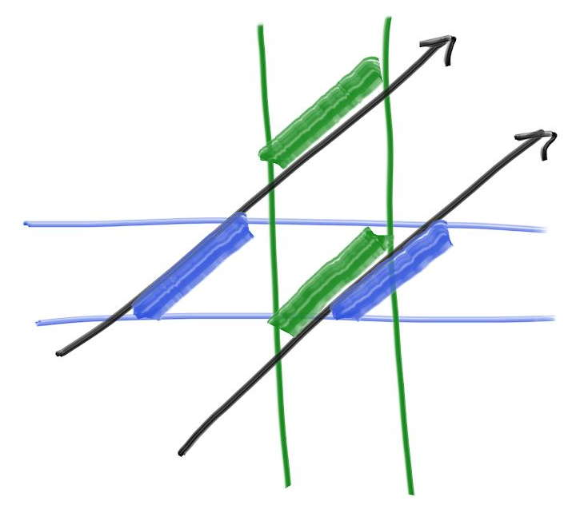

- # 运动模糊
	- ## 空间-时间(SpaceTime)光追简介
		- 在快门打开时的随机事件发送光线
	- ## 定义移动球体
		- 移动球体的初始球心，结束球心，起始时间和结束时间都只是为了算出速度和移动方向
		- 球体本身是**[[$red]]==一直处于线性移动中的==**
	- ## 具体实现思路：
		- 让光线**带有时间属性**
		- 相机新增**快门按下时间和释放时间**，发出的光的时间**随机分布**在此时间段内
		- 可动球体带有额外属性可用于计算速度和移动方向
		- 球体的材质scatter后的光也增添时间属性
		- 根据光线所带的时间不同，小球是否被击的情况将会产生变化
- # 绑定体积层次(Bounding Volume Hierarchies)
	- 计算物体-光线的相交是光追计算的最大**瓶颈**，计算时间随着物体的数量**线性增长**
	- 在搜索相交物体时可以使用二分查找来降低时间消耗，一般有两种选择：
		- 分割**空间**
		- 分割**物体**
	- 后者更为简单，且几乎在任何模型下都能做到足够快
	- ## 核心思想
		- 将物体整合在不同的volume中方便进行二分查找
		- 例如，若一个volume包含10个球体，若光线未击中此volume，那么**一定不会击中**十个球体中的任何一个，若击中，则再**递归计算具体被击中的球体**
		- 一个典型的代码形如：
			- ```c++
			  if (ray hits bounding object)
			      return whether ray hits bounded objects
			  else
			      return false
			  ```
		- 分割的**是物体**，将不同的物体划分到不同的子集中，**任何一个物体都只在一个子集中**，但是这些子集的**体积[[$red]]==可以重合==**
	- ## 绑定体积的层次关系
		- {:height 285, :width 637}
		- 一个集合对于子集内部的子集没有顺序概念，所有的子集仅仅是**在其内部**而已
		- 因此一个典型的代码形如：
			- ```c++
			  if (hits purple)
			      hit0 = hits blue enclosed objects
			      hit1 = hits red enclosed objects
			  if (hit0 or hit1)
			       return true and info of closer hit
			  return false
			  ```
	- ## 轴对齐绑定盒(Axis-Aligned Bounding Boxes, AABBs)
		- 实际上**如何划分**是最重要的，好的划分才能最大化性能优化
		- 在实际操作中，轴对齐盒的效率总是比其他选择更好
			- 但是在对付不常见模型时，可能会使用其他选择
		- 大多数人使用**"slab"**方法来定义AABB，此方法基于一个观察：一个n维的AABB是n个轴对齐的区间(Intervel)的交集，而一个轴对齐区间就叫做**"slab"**
			- {:height 242, :width 374}
			- 上图的二维AABB就是由两个轴对齐区间，$3<x<5$和$1<y<3$的交集构成的
		- 由于光线是一个函数，因此可以得出光线击中两个平面时的解
			- {:height 276, :width 375}
			- 在三位中一个区间可以看作两个平面之间的空间，平面的表达方式为$x=x_0$
			- 可以分别求解出两个解$t_0$和$t_1$
				- $x_0 = A_x + t_0b_x$
				- $t_0 = \frac{x_0-A_x}{b_x}$
				- 同理得$t_1 = \frac{x_1 - A_x}{b_x}$
				- 若$t_0<t_1$，则解为$t\in [t_0,t_1]$
		- 回到二维情况，若一束光线击中一个二维得bounding box，那么表现为**[[$red]]==在两个区间得解上有重合==**
			- {:height 239, :width 261}
			- 上图中，上方的光线未击中，下方的光线集中
		- 对于三维情况，原理仍然相同，解三个维度上的解，查看三个解有无重叠，有重叠则说明hit
	- 在浮点数的运算中，如果除以0会得到无穷，且无穷有正负
		- 需要特殊处理的是当光线的远点处于某个平面之上，此时的计算结果为**`NaN`**
		- 也可以不处理``NaN``情况，因为``NaN``和任何值的任何比较都是false，也就是意味着处在边界上的点被认为未命中
	- ## 分割BVH体积
		- **大多数高效数据结构(包括BVH)，最复杂的部分就是创建**
		- 选择一种在复杂性和性能上折中的方法来构建BVH，分为三步
			- 随机选择一个轴
			- 排序所有的元素(primitive)
			- 将一半的元素分别放入两个子树中
		- 当递归到**只有[[$red]]==两个==元素**时，分别将两个元素放入两个子树并结束递归
		- 当递归到**只有[[$red]]==一个==元素**时，在两个子树中都复制此元素
			- 以此免去空指针检查
	- ## SAH(Surface Area Heuristic)
		- 另一种分割构建BVH的方法，会最小化分割出的子树空间的**表面积**，性能表现更好
- # 实体纹理(Solid Texture)
	- 在图形学中，“纹理”是指一种可以**过程化(Procedural)改变[[$red]]==表面颜色==**的函数
	- 这个过程(procedure)可能是综合的代码，也有可能是一张图像的查找函数，也可以是两者结合
	- ## 计算球体纹理坐标(Texture Coordinates)
		- 由于纹理是一个过程化的函数，因此计算出表面某个点的颜色需要知晓此点在表面的坐标
		- 对于球体来说，一个坐标可以由**[[$red]]==经纬度==**构成，一个经(longitude)纬(lattitude)度包含：
			- $(\theta,\phi)$
			- 其中，$\theta$是从y轴负方向向上的角度，即从-y向上
			- $\phi$是绕y轴旋转的角度，从-x到+z，再到+x，再到-z，再回到-x
		- 需要将$(\theta, \phi)$映射到纹理坐标系$(u,v)$，u和v的范围为$[0,1]$
			- $(u=0, v=0)$表示纹理的左下角
			- 因此可以通过以下方式得到u，v
				- $u = \frac{\phi}{2\pi}$
				- $v =\frac{\theta}{\pi}$
		- 计算某个球心在原点的单位球体上某点的$(\theta,\phi)$，使用以下方式求得：
			- $y = -\cos\theta$
			- $x = -\cos(\phi)\sin(\theta)$
			- $z = \sin(\phi)\sin(\theta)$
		- 通过解反三角函数得到$\theta$和$\phi$的解
			- $\phi = \text{atan2}(z,-x)+\pi$
			- $\theta = \text{acos}(-y)$
		-
		-