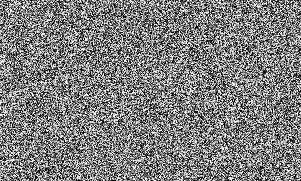
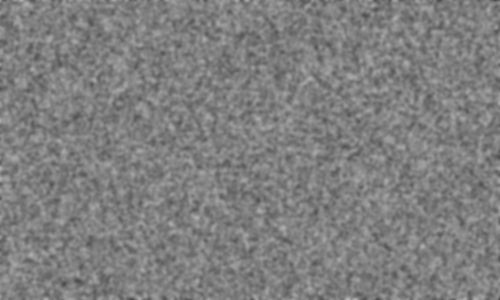
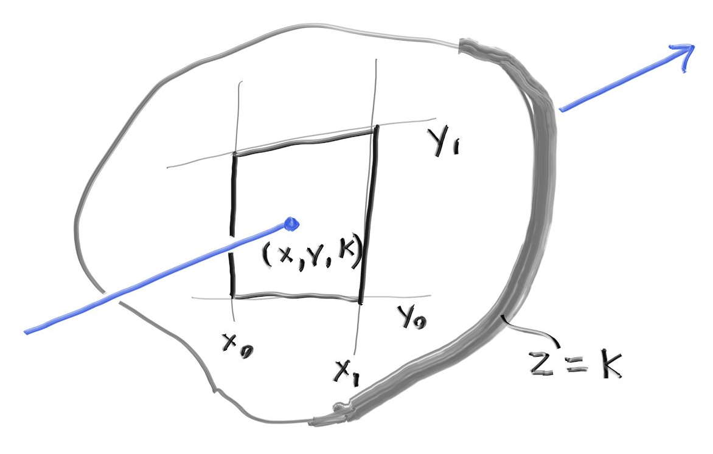
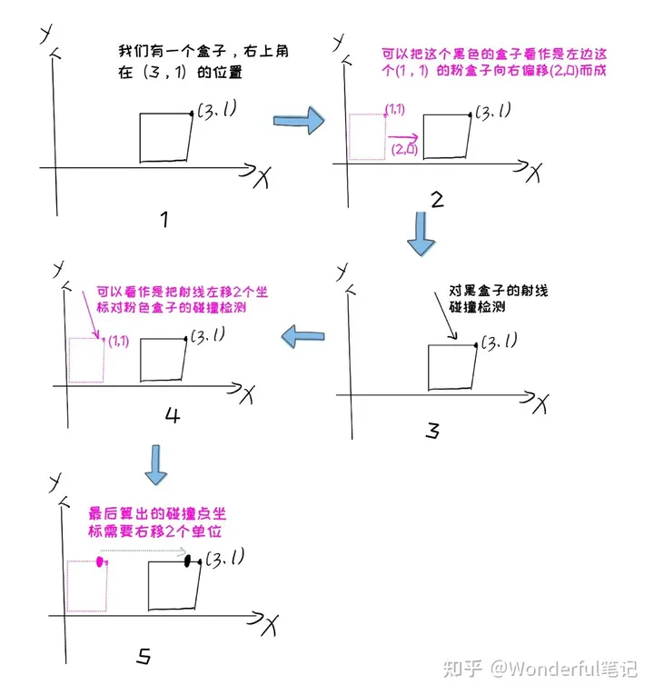
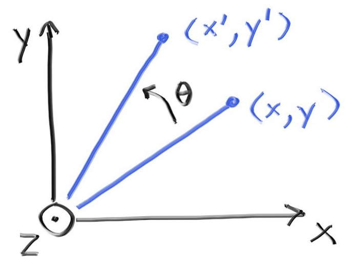
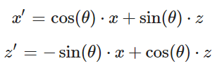
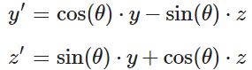

- # 运动模糊
	- ## 空间-时间(SpaceTime)光追简介
		- 在快门打开时的随机事件发送光线
	- ## 定义移动球体
		- 移动球体的初始球心，结束球心，起始时间和结束时间都只是为了算出速度和移动方向
		- 球体本身是**[[$red]]==一直处于线性移动中的==**
	- ## 具体实现思路：
		- 让光线**带有时间属性**
		- 相机新增**快门按下时间和释放时间**，发出的光的时间**随机分布**在此时间段内
		- 可动球体带有额外属性可用于计算速度和移动方向
		- 球体的材质scatter后的光也增添时间属性
		- 根据光线所带的时间不同，小球是否被击的情况将会产生变化
- # 绑定体积层次(Bounding Volume Hierarchies)
	- 计算物体-光线的相交是光追计算的最大**瓶颈**，计算时间随着物体的数量**线性增长**
	- 在搜索相交物体时可以使用二分查找来降低时间消耗，一般有两种选择：
		- 分割**空间**
		- 分割**物体**
	- 后者更为简单，且几乎在任何模型下都能做到足够快
	- ## 核心思想
		- 将物体整合在不同的volume中方便进行二分查找
		- 例如，若一个volume包含10个球体，若光线未击中此volume，那么**一定不会击中**十个球体中的任何一个，若击中，则再**递归计算具体被击中的球体**
		- 一个典型的代码形如：
			- ```c++
			  if (ray hits bounding object)
			      return whether ray hits bounded objects
			  else
			      return false
			  ```
		- 分割的**是物体**，将不同的物体划分到不同的子集中，**任何一个物体都只在一个子集中**，但是这些子集的**体积[[$red]]==可以重合==**
	- ## 绑定体积的层次关系
		- {:height 285, :width 637}
		- 一个集合对于子集内部的子集没有顺序概念，所有的子集仅仅是**在其内部**而已
		- 因此一个典型的代码形如：
			- ```c++
			  if (hits purple)
			      hit0 = hits blue enclosed objects
			      hit1 = hits red enclosed objects
			  if (hit0 or hit1)
			       return true and info of closer hit
			  return false
			  ```
	- ## 轴对齐绑定盒(Axis-Aligned Bounding Boxes, AABBs)
		- 实际上**如何划分**是最重要的，好的划分才能最大化性能优化
		- 在实际操作中，轴对齐盒的效率总是比其他选择更好
			- 但是在对付不常见模型时，可能会使用其他选择
		- 大多数人使用**"slab"**方法来定义AABB，此方法基于一个观察：一个n维的AABB是n个轴对齐的区间(Intervel)的交集，而一个轴对齐区间就叫做**"slab"**
			- {:height 242, :width 374}
			- 上图的二维AABB就是由两个轴对齐区间，$3<x<5$和$1<y<3$的交集构成的
		- 由于光线是一个函数，因此可以得出光线击中两个平面时的解
			- {:height 276, :width 375}
			- 在三位中一个区间可以看作两个平面之间的空间，平面的表达方式为$x=x_0$
			- 可以分别求解出两个解$t_0$和$t_1$
				- $x_0 = A_x + t_0b_x$
				- $t_0 = \frac{x_0-A_x}{b_x}$
				- 同理得$t_1 = \frac{x_1 - A_x}{b_x}$
				- 若$t_0<t_1$，则解为$t\in [t_0,t_1]$
		- 回到二维情况，若一束光线击中一个二维得bounding box，那么表现为**[[$red]]==在两个区间得解上有重合==**
			- {:height 239, :width 261}
			- 上图中，上方的光线未击中，下方的光线集中
		- 对于三维情况，原理仍然相同，解三个维度上的解，查看三个解有无重叠，有重叠则说明hit
	- 在浮点数的运算中，如果除以0会得到无穷，且无穷有正负
		- 需要特殊处理的是当光线的远点处于某个平面之上，此时的计算结果为**`NaN`**
		- 也可以不处理``NaN``情况，因为``NaN``和任何值的任何比较都是false，也就是意味着处在边界上的点被认为未命中
	- ## 分割BVH体积
		- **大多数高效数据结构(包括BVH)，最复杂的部分就是创建**
		- 选择一种在复杂性和性能上折中的方法来构建BVH，分为三步
			- 随机选择一个轴
			- 排序所有的元素(primitive)
			- 将一半的元素分别放入两个子树中
		- 当递归到**只有[[$red]]==两个==元素**时，分别将两个元素放入两个子树并结束递归
		- 当递归到**只有[[$red]]==一个==元素**时，在两个子树中都复制此元素
			- 以此免去空指针检查
	- ## SAH(Surface Area Heuristic)
		- 另一种分割构建BVH的方法，会最小化分割出的子树空间的**表面积**，性能表现更好
- # 实体纹理(Solid Texture)
	- 在图形学中，“纹理”是指一种可以**过程化(Procedural)改变[[$red]]==表面颜色==**的函数
	- 这个过程(procedure)可能是综合的代码，也有可能是一张图像的查找函数，也可以是两者结合
	- ## 计算球体纹理坐标(Texture Coordinates)
		- 由于纹理是一个过程化的函数，因此计算出表面某个点的颜色需要知晓此点在表面的坐标
		- 对于球体来说，一个坐标可以由**[[$red]]==经纬度==**构成，一个经(longitude)纬(lattitude)度包含：
			- $(\theta,\phi)$
			- 其中，$\theta$是从y轴负方向向上的角度，即从-y向上
			- $\phi$是绕y轴旋转的角度，从-x到+z，再到+x，再到-z，再回到-x
		- 需要将$(\theta, \phi)$映射到纹理坐标系$(u,v)$，u和v的范围为$[0,1]$
			- $(u=0, v=0)$表示纹理的左下角
			- 因此可以通过以下方式得到u，v
				- $u = \frac{\phi}{2\pi}$
				- $v =\frac{\theta}{\pi}$
		- 计算某个球心在原点的单位球体上某点的$(\theta,\phi)$，使用以下方式求得：
			- $y = -\cos\theta$
			- $x = -\cos(\phi)\sin(\theta)$
			- $z = \sin(\phi)\sin(\theta)$
		- 通过解反三角函数得到$\theta$和$\phi$的解
			- $\phi = \text{atan2}(-z,x)+\pi$
			- $\theta = \text{acos}(-y)$
- # Perlin 噪声(Noise)
	- 补充： [[Perlin噪声原理]]
	- 由**Ken Perlin**发明
	- 不返回白噪声，而是类似于**模糊化的白噪声**
	- 白噪声看起来类似于：
		- {:height 198, :width 320}
	- 模糊化的白噪声类似于：
		- {:height 230, :width 318}
	- Perlin噪声有两个特点：
		- **可重复(Repeatable)**：给定一个三维点作为输入，产生的结果总是相同的，附近的点产生相似结果
		- **简单高效**
	- 本书的Perlin函数产生算法基于**Andrew Kensler**的算法
	- ## 使用随机数块(block)
		- 详见代码
	- ## 平滑(Smoothing)结果
		- 通过线性插值来平滑结果
	- ## 使用Hermitian方法改进结果
		- 简单的插值平滑导致了一些意料之外的结果，例如**马赫带(Mach Band)**
		- 使用hermite cube来平滑差值
	- ## 调节频率(Frequency)
		- 目前的结果频率较低(低频图案)
		- 通过增加一个新的成员变量，可以方便地调节频率
	- ## 在网格点(Lattice)上使用随机向量
		- 目前的效果仍然给人一种格子的感觉
		- 将随机double数组变为随机(单位)向量数组
	- ## 引入扰动(Turbulence)
		- 多个频率相加得到符合噪声即称为**扰动**
		- 多次噪声运算相加即可
	- ## 调整相位
		- 让颜色与sinie函数值成比例，使用扰动函数调整相位(即**平移x**)
		- 能得到带状条纹起伏波荡，类似于大理石纹理
- # 图像材质映射(Image Texture Mapping)
	- 通过计算表面坐标(u,v)，通过uv作为索引，映射到一张图片上
	- 使用图像的像素坐标非常笨拙，而且每次更改图片材质都需要重新修改代码以适配分辨率
	- 因此在图形学中，更常用的方法是使用图像的**材质坐标(texture coordinate)**
		- 材质坐标是一对double值，对于一张分辨率为$N_x, N_y$的图片来说，计算材质坐标的 方法为：
		- $u=\frac{i}{N_x-1}$
		- $v = \frac{j}{N_y-1}$
	- 使用图像库``stb_image``加载图像
		- 此库将图像加载为无符号char的数组
- # 长方形和光照
	- ## 给ray color函数增添背景颜色
		- 在之前的实现中，现实的底层颜色不是纯黑，其效果类似于整个场景中充斥着光
		- 现在为了凸显光源的效果，背景颜色要调为黑色
	- ## 创建长方型物体
		- 轴对齐长方形更好定义
		- 对于一个轴对称长方形，其可以被**四条线**和**一个平面**所定义
			- {:height 294, :width 468}
			- 上图中的长方形被定义为：
				- 位于**平面**z=k上
				- 由四条直线$x=x_0,x=x_1,y=y_0,y=y_1$围成
		- ### 判断光线是否击中一个长方形
			- **首先判断是否击中长方形所在平面**
				- $P_z(t) = A_z + tb_z = k \Rightarrow t = \frac{k-A_z}{b_z}$
			- **然后判断击中平面的点是否在长方形中**
				- $x = A_x+tb_x \Rightarrow x_0\le x \le x_1$
				- $y = A_y+tb_y \Rightarrow y_0\le y \le y_1$
	- **[[$red]]==注意==**：长方形的bounidng box不能直接是它本身，因为这样会导致长方形的bounding box没有体积，在分割场景时可能会出现问题([[$red]]==**为什么？**==)
	- ## 将物体变为发光物体
		- 将物体变为发光物体只需要将其材质赋予为DiffuseLight材质即可
		- 为了照亮周围物体，其颜色一般要为大于(1,1,1)的白色，因为如果颜色的值过小，经过几次attenuation之后将下降非常快
		- 因此**光照的强度可以通过颜色值的大小来改变**
	- ## 创建Cornell Box
		- 1984年第一次出现，用于展示光照效果
- # 实例
	- 首先实现轴对称盒子
	- 旋转轴对称盒子需要使用**实例(instance)**概念
	- 实例是一种经过旋转和平移的几何**图元(premitive)**
	- ## 平移(Translate)实例
		- 原理很简单，将光线的原点减去平移量，和原对象碰撞检测，如hit，则将碰撞点加上平移量
		- {:height 469, :width 467}
		-
	- ## 旋转实例
		- {:height 240, :width 318}
		- 旋转后的(x',y')可通过如下求得
			- $x' = \cos(\theta)\cdot x - \sin(\theta)\cdot y$
			- $y' = \sin(\theta)\cdot x + \cos(\theta)\cdot y$
		- 同理，照另外两个轴旋转求解公式为：
			- {:height 60, :width 169}
			- {:height 56, :width 158}
		- 如果要顺时针旋转，传入负数的角度即可
	-