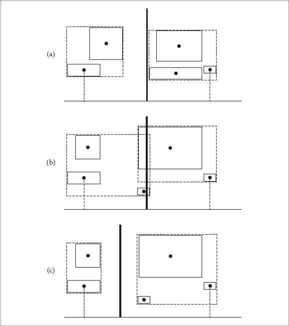
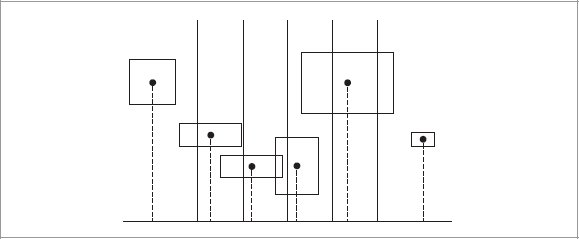
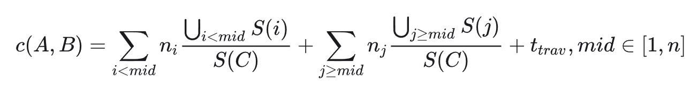

# Why？
	- BVH在构建时有很多方法来分割物体列表，例如最简单的就是按某一轴排序，各取一半递归构建BVH
	- 但是这样的构建方式可能导致一边的物体很稀疏，另一边却很密集，也可能会产生很多重叠，效率不佳
	- SAH就是一种构建BVH时的物体分割方式，能够做到被分割的两部分的总的**表面积**尽可能地小
- # How？
	- 先确定一些术语的含义
		- **图元(Primitive)**：即构成场景的最小元素，可以是球形，三角形，立方体等，也可称objective
	- ## 回顾BVH的构建过程
		- 主要分为**三步**
			- 计算场景中每一个图元的**AABB**和**质心(一般取中心(centroid))**并存储
			- 根据**不同的划分策略**构建树状索引结构
				- 非叶节点持有指向子节点的指针
				- 叶节点持有指向其所包含图元数组第一个元素的指针和所包含图元的个数
			- 将得到的二叉树转化为更加紧凑的表示形式(无指针，内存连续)
		- 不同的划分策略最重要的指标就是尽量减少两个子节点之间的重叠体积
			- 因为重叠体积越大，一条ray穿过重叠区的可能性就越大，需要同时遍历两个子树的可能性就越大，计算消耗就越多
		- 一个简单的划分方法就是：
			- 选取一个跨度最大的dimention，在该dimention上排序之后取中点，中点前后两个部分的物体分别进行递归构建左右子树
			- 这一算法可以参看`assignment6`分支的`before implementing SAH` commit中，`BVH.cpp:30`的内容
		- 但是当图元分布并不均匀时，上述划分方法可能导致大量重叠的情况
			- {:height 425, :width 363}
			- 上图中，a情况使用中点法较为合适，不会产生大量重叠；b情况明显不适合中点分割，会导致重叠，使用c中的分割方式更为合适
	- ## SAH原理
		- 假设当前节点的包围盒中存在$n$个物体，若对每一个物体$i$求交的代价为$t(i)$，那么在不做划分的请款该依次对所有物体进行求交运算的代价为：
			- $\sum\limits_{i=1}^n t(i)$
		- 若将这些物体划分为**2组**，两组物体分别位于其组的包围盒$A,B$中，一束光线击中两个包围盒的概率分别是$p(A),p(B)$。
			- 需要注意由于$A,B$之间可能存在重叠，因此$p(A)+p(B)$**可能大于1**，其和越大，重叠程度越大
			- 则当前节点的**求交成本(cost)**为：
				- $c(A,B) = p(A)\sum\limits_{i\in A}t(i) + p(B) \sum\limits_{j\in B}t(j) + t_{trav}$
				- 其中，$t_{trav}$是遍历树状结构的成本
		- 又因为一般来说，**对所有图元的求交成本是相同的**，可以假设对于任意图元$i$，都有：$t(i)=1$；又可不失一般性地假设，**遍历成本远小于图元求交成本**，因此可假设$t_{trav}=0.125$。假设$A$中有$b$个图元，$B$中有$b$个图元，那么有：
			- $c(A,B) = p(A)a+p(B)b + 0.125$
		- 光线击中包围盒的概率可以根据包围盒的表面积来估计。假设他们的父节点的包围盒为$C$那么$A,B$相对于$C$的表面积的比值即可看作他们被光线击中的概率。假设表面积函数为$S$，那么有：
			- $c(A,B) = \frac{S(A)}{S(C)}a + \frac{S(B)}{S(C)}b + 0.125$
		- **这个公式就是SAH的[[$red]]==核心==**，因为在计算成本时**对于表面积是有感知的**
		- 沿某一个轴将所有的图元分到若干个**桶(Bucket)**中，每个图元被按照中心的坐标被分配到某一个桶中。划分仅出现在桶之间，因此若划分出$n$个桶，则总共会有$n-1$种划分的可能
			- {:height 246, :width 559}
			- 每一个图元所在的桶的索引号为：
				- $i = clamp(int(\frac{t-t_{min}}{t_{max}-t_{min}}n),0,n-1)$
				- $clamp(i,l,r)$函数的作用是返回一个将$i$限定在区间$[l,r]$之间的值
	- ## SAH实现
		- 每一次要划分出多少个桶$n$，这个参数可以被指定，也可以写死在程序中
		- 具体在那条轴上做SAH，可以选择跨度最大的轴，也可以三个轴都做，选取成本最小的方案
		- 遍历$C$中的所有图元，统计每一个同种图元的个数和每一个桶的包围盒(桶之间可能存在重叠)。通过这些信息可以计算每一种划分的代价：
			- {:height 74, :width 568}
		- 如果所有的图元中心位置都相同，一般有两种特殊处理方法：
			- 直接建立一个叶节点，该节点包含所有图元
				- 一般来说这个方案更好，因为无论如何都要把这些挤在一起地图元挨个求交，不如直接放在一起
			- 按数量均等地分给两个子节点
- # games101-assignment6 SAH代码实现
	- ```c++
	  Bounds3 centroidBounds;
	  for (int i = 0; i < objects.size(); ++i)
	      centroidBounds =
	          // Centroid function returns the center point(Vector3f) of a bound
	          // Bounds can be constructed from a Vector3f, in such case, the bound's min and max are both the Vector3f
	          // which means the bound only encloses a point
	          Union(centroidBounds, objects[i]->getBounds().Centroid());
	  // the final centroidBounds is the bound that encloses all the centroids of the objects.
	  
	  // ! SAH
	  
	  // Get the surface area of the whole bounding box
	  auto SC = centroidBounds.SurfaceArea();
	  
	  // each spliting, n buckets are created
	  int n = 12;
	  // min cost and the corresponding spliting dimension
	  auto minCost = std::numeric_limits<float>::max();
	  auto minDim = 0;
	  auto minIndex = 0;
	  
	  // split on each dimension to get the optimal spliting plan
	  for(int dim = 0;dim<3;dim++){
	      sort_objects_by_dim(objects, dim);
	      Bounds3 cost_of_buckets[n];
	      int count_of_buckets[n];
	      for(auto& i : count_of_buckets) i = 0;
	      auto min_t = centroidBounds.pMin[dim];
	      auto max_t = centroidBounds.pMax[dim];
	  
	      // ! CAUTION: can not simply split the scene on objects
	      // ! should assign each object to a bucket, then calculate the cost of each bucket
	      for(auto object : objects){
	          // calculate the index of the bucket that the object belongs to
	          auto t = object->getBounds().Centroid()[dim];
	          int index = (t - min_t) / (max_t - min_t) * n;
	          if(index == n) index--;
	          if(index < 0) index = 0;
	      
	          // update the bounds of the bucket
	          cost_of_buckets[index] = Union(cost_of_buckets[index],object->getBounds());
	          count_of_buckets[index]++;
	      }
	  
	      auto min_cost_now = std::numeric_limits<float>::max();
	      int min_index_now = 0;
	  
	      // ! there is n-1 spliting plans
	      for (int i = 0; i < n-1; ++i){
	          Bounds3 left, right;
	          int count_left = 0, count_right = 0;
	          // ! i is not included in the left part
	          for(int j = 0;j<i;j++){
	              left = Union(left, cost_of_buckets[j]);
	              count_left += count_of_buckets[j];
	          }
	          for(int j = i;j<n;j++){
	              right = Union(right, cost_of_buckets[j]);
	              count_right += count_of_buckets[j];
	          }
	          // calculate the cost of the spliting plan
	          float cost_left = left.SurfaceArea() / SC * count_left;
	          float cost_right = right.SurfaceArea() / SC * count_right;
	          float cost_now = cost_left + cost_right;
	  
	          if(cost_now < min_cost_now){
	              min_cost_now = cost_now;
	              min_index_now = i;
	          }
	      }
	  
	      if (min_cost_now < minCost){
	          // the min_index_now is the index of the bucket that the spliting plan is based on
	          // ! but what we need here is the index of the first object in the right part
	          // ! thus we need to calculate the object id from the min_index_now
	          int objects_id = 0;
	          // ! recall that the min_index_now is not included in the left part
	          for(int i = 0;i<min_index_now;i++) objects_id += count_of_buckets[i];
	          minCost = min_cost_now;
	          minDim = dim;
	          minIndex = objects_id;
	      }
	  }
	  
	  // get the final spliting plan
	  sort_objects_by_dim(objects, minDim);
	  
	  // split the objects into two vectors, each contains half of the objects
	  auto leftshapes = std::vector<Object*>(objects.begin(), objects.begin() + minIndex);
	  auto rightshapes = std::vector<Object*>(objects.begin() + minIndex, objects.end());
	  
	  assert(objects.size() == (leftshapes.size() + rightshapes.size()));
	  
	  // recursively build the left and right nodes of each half
	  node->left = recursiveBuild(leftshapes);
	  node->right = recursiveBuild(rightshapes);
	  
	  node -> bounds = Union(node->left->bounds, node->right->bounds);
	  ```
	- SAH实际上就是BVH构建时的一种划分方法，在objects只有一个和两个图元时，直接使用常规方式。此处只贴出处理三个以上物体的分支，详见assignment6 源码中的``BVH.cpp:91``