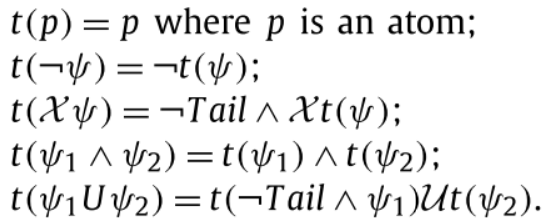

- # 问题：
	- [[$red]]==什么是specification language==
		- 是专门用于描述specification的语言吗？
		- 除了LTL还有哪些specification language
	- [[$red]]==什么是specification debugging==
	- [[$red]]==什么是runtime verification==
- # 基础
	- 一个自然数上的区间$I=[a,b]0\le a\le b$，a，b都是自然数，是一个自然数的集合$\{i\ |\ a\le i\le b\}$
	- 当且仅当$b<+\infin$时，$I$是受约束(bounded)的，否则就是不受约束(unbounded)的
	- MLTL的公式$\varphi$的语法如下：
		- $\phi::=\text{true | false | }p\ |\ \neg \varphi\ |\ \varphi\wedge \psi\ |\ \varphi\vee\psi\ |\ \varphi \ \mathcal{U}_I\ \psi\ |\ \varphi\ \mathcal{R}_I\ \psi$
		- $p\in \mathcal{AP}$
	- ## MLTL的语义
		- 令$\pi$是一个有限trace
		- $\pi[i](i\ge0)$在$2^\mathcal{AP}$上
		- $|\pi|$表示$\pi$的长度
		- $\pi_i(|\pi|>i\ge0)$表示从下标i(包含i)开始的后缀
		- 令$a,b\in \mathbb{I},a\le b$，定义$\pi$ models(satisfies) 一个MLTL公式$\varphi$(记作$\pi\vDash \varphi$)如下：
			- $\pi \vDash p \text{ iff } p\in \pi[0]$
			- $\pi \vDash \neg \varphi \text{ iff }\pi\nvDash \varphi$
			- $\pi \vDash \varphi \wedge \psi\text{ iff }\pi\vDash\varphi \text{ and }\pi\vDash \psi$
			- $\pi \vDash \varphi\mathcal{\ U}_{[a,b]}\ \psi \text{ iff } |\pi|>a \text{ and, there exists }i\in[a,b],i<|\pi|\text{ such that }\pi_i \vDash \psi\text{ and for every }j\in[a,b], j<i \text{ it holds that }\pi_j \vDash \varphi$
		- ### 公式的等价性
			- 给定两个公式$\varphi,\psi$，记$\varphi = \psi$当且仅当它们***在语法上等价(syntactically equivalent)***，记$\varphi \equiv \psi$当且仅当它们***在语义上等价(semantically equivalent)***
				- 语义等价的例子：$\pi \vDash \varphi \text{ iff }\pi \vDash \psi$
		- 定义：$\text{false }\equiv \neg \text{ true},\varphi \vee \psi \equiv \neg(\neg\varphi\wedge \neg \psi), \neg(\varphi \mathcal{\ U}_I\ \psi \equiv (\neg\varphi \mathcal{\ R}_I\ \neg psi))$
		- 继承了LTL中标准操作符的等价性，例如：
			- $\diamond_I\varphi\equiv(true\mathcal{\ U}_I\ \varphi), \square_I\varphi \equiv (false \mathcal{\ R}_I\ \varphi), (\varphi \mathcal{\ R}_i\ \psi), (\varphi\mathcal{\ R}_I\ \psi)\equiv (\neg(\neg\varphi \mathcal{\ U}_I\ \neg \psi))$
		- 取消了neXt操作符$\mathcal{X}$，因为表达能力和$\square_{[1,1]}\varphi$相同
	- ## MLTL公式的BNF范式
		- 如果一个MLTL公式仅仅包含操作符$\neg,\wedge,\mathcal{U}_I$，则该公式是一个**BNF(Backus Naur Form)**
		- 显然，任何一个MLTL公式都可以转化为语义上相同的BNF范式
		- 本篇文章假设每一个MLTL公式都是BNF范式的
	- ## MLTL公式的闭包
		- 一个MLTL公式$\varphi$的闭包记作$cl(\varphi)$，是一个定义如下的集合：
			- $\varphi \in cl(\varphi)$
			- $\varphi_1 \in cl(\varphi)$如果$\neg\varphi_1 \in cl(\varphi)$
			- $\varphi_1,\psi \in cl(\varphi)$如果$\varphi_1\ op\ \psi \in cl(\varphi)$，op可以是$\wedge,\mathcal{U}$
		- $|cl(\varphi)|$表示$cl(\varphi)$的长度
			- $|cl(\varphi)|$和$\varphi$中的操作符数量是线性关系
		- 定义闭包的幂集$cl^*(\varphi)$如下：
			- $\varphi \in cl^*(\varphi)$
			- $\varphi_1\mathcal{\ U}_{[a-1,b-1]}\ \psi \in cl^*(\varphi)$如果$\varphi_1\mathcal{\ U}_{[a,b]}\in cl^*(\varphi),0< a\le b$
			- $\varphi_1\mathcal{\ U}_{[0,b-1]}\ \psi\in cl^*(\varphi)$如果$\varphi_1\mathcal{\ U}_{[0,b]}\ \psi\in cl^*(\varphi),0<b$
		- $|cl^*(\varphi)|$表示$cl^*(\varphi)$的长度
			- 令K为$\varphi$中出现的所有区间中的最大值，则明显，$|cl^*(\varphi)|\le K\cdot|cl(\varphi)|$
	- ## MLTL的一个碎片(fragament)
		- $\text{MLTL}_0$是MLTL的一个fragament，其在实践中更常被应用
		- $\text{MLTL}_0$的公式是所有区间的下界都为0的MLTL公式，例如$\diamond_{[0,4]}a$
	- ## MLTL公式的可满足性
		- 给定一个MLTL公式$\varphi$，其***可满足性问题(satisfiability)***为，是否存在一个有限的trace序列$\pi$，令$\pi\vDash \varphi$成立
		  id:: 638b5bbf-f23b-46fe-98c4-dc5429d20235
		- 为了解决这样的可满足性问题，可以将其归约到LTL和$\text{LTL}_f$(LTL over finite traces)，然后直接调用兼容这两种逻辑的求解器算法。
		- 讲MLTL，LTL，$\text{LTL}_f$的可满足性问题分别缩写为$\text{MLTL-SAT, LTL-SAT, LTL}_f\text{-SAT}$
	- ## LTL over finite traces
		- $\text{LTL}_f$是LTL逻辑的一个变种， 有着和LTL相同的语法
		- 但是在$\text{LTL}_f$中，双元操作符$\mathcal{X}$是weak next $\mathcal{N}$
			- 例如，在一个有限trace序列的最后一项上，$\mathcal{X}\psi$是不满足的，但是$\mathcal{N}\psi$是可满足的
		- ### 和LTL公式之间的转换
			- 给定一个$\text{LTL}_f$公式$\varphi$，存在一个LTL公式$\psi$，使得$\varphi$是可满足的当且仅当$\psi$是可满足的
			- 
			- Tail是一个原子命题，表示一个满足公式的trace的结尾
- # MLTL-SAT的复杂度
	- 众所周知，MITL(Metric Interval Temporal Logic)的可满足问题是[[$red]]==EXPSPACE-complete==的，而MITL的碎片$\text{MITL}_{0,\infin}$是PSPACE-complete。
	- MLTL可以看作MITL的变种
	- 通过将MLTL规约到$\text{LTL}_f$上来证明MLTL可满足问题是NEXPTIME-complete