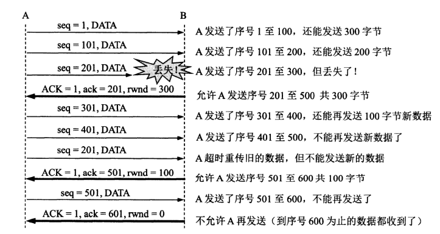

- 是对于Stop and Wait的一种**泛化**：允许同一时刻有多个未确认的包
	- 允许的未确认包的上限就是**窗口**
- 滑动窗口可以利用所有的网络带宽
- # 发送方
	- 每一个包都有一个**序列号(SeqNo)**
	- 维护三个变量
		- 发送窗口大小(Send Window size, SWS)
		- 最近接收确认(Last Acknowledge Received, LAR)
		- 最后发送包(Last Segment Sent)
	- 保证一个不变式：(LSS-LAR) <= SWS
	- 新的ack到来时推进LAR
	- 最多缓存SWS个包
- # 接受方
	- 维护三个变量
		- 接收窗口大小(Receive Window Size, RWS)
		- 最后可接受包(Last Acceptable Segment, LAS)
		- 最近接收包(Last Segment Received, LSR)
	- 保持一个不变式：(LAS-LSR) <= RWS
	- 如果新收到的包小于LAS，发送确认
		- 积累式确认，如果收到了1,2,3,5，则确认3
			- 表示3以前的都已被接收
		- **[[$red]]==注意：==**TCP的确认帧里的序号是期望的下一个序号，所以如果想确认3，那么发送的确认帧包含的序号应该为4
- # RWS，SWS 和序列号空间(Sequence Space)
	- RWS >= 1, SWS >= 1, RWS <= SWS
		- RWS大于SWS并不会产生严重后果，只是没必要，会造成RWS的浪费
	- 如果RWS=1，那么退化回"Go back N"协议
		- 因为接收方不会缓存任何包，一旦一个包丢失，发送方需要重发从该包开始的后面所有包
	- 需要的序列号空间大小至少为RWS+SWS
		- 对于发送窗口，由于确认帧带有部分源帧的信息，因此发送方不太容易弄混
		- 而对于接收方，如果接收窗口和发送窗口的序列号出现重叠，则在极端情况下会出现接收方错误地将延迟到达或者重传地旧帧当作新帧地情况
		- 考虑以下情况：
			- 发送方：0,1,2,3
			- 接收方：     2,3,1,0
			- 假设2,3实际上已经接收到0和1，但是ack丢失，若发送方重发0，则接收方会将旧帧当作新帧缓存下来
- # TCP流控制
	- TCP使用滑动窗口协议来完成流控制
	- 接收方在建立连接时，会在window域中告知发送方RWS的大小
	- 发送方最多只能发送到LAR+window的包
	- 
	- 如果发送方迟迟收不到接收方给出的非零窗口确认帧，为了避免确认帧丢失导致的死锁，TCP会在该链接的**持续计时器**(Persistence Timer)归零之后发送一个**零窗口探测报文段**
	- TCP规定哪怕是设置了零窗口，也必须接收：**零窗口探测报文段，确认报文段(ACK=1)和紧急报文段(URG=1)**