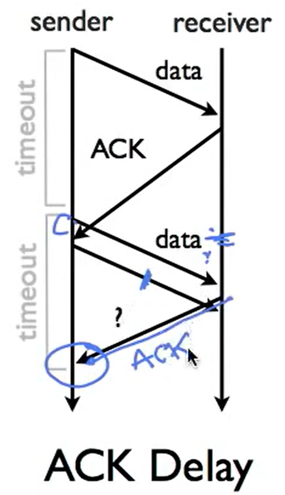

- # 问题描述
	- A和B进行通信
	- A每秒钟最多能送出500000个包
	- B每秒钟最多能接受200000个包
	- 如果不加以任何限制，则每分钟B会丢弃掉300000个包
		- 这对于A和整个网络的承载力来说都是巨大的浪费
- # 流控制
	- flow control
	- 因此引入**流控制**是很重要的
	- 为了解决以上问题，需要确保发送者发送的数据不要比接收者处理数据的速度更快
	- 接受者需要给发送者一些反馈
	- 两大基本方法
		- Stop and wait
		- [[Sliding Window]] (下一节)
- Stop and Wait的**基本思想**很简单
	- 每次只能有一个包在路上
	- 发送者要等待接收者回应才能发送下一个包
	- 如果超时没有收到回应，重发当前的包
- 但是单纯的ACK可能会导致发送者不知道对方是在对哪一个包进行ACK
	- {:height 254, :width 143}
	- 在ACK出现延迟的时候，很容易出现ACK语义模糊
- 因此需要给包加上n-bit的counter，这样就知道是在对哪一个包进行ACK
	- counter位数越长，去模糊的效果就越好