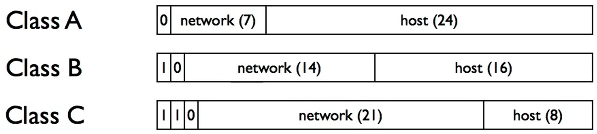

- 子网掩码(Netmask)是用于区分是否在同一个网络下的工具
- 在同一个网络下，不同设备共用同一个链路，包可以直接到达其他设备([[$red]]==how==)
- 如果不在同一个网络下，则需要经过路由器路由
- # 地址结构
	- ## 历史结构：三级分类
		- 
		- 缺少灵活性，现已基本不使用
	- ## 目前结构：CIDR
		- **Classless Inter-Domain Routing**
		- 地址块是一个二元对，地址和计数(count)
		- count是2的幂数，即子网掩码的长度
		- 如171.61.0.0/16表示从171.64.0.0到171.64.255.255的地址块
- # IPv4 Address Assignment
	- **IANA: Internet Assigned Numbers Authority**
		- Internet Corporation for Assignment of Names and Numbers（ICANN）
	- IANA将/8长度的地址块给Regional Internet Registries(RIRs)
		- IANA已经给完了所有的/8地址块
	- 不同的地理区域有不同的RIR，各RIR的政策也不尽相同
		- AfriNIC: 非洲
		- ARIN: 美国，加拿大，加勒比海诸国，南极洲
		- APNIC: 亚洲，澳大利亚，新西兰
		- LACNIC: 拉丁美洲，加勒比海诸国
		- RIPE NCC: 欧洲，俄罗斯，中东，中亚
- # 最长前缀匹配
	- **Longest Prefix Match**
	- 是路由器的IP地址匹配算法
	- 选择最具体的匹配
	- 转发表是一个CIDR条目的集合
	-