# 重传机制
	- TCP确保可靠传输的一大关键机制就是重传机制，在丢包和传输数据出现错误的情况下，接收方通过重传机制要求对方重新传输数据。
	- TCP中有**四大重传机制**
	- ## 超时重传
		- 每一个TCP帧发送之后都会设置一个定时器，若超过定时器设置时间还没有收到对方的ACK确认应答报文，就会向对方重发这一帧
		- **[[$red]]==数据包丢失==**和**[[$red]]==确认帧丢失==**都会触发超时重传
		- 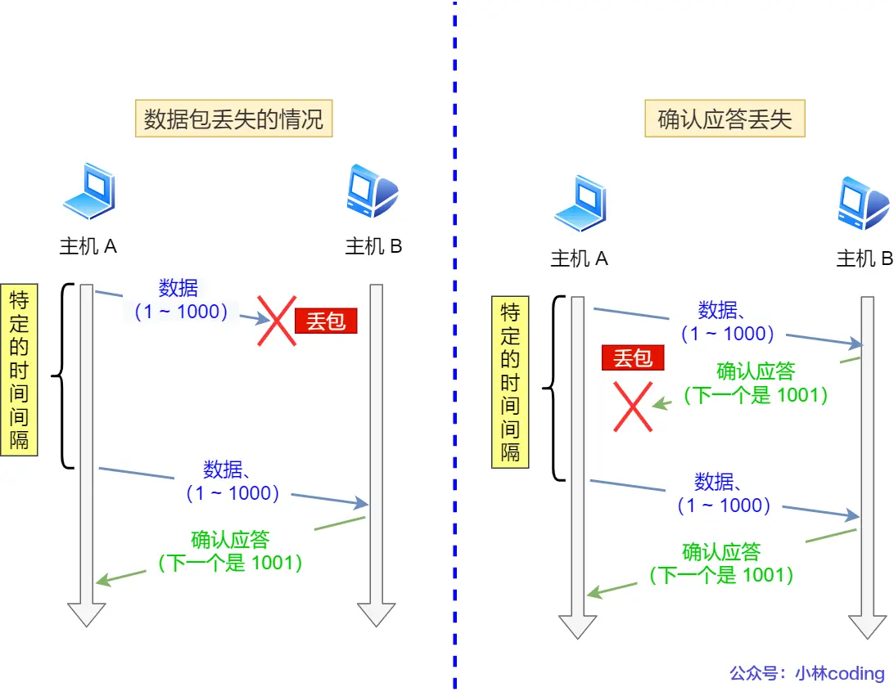{:height 437, :width 590}
		- ### 超时间隔的设置
			- **超时重传间隔(Retransmission Timeout, RTO)**的选择往往和**RTT(Round Trip Time)**有关
			  collapsed:: true
				- RTT即从发送信息到收到对方确认信息的时间
				- 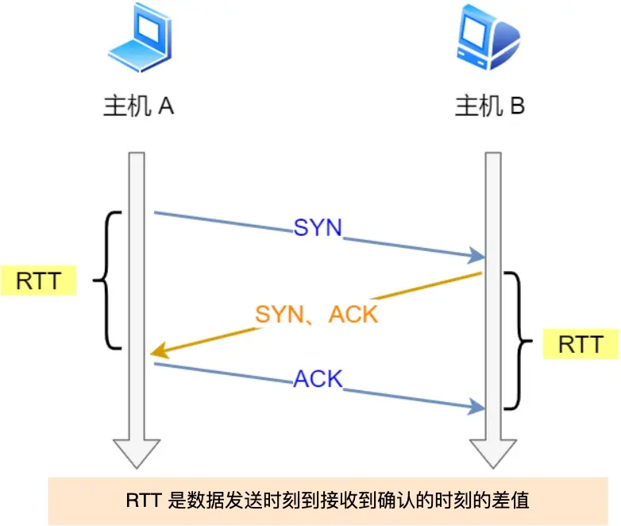
			- 如果RTO过大会导致重传效率低下，丢的包需要等很久才会重传
			- 如果RTO过小(小于RTT)会导致重发过多过快，导致网络拥塞
			- RTO的选择应该略大于RTT，但是**RTT是会[[$red]]==动态变化==的**，需要有专门的算法来计算RTO
			- **linux中的RTO计算算法**
				- 通过两个采样估计RTO：
					- 采样RTT值，计算加权平均的平滑RTT值，随网络情况动态变化
					- 采样RTT波动范围，避免RTT大波动导致预测失效
				- 采用了**RFC2988**标准用于计算RTO
				  collapsed:: true
					- 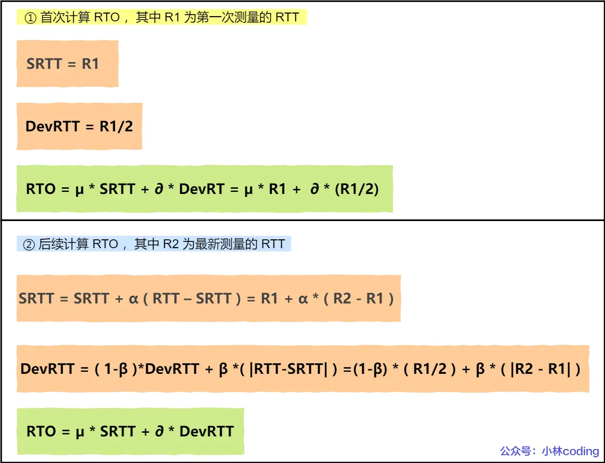
					- Linux中，$\alpha=0.125,\beta = 0.25,\mu=1,\partial=4$，这些系数的选择是通过大量实验获得的
				- **每遇到一次超时重传，[[$red]]==下一次超时间隔将翻倍==**
				- 若连续遇到两次超时，则说明网络环境差，不宜频繁反复发送
	- ## 快速重传
		- **Fast Retransmit**
		- 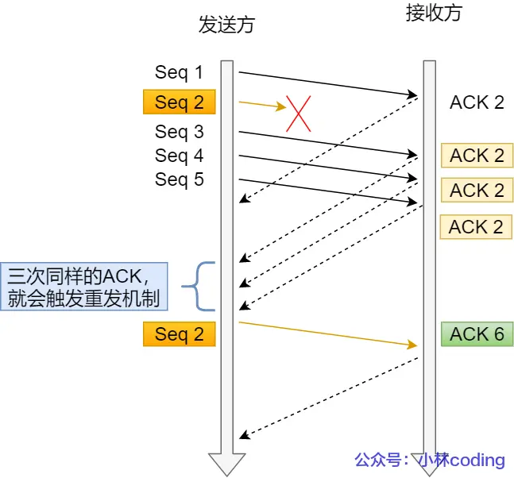
		- 即**若收到[[$red]]==连续三份相同的ACK帧==**，则会在某一数据帧超市之前直接重传
		- 快速重传的一个问题是发送发不知道对方到底有多少数据没收到，例如在上图中，发送方并不知道接收方是只有2没收到，还是2以后的所有包(2,3,4,5)都没收到
			- 如果只重传2，那么如果后续的包实际上都丢了，那么重传效率十分低下
			- 如果2之后的全部重传，那么占用了额外的网络资源，可能导致网络拥塞
	- ## SACK
		- **选择性确认(Selective Acknowledgement)**
		- 用于解决快速重传中无法确认重传数据范围的问题
		- 启用此特性会在TCP头部的**选项字段**中添加一个**SACK**域，此域的信息用于告知发送方有哪些数据已经收到。
		- 当连续三个相同ACK序列号的确认帧发送到发送方，发送方即可通过SACK的信息判断出需重传哪些数据
		- 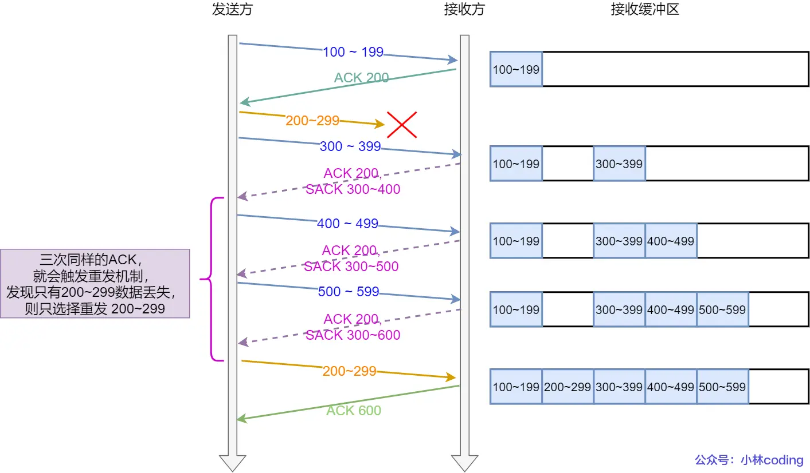
		- 需要通信的两台电脑都支持sack才可启用此功能，linux中可以修改`/etc/sysctl.conf`中的`net.ipv4.tcp_sack`字段来开启此功能(**linux 2.4之后默认开启**)
	- ## D-SACK
		- **Duplicate SACK**，使用SACK来**告知发送方有哪些数据被重复接收**
		- 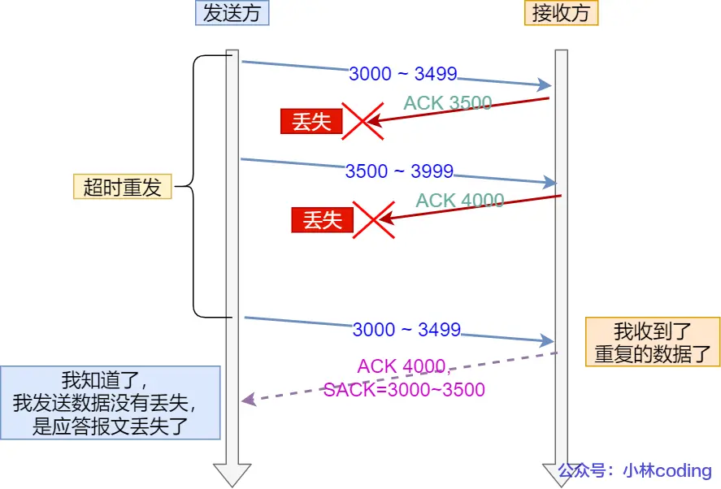
		- 以此让发送方知道，之前发送的数据并没有丢失，而是接收方的确认帧丢失了
		- Linux下通过``sysctl``指令修改``net.ipv4.tcp_dsack``即可开启或关闭此功能(2.4之后默认开启)
- # 滑动窗口
	- 窗口就是**[[$red]]==在没有收到确认应答前能够发送数据量的最大值==(单位：字节)**
	- 操作系统会为每一个tcp链接建立一个缓存空间，发送方主机在缓冲区中保留**已发送但未收到确认帧**的数据。被确认的数据会从缓冲区中清除
	- ACK的序列号表示在此序列号之前的所有数据都已经被收到，这杯乘坐**累计确认**或**累计应答**
	- 每一个TCP帧都会有一个窗口大小域，实时告诉对方自己当前可接受的窗口大小
	- ## 发送方的滑动窗口
		- 数据流被滑动窗口**划分为四部分**
			- 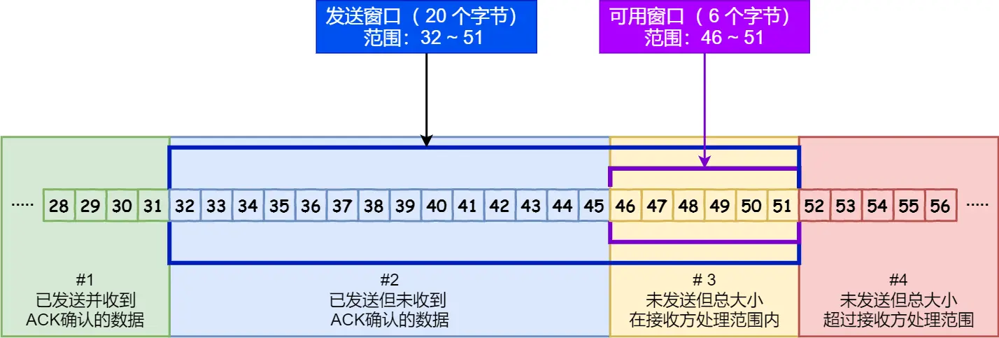
		- 在实现上，使用两个指针(序列号)和一个窗口大小变量来区分这四部分
			- 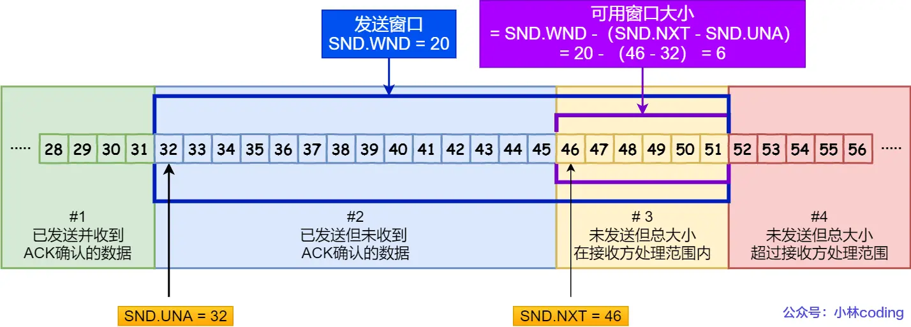
			- ``SND.UNA``，**Send Unacknowledged**，指向已发送但尚未接受的字节流的第一个字节
			- ``SND.NXT``，指向尚未发送但处于发送方接受能力范围内的字节流的第一个字节
			- ``SND.WND``，标识当前接收方的窗口大小，``SND.UNA``+ `SND.WND`即指向第四部分的第一个字节
			- 可用窗口大小为：``SND.WND``- (`SND.NXT` - `SND.UNA`)
	- ## 接收方的滑动窗口
		- 相较于发送方，接收方的滑动窗口要相对简单一些
			- 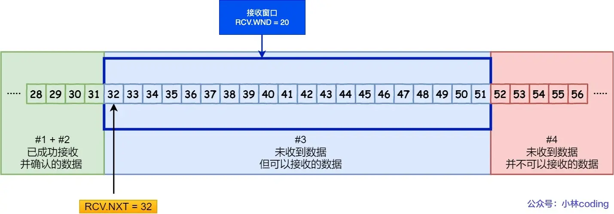
		- 使用一个窗口大小变量和一个指针进行划分进行划分
			- ``RCV.WND``，表示接收窗口的大小，这个值会通过tcp帧告知对方
			- `RCV.NXT`，指向期望从发送方接收到的下一个字节(序列号)
			- `RCV.NXT`+`RCV.WND`即可指向第四部分
	- 发送方的窗口大小(`swnd`)和接收方的窗口大小(`rwnd`)是**约等于的关系**
		- 接收方会实时告知对方最新的窗口大小，但是由于告知消息在需要通过网络传输，因此在告知消息到达前，会出现两者不相同的情况
- # 流量控制
	- 滑动窗口的引入就是为了处理流量控制问题
	- 核心是**[[$red]]==双方实时沟通对方的接受能力，对发送数据量做出动态调整==**
	- 窗口的大小会动态调整，双方都会通过最新的确认帧的窗口大小字段将最新的窗口大小告知对方
	- ## 窗口关闭
		- 接收方有可能因为数据处理的能力较低，导致大量数据滞留缓冲区，即虽然已经确认收到了发送的数据，但是无法继续接受更多的数据，这种情况下接收方可能会逐步缩小窗口大小，直到窗口大小降为0，这种情况即**窗口关闭**
		  collapsed:: true
			- 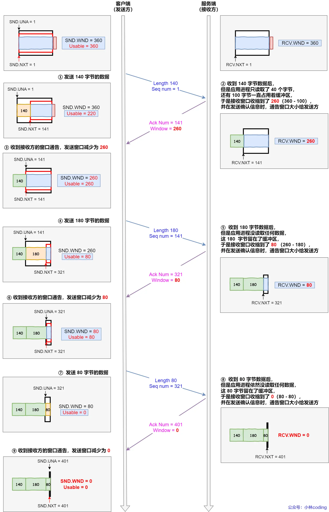
		- 发生窗口关闭时，**[[$red]]==发送方将无法继续发送任何有效信息==，直到接收方告知发送方之前的数据已经处理完毕，窗口大小重新可用**
		- 但是如果接收方死等接收方的窗口可用消息有可能导致死锁，即窗口可用消息丢失，发送方将无从得知窗口已经重新可用
		  collapsed:: true
			- 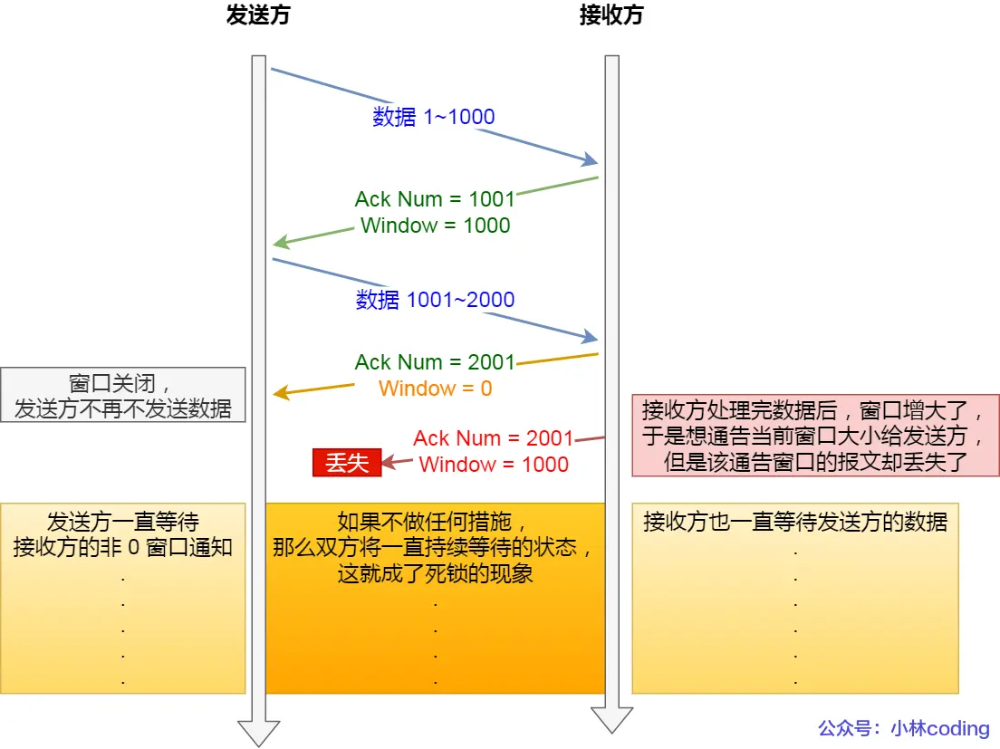
		- 为了避免上述死锁情况发生，TCP引入了**[[$blue]]==窗口探测帧(Window Probe)==**
			- **发送方**在窗口变为0之后会启动一个计时器，超过此计时器事件之后如果还没有收到接收方的窗口可用通知，则发送一个**不带任何数据**的窗口探测帧
			- **接收方**在接收到窗口探测帧之后需要向对方告知最新的窗口大小
			- 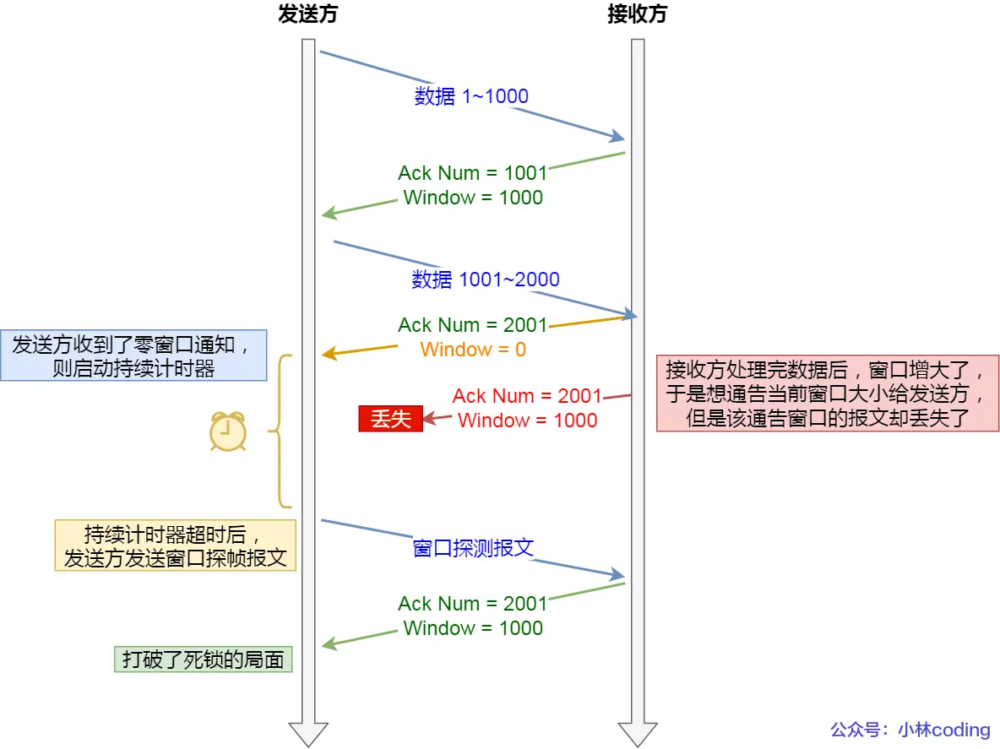
	- ## 糊涂窗口综合征
		- **Silly Window Syndrome**
		- 发送方处于效率考虑，一般会在窗口可用的时候立即使用掉窗口额度，而当窗口较小的时候，发送少量数据会导致overhead所占比例增大，不经济
		- 例如，在窗口大小可能只有60字节，而发送方为了发送这60字节的数据需要加上共计40字节的IP和TCP头
		- 这种在小窗口情况下，为了发送少量数据而付出大量overhead开销的行为就是**糊涂窗口综合征**
		- ### 解决方案
			- 出现此问题的关键在于极小的窗口大小，那么只需确保小窗口不出现即可，通常有两种方法
			- **让接收方不通知小窗口**
				- 当窗口大小小于`min(MSS,缓存空间/2)`时，向发送方告知串口为0，阻止更多数据的到来
				- 直到缓存中的数据被消耗掉一部分致使窗口大小大于`min(MSS,缓存空间/2)`后，再通知发送方此时的窗口大小
			- **让发送方不发送小数据**
				- 使用**Nagle算法**，此算法下，发送方发送数据需要满足以下两个条件之一
					- 窗口大于等于MSS，且待发送数据大于等于MSS
					- 收到之前发送数据的ACK帧
					- ```C++
					  if 有数据要发送 {
					      if 可用窗口大小 >= MSS and 可发送的数据 >= MSS {
					      	立刻发送MSS大小的数据
					      } else {
					          if 有未确认的数据 {
					              将数据放入缓存等待接收ACK
					          } else {
					              立刻发送数据
					          }
					      }
					  }
					  ```
				- 可以发现**如果接收方会通知发送方小窗口，那么Nagle算法无法避免糊涂窗口综合征**
			- 因此必须**接收方不通告小窗口+发送方开启nagle算法**才能避免糊涂窗口综合症
			- **Nagle算法默认开启**，但是对于需要小数据包的高交互性应用程序，例如``telnet``和``ssh``；或需要大流量传输的场景，例如下载大文件时， Nagle算法并不合适
			- 可以在Socket设置中通过``TCP_NODELAY``参数来开关此算法
- # 拥塞控制
	- **Congestion Control**
	- 流量控制是为了**避免发送方发送数据的速度高于接收方处理数据的速度**
	- 但是计算机一般处于共享网络环境中，虽然各个发送方-接收方之间可能都按照双方的能力在收发数据，但是仍然可能导致**整个网络环境的拥堵**
	- 拥塞控制就是为了**避免网络中所有的发送方发送过多数据导致整个网络系统过载**
	- ## 拥塞窗口
		- **``cwnd``**是发送方维护的一个**状态变量**，其值随着网络拥塞程度**动态变化**
		- 发送窗口的实际值是接收窗口和拥塞窗口中的最小值
		- 拥塞窗口变化的一般原则为：
			- 若网络中没有出现拥塞，``cwnd``就会增大
			- 若出现拥塞，``cwnd``将减少
		- 而对于**网络中是否存在拥塞**的判断，是通过确认帧的接收情况来判断的，**如果发送方没有在规定时间内收到确认帧，即发生了超时重传，就可以认为网络出现了拥塞**
	- ## 拥塞控制算法
		- 主要有四种控制拥塞的算法
		- ### 慢启动(Slow Start)
			- 拥塞窗口在TCP链接建立时初始化为一个默认值，**每收到一个ACK，便曾指数级增加`cwnd`大小，[[$red]]==直到慢启动门限==(``ssthresh``(slow start threshold)**
			- 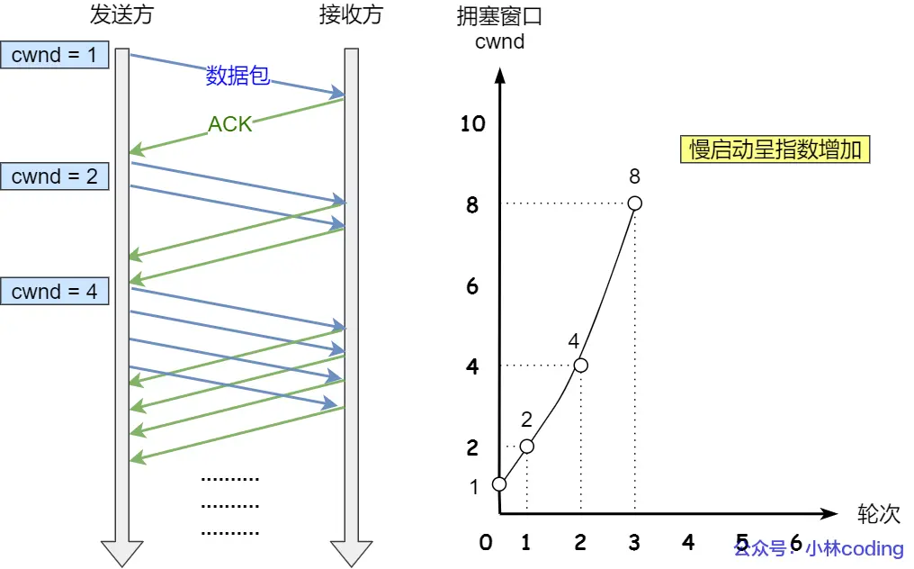
			- 此处的1，2，4是指多少个MSS大小
			- 当到达``ssthresh``之后，转而使用**拥塞避免算法**，此变量的一般取值是65535字节
		- ### 拥塞避免算法(Congestion Avoidance)
			- 超过门限之后的拥塞窗口增长将会进入**拥塞避免阶段**
			- 在此阶段，拥塞窗口的大小在每次收到确认帧之后**只能增长``1/cwnd``**
			- 例如，若目前拥塞窗口大小是8，那么下一个确认帧成功接收之后，拥塞窗口的大小将增加1/8，变为9
			- 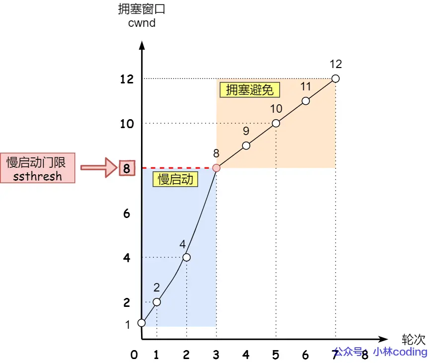
		- ### 拥塞发生
			- 若发生了**超时重传(RTO)**和**快速重传**，那么网络中很有可能存在拥塞，此时需要调小拥塞窗口
			- **超时重传**
				- 超时重传发生时，网络的拥挤状况可能已经相当糟糕，需要使用激进的方法避免进一步拥塞
				- ``ssthresh``设为`cwnd/2`
				- `cwnd`重置为初始值
				- 使用``ss -nli``可以查看每一个TCP链接的`cwnd`的初始值
				- 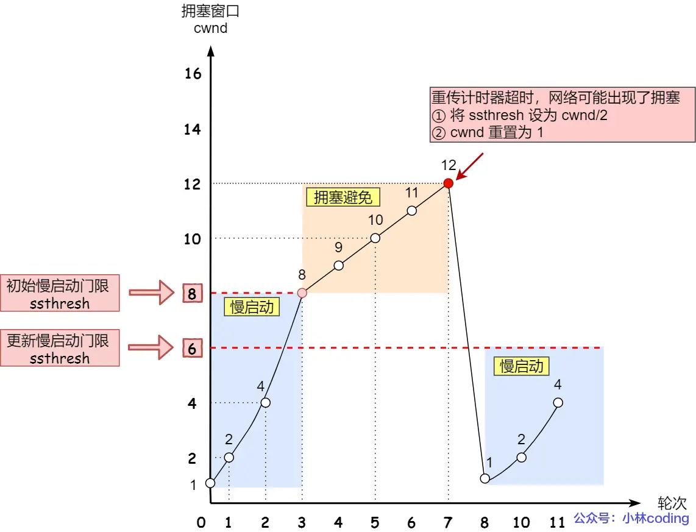
			- **快速重传**
				- 相较于RTO发生时的激进方式，快速重传发生之后的处理手段较为温和，被称为**快速恢复**
				- `cwnd`设为`cwnd`/2
				- ``ssthresh``设为`cwnd`
				- 接下来的步骤为：
					- `cwnd=ssthresh+3`
					- 重传丢失的数据包
					- 若收到重复的`ACK`(接收方试图确认已经被确认过的数据)，`cwnd`加1
					- 若收到新的``ACK``，则说明丢失数据已经发送完毕，将`cwnd`置为`ssthresh`，进入拥塞避免状态
				- 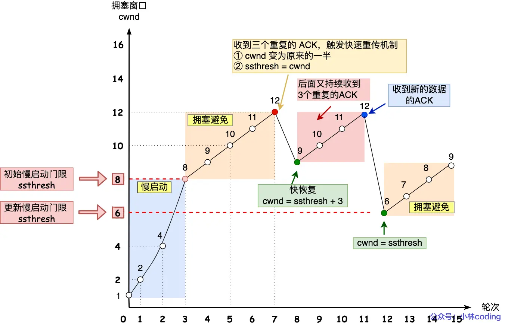
				- **[[$red]]==为什么cwnd在发生拥塞时先增加后减少？==**
					- 首先在快速重传发生时，可以假设网络的状况还没有那么糟糕，毕竟还能连续接收三个确认帧
					- 在此情况下，首要目标是尽快将丢失的数据重传到接收方，因此此时首先把拥塞窗口设置为``ssthresh+3``，并且会在每一收到重复确认帧时增大``cwnd``，就是为了尽快将丢失的帧重传
					- 收到新数据的确认帧以为着丢失的数据已经被重传成功，那么**为了避免后续的拥塞**，``cwnd``应该降低，置为``ssthresh``
					- **[[$red]]==切记快速重传本质上还是一个在拥塞发生后避免后续拥塞的算法==，因此其最终还是会降低``cwnd``大小的**
			-
				-
	-