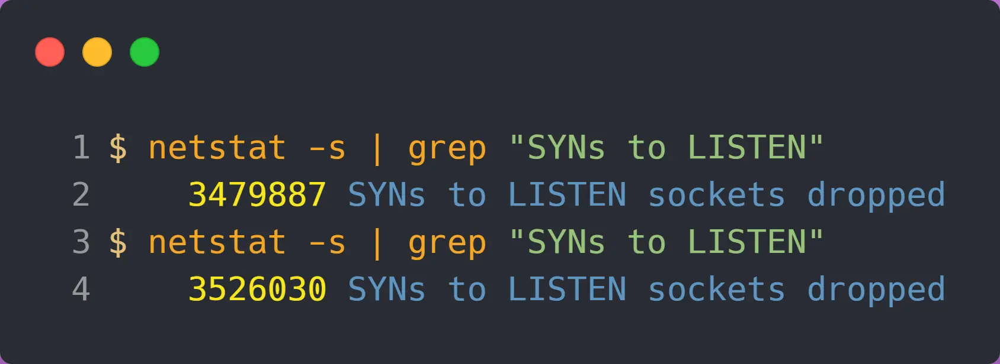
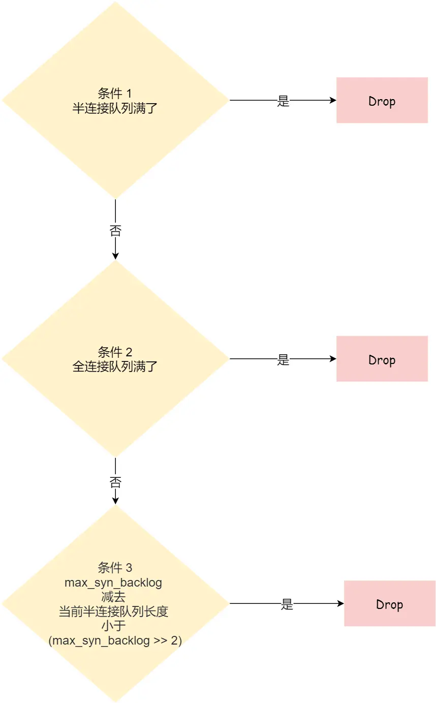
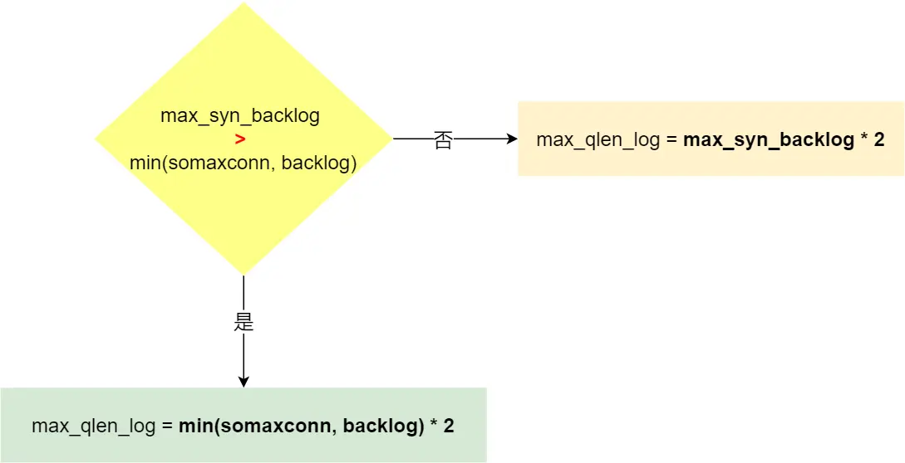
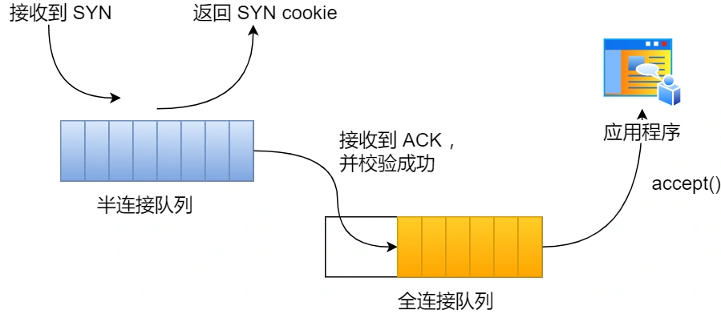
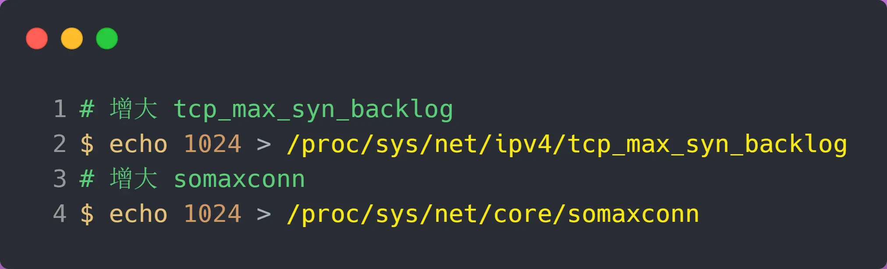

# TCP的半连接和全连接队列
	- 指Linux内核为TCP链接维护的两个用于三次握手的队列
	- **半连接队列**，也称**SYN队列**
		- 服务端收到客户端发起连接的SYN包之后，会将此连接放入**半连接队列**，并向客户端发送SYN+ACK包
	- **全连接队列**，也称**accept**队列
		- 收到客户端的第三次握手ACK包之后，内核会把此连接从半连接队列中移除，然后**创建新的完全连接**，并将其添加到**全连接队列**，等待进程调用``accept``函数将连接取出
	- 
	- 两个队列**[[$red]]==都有最大长度限制==**，如果超过限制时还有新的连接试图入队，内核会**丢弃此连接并返回RST包**
- # 队列溢出情况的内核行为
	- ## TCP全连接队列溢出
		- 可以使用``ss``命令查看所有连接的状态
		  collapsed:: true
			- 其``Recv-Q``和``Send-Q``两列的含义根据连接状态有所不同
				- 对于处于LISTEN状态的连接：
					- `Recv-Q`表示目前全连接队列的大小
					- `Send-Q`表示当前全连接队列的最大长度
				- 对于处于非LISTEN状态的连接：
					- `Recv-Q`表示已收到但未被应用进程读取的字节数
					- `Send-Q`表示已发送但未被确认的字节数
		- **在全连接队列已经到达最大容量的情况下，[[$red]]==多的连接会被系统丢弃==**
			- 使用``netstat -s | grep overflowed``可以查看有多少个连接被丢弃
			- 每个一段时间重复此命令，如果看到数值在上升可判定全连接队列发生了溢出
		- 
		- ### 全连接队列溢出时的行为
			- 对于溢出的连接(客户端发来的第三次握手消息)，有两种行为
				- **直接丢弃**
				- **向客户端发送RST**
			- 在linux下，**默认是直接丢弃**，但是可以通过修改`/proc/sys/net/ipv4/tcp_abort_on_overflow`来自定义行为
				- 如果为0则是直接丢弃
				- 如果为1则会向客户端发送RST
		- ### 两种行为的利弊
			- **对于直接丢弃来说**，其更适合应对短期突发流量
				- 直接丢弃之后，客户端的连接状态仍处于``ESTABLISHED``
				- 由于长时间收不到服务端的ack，客户端会不停尝试重发第三次握手信息
				- 若后续某一次重发时全连接队列出现空隙，则连接仍可能被成功建立
			- **对于发送RST来说**，除非全连接队列溢出是常态，否则不应该选用此行为
				- 此行为会尽快通知客户端，让客户端知晓服务端的繁忙，避免不必要的重发
		- ### 增大全连接队列容量
			- 如果发现全连接队列频繁溢出，那么应当考虑增大队列大小
			- **在linux下**，TCP全连接队列的容量取决于`somaxconn`和`backlog`之间的最大值
				- ``somaxconn``是内核系统参数，可以通过修改``/proc/sys/net/core/somaxconn``来设置
				- `backlog`是`listen(int sockfd, int backlog)`函数中`backlog`的大小，nginx下默认值是511，可以通过修改配置文件更改
	- ## TCP半连接队列溢出
		- 半连接队列的长度无法使用某个命令进行快捷查看，只能通过统计所有处于``SYN_RECV``状态的连接来获知当前半连接队列中连接的数量
			- `netstat_natp | grep SYN_RECV | wc -l`
			- 在大量新建连接请求进来的情况下，如果以上命令一直返回一个固定值，则此值即为半连接队列的最大长度
		- 会导致半连接队列溢出的请况即客户端**短时间内发来大量连接建立请求(SYN包)**，这也即SYN洪泛攻击的实现方式
		- 通过指令`netstat -s | grep "SYN to LISTEN"``可以查看半连接队列的溢出情况
			- {:height 166, :width 482}
			- 短时间内重复使用上述指令，若看到数值上升，则大概率发生了半连接队列溢出
		- ### TCP半连接队列的大小和连接丢弃机制
			- 某种程度上来说 ``max_syn_backlog``可以控制tcp半连接队列的大小，但不绝对
				- `/proc/sys/net/ipv4/tcp_max_syn_backlog`
			- 半连接队列的丢弃机制极为复杂，总体上来看，一个syn连接被丢弃的流程大致为
			  collapsed:: true
				- {:height 533, :width 326}
				- 若半连接队列已满且没有开启``tcp_syncookies``，则此连接请求被直接丢弃
				- 若全连接队列已满且没有重传第二次握手消息的连接请求多于1个，则此链接请求被丢弃
				- 如果没有开启`tcp_syncookies`且`max_syn_backlog`减去当前半连接队列长度小于`max_syn_backlog`值的一半，则丢弃
			- 半连接队列的最大长度在系统源码中实际是``max_qlen_log``,也即最大长度的对数值
			  collapsed:: true
				- 而这个值同时受``max_syn_backlog``，`somaxconn`和`backlog`三个值的影响
				- {:height 182, :width 350}
				- 其判断逻辑可概括为：
					- 若`max_syn_backlog`大于`somaxconn`和`backlog`之间的最小值，则`max_qlen_log`为`min(somaxconn, backlog)*2`
					- 否则为`max_syn_backlog*2`
			- 然而`max_qlen_log`也**[[$red]]==只是理论上的半连接最大值==**，就算半连接队列长度没有达到这个值，[[$red]]==新的连接建立请求仍然有可能被丢弃==
			  collapsed:: true
				- 根据之前所属连接请求被丢弃的判断规则，在规则三这一步会在没有开启`tcp_syncookies`且``max_syn_backlog`` 减去 当前半连接队列长度小于 (max_syn_backlog >> 2)的情况下丢弃连接，此时半连接队列长度显然没有达到理论最大值
		- ### 应对TCP半连接队列溢出(SYN攻击)
			- **开启`tcp_syncookies`**
				- `echo 1 > /proc/sys/net/ipv4/tcp_syncookies`
				- 开启此功能可以**在不使用半连接队列的情况下**成功建立连接
				- {:height 184, :width 405}
				- 其工作原理为在收到syn包之后计算一个SYN cookie随着第二次握手信息发送给客户端，客户端将此cookie值夹带在第三次握手信息中，如果此cookie被验证有效则成功建立连接
				- 在linux下，`tcp_syncookies`有三个值
					- 0，表示关闭此功能
					- 1，表示当半连接队列无法存入更多连接时启用此功能
					- 2，表示无条件开启此功能
			- **增大半连接队列大小**
				- 更具以上分析必须同步增大`tcp_max_syn_backlog`，`somaxconn`和`backlog`三个系统参数才能增大tcp半连接的大小
				- 前两个系统参数可以直接通过修改内核参数增大
					- {:height 93, :width 325}
				- `backlog`的增大方式不同的服务器不尽相同，在nginx下主要通过修改配置文件完成
			- **减少第二次握手消息(SYN+ACK)重传次数**
				- 服务端受到SYN攻击时会有大量处于SYN_RECV状态的TCP连接，处于此状态连接会尝试重传第二次握手消息
				- 减少重传次数可在一定程度上缓解SYN攻击带来的负面效果
				- `echo 1 > /proc/sys/net/ipv4/tcp_synack_retries`
					- 将重传次数置为1
	-