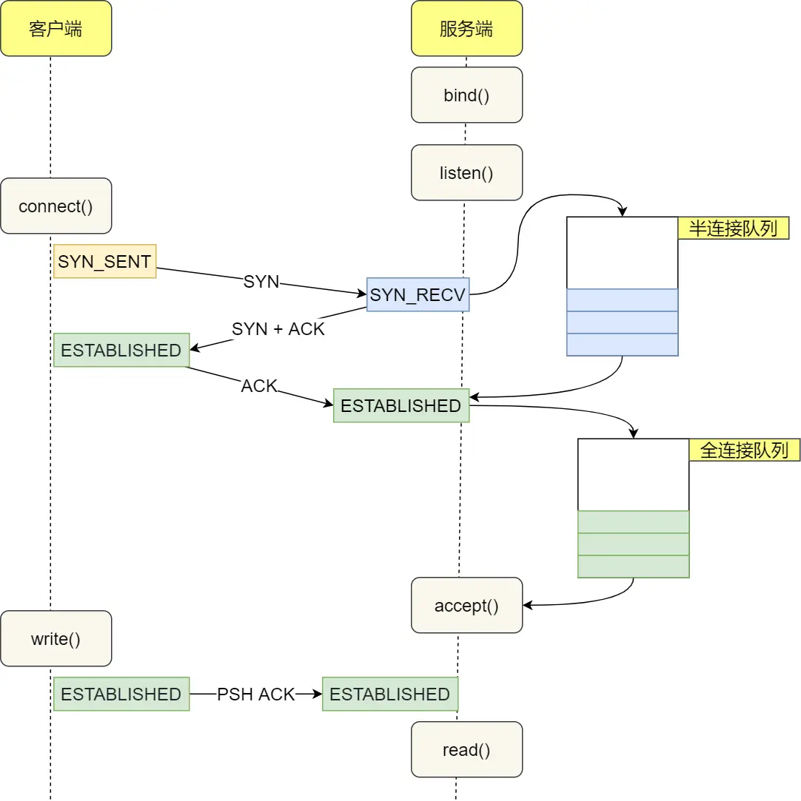
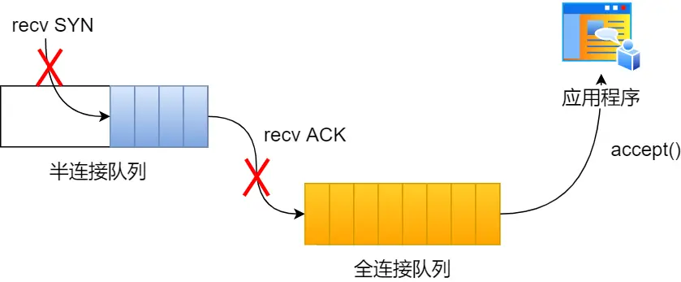

# TCP的半连接和全连接队列
	- 指Linux内核为TCP链接维护的两个用于三次握手的队列
	- **半连接队列**，也称**SYN队列**
		- 服务端收到客户端发起连接的SYN包之后，会将此连接放入**半连接队列**，并向客户端发送SYN+ACK包
	- **全连接队列**，也称**accept**队列
		- 收到客户端的第三次握手ACK包之后，内核会把此连接从半连接队列中移除，然后**创建新的完全连接**，并将其添加到**全连接队列**，等待进程调用``accept``函数将连接取出
	- 
	- 两个队列**[[$red]]==都有最大长度限制==**，如果超过限制时还有新的连接试图入队，内核会**丢弃此连接并返回RST包**
- # 队列溢出情况的内核行为
	- ## TCP全连接队列溢出
		- 可以使用``ss``命令查看所有连接的状态
		  collapsed:: true
			- 其``Recv-Q``和``Send-Q``两列的含义根据连接状态有所不同
				- 对于处于LISTEN状态的连接：
					- `Recv-Q`表示目前全连接队列的大小
					- `Send-Q`表示当前全连接队列的最大长度
				- 对于处于非LISTEN状态的连接：
					- `Recv-Q`表示已收到但未被应用进程读取的字节数
					- `Send-Q`表示已发送但未被确认的字节数
		- **在全连接队列已经到达最大容量的情况下，[[$red]]==多的连接会被系统丢弃==**
			- 使用``netstat -s | grep overflowed``可以查看有多少个连接被丢弃
			- 每个一段时间重复此命令，如果看到数值在上升可判定全连接队列发生了溢出
		- 
		- ### 全连接队列溢出时的行为
			- 对于溢出的连接(客户端发来的第三次握手消息)，有两种行为
				- **直接丢弃**
				- **向客户端发送RST**
			- 在linux下，**默认是直接丢弃**，但是可以通过修改`/proc/sys/net/ipv4/tcp_abort_on_overflow`来自定义行为
				- 如果为0则是直接丢弃
				- 如果为1则会向客户端发送RST
		- ### 两种行为的利弊
			- **对于直接丢弃来说**，其更适合应对短期突发流量
				- 直接丢弃之后，客户端的连接状态仍处于``ESTABLISHED``
				- 由于长时间收不到服务端的ack，客户端会不停尝试重发第三次握手信息
				- 若后续某一次重发时全连接队列出现空隙，则连接仍可能被成功建立
			- **对于发送RST来说**，除非全连接队列溢出是常态，否则不应该选用此行为
				- 此行为会尽快通知客户端，让客户端知晓服务端的繁忙，避免不必要的重发
		- ### 增大全连接队列容量
			- 如果发现全连接队列频繁溢出，那么应当考虑增大队列大小
			- **在linux下**，TCP全连接队列的容量取决于`somaxconn`和`backlog`之间的最大值
				- ``somaxconn``是内核系统参数，可以通过修改``/proc/sys/net/core/somaxconn``来设置
				- `backlog`是`listen(int sockfd, int backlog)`函数中`backlog`的大小，nginx下默认值是511，可以通过修改配置文件更改
	- ## TCP半连接队列溢出
		- 半连接队列的长度无法使用某个命令进行快捷查看，只能通过统计所有处于``SYN_RECV``状态的连接来获知当前半连接队列中连接的数量
			- `netstat_natp | grep SYN_RECV | wc -l`
		-
		-
	-