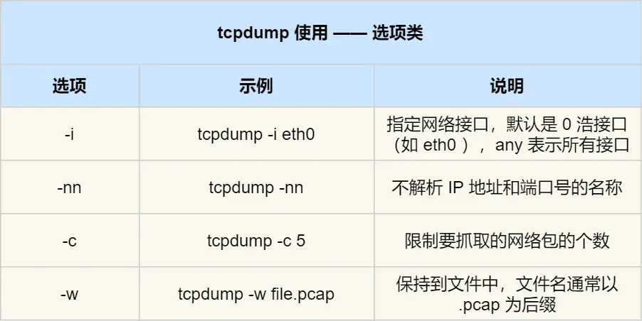
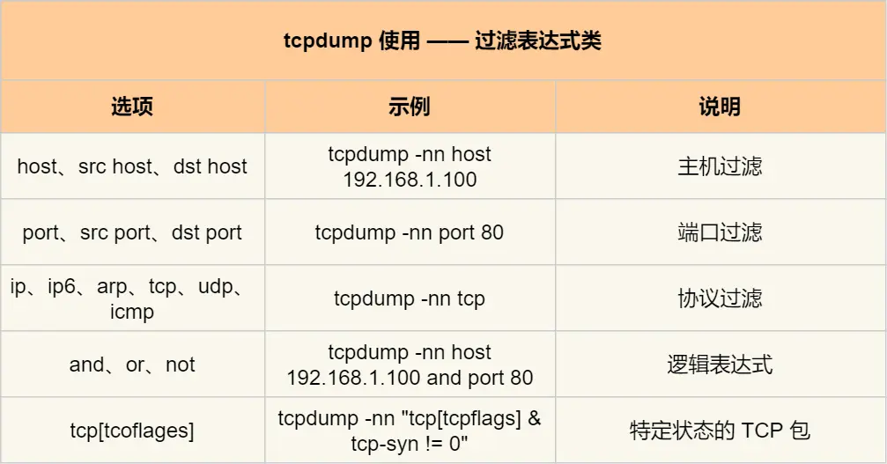

- 常用的抓包软件：
	- 在linux命令行环境中：**tcpdump**
	- 在图形化界面环境中：**Wireshack**
- # tcpdump
	- tcpdump提供了大量的**选项**和**过滤表达式**用于筛选出指定的数据包
	- 一些常用的**选项**
		- 
	- 一些常用的**过滤表达式**
		- 
	- 一个例子：抓ping包
		- 使用命令：``sudo tcpdump -i eth0 icmp and host 183.232.231.174 -n``
		- ``sudo``，因为普通用户可能没有权力监听某个网卡设备
		- ``-i eth0``表示可以监听``eth0``网络设备上的包
		- ``icmp and host 183.232.231.174``表示仅抓icmp协议且某个(发送方或接收方)主机地址为``183.232.231.174``的包
		- `-n`含义如上表所示
- # Wireshark
	- tcpdump的一大问题是对抓到包的输出格式并不直观，因此一种常见的工作流是用tcp抓包，然后保存为``pcap``格式之后由wireshark来解析并提供图形化的输出结果，方便分析
	-