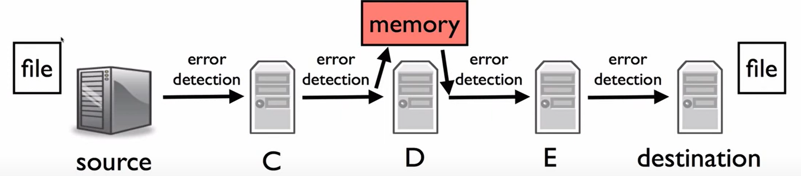

- 实际上看来，网络在数据传输中做的工作十分有限
- 网络可以为数据传输提供更多的特性
	- 数据压缩(Compress Data)
	- 重格式化(Reformat)/翻译(Translate)/改进(Improve)请求
		- 比如把两个请求合并
	- 使用已缓存数据
		- 例如A向B请求某文件，而此文件在举例A更近的C上存在，则让C给A传输文件
	- 增加安全性
	- 融合不同网络的连接
	- ............
- 之所以不提供以上更高级的特性，是因为**端到端原则**(End-to-end Principle)
	- 因为以上特性的正确实现需要用到终端应用层面的一些信息，因此将这些特性作为通信系统自身的特性是无法做到的
	- **[[$red]]==个人认为==**：如果要实现这些特性，那么分层原则和包交换原则也会被打破
	- 但是通信系统也可以通过一些端到端功能的**不完整实现**来增强网络的性能
- # 一个文件传输的场景
	- 
	- 希望做出一个假设，即每一次转发都会进行错误检测，那么当文件地送到终点的时候一定是正确的
	- 然而上述假设无法成立，因为如果在D处有一个bit在内存中发生了翻转，将其再封装进入一个包之后，该翻转位无法被后续的路由器或终端检测出来
	- 所以终端的应用必须自己也要做数据正确性验证
	- TCP虽然是可靠协议，但是也有出错的可能，因此端到端的正确性验证还是有必要的
		- Torrent协议就是用TCP来传输若干chunk，且每个chunk传输完毕之后，Torrent自己也会再做一次验证
- # 举例：链路可靠性
	- 有线链路一般可靠性较高
	- 对于无线链路，为了提高可靠性，增加了链路层级别的确认
		- 如果没有收到一个对应包的确认，则会进行链路层帧重传
	- 这种实现降低了高层协议(如：TCP)重传的比例，让网络的性能得到了提升
- 在**RFC1958**中有对**"Strong" End to End**的定义
	- “网络的工作是尽可能有效和灵活地传输数据报”
	- “任何其他的工作都应该让边缘来完成”
	- 相较于之前地定义，此定义强调了在两端之间不要做任何工作，哪怕是做一些用于提升网络性能的工作也不要做
	- 提出如此强的定义是为了简易性和灵活性
	-
	-