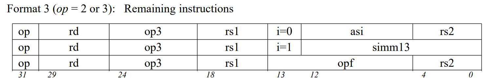
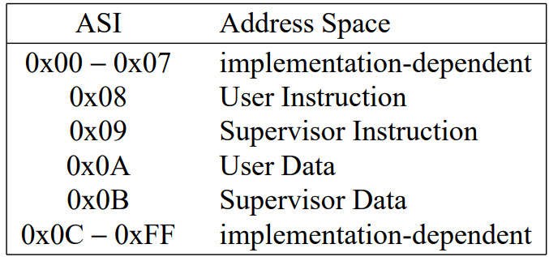
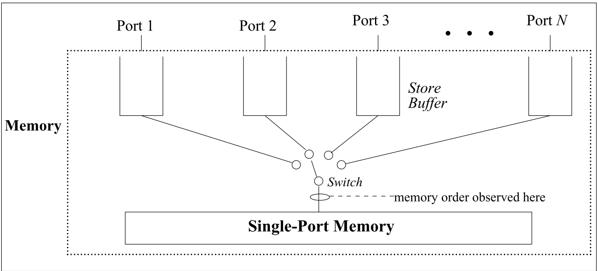
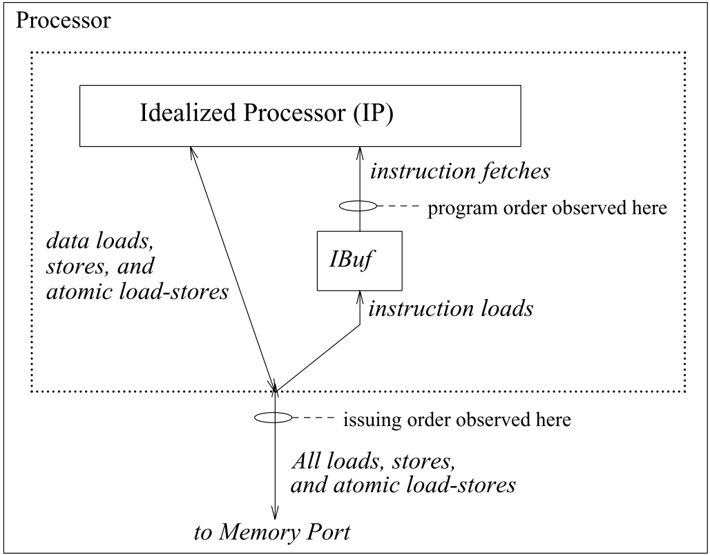
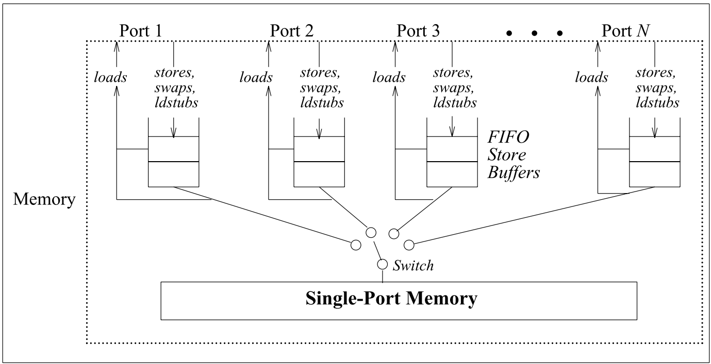
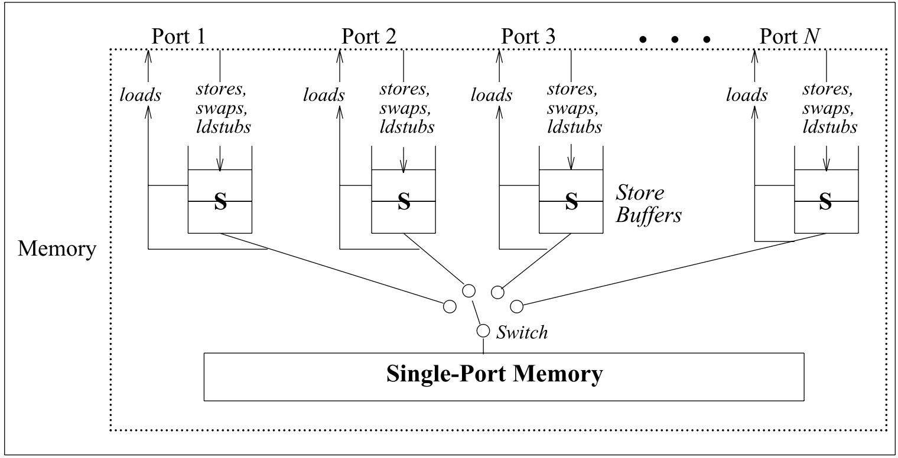

- # 第六章：内存模型
	- ## 基本定义
		- 内存是被load/store指令访问的**地址(Location)**集合
		- 这些地址包括传统内存，亦包括IO寄存器和可以通过**地址空间标识符(Adress Space Identifier, ASI)**访问的寄存器
		- ### Real Memory
			- 也称**主(Main)内存**
			- 所有满足以下两点之一的都是主内存：
				- ASI field 哦是8,9,0xA或0xB
				- ASI field 和 MMU中一条对应的entry隐含表示了对一个主内存的引用
			- 主内存不应该被其他任何ASI访问
			- 所有对主存的操作都不能在除了访问地址以外的任何地方产生效果
		- ### [[$red]]==补充：ASI==
			- ASI是一种指令格式中中的一个8位长度的域
			- 
			- {:height 165, :width 332}
		- ### Input/Output Locations
			- IO寄存器不属于主内存，因此在这些位置上进行的load-store操作可能会产生**可见的副作用**
			- 对于IO地址的操作也**不由内存模型定义**
		- ### 内存概述
			- 内存是编址的地址，半字(half-word)访问向2字节对齐，字访问向4字节对齐，双字访问向8字节对齐
			- 能够被内存硬件原子化读写的最大数据长度是**8字节**
			- 内存被建模为一个有**N个端口**(N代表处理器的数量)的设备
			- 一个处理器通过端口发起操作，操作的发出顺序叫做**issuing order**
			- 每一个端口都有一个store buffer用于保存store，FLUSH，atomic load-store指令
			- 内存本身只有一个端口，但有一个可以随时切换连接端口的开关，开关何时切换是**不确定的**
			- 且开关的切换定义了操作的**内存顺序(Memory Order)**，下图展示了一般内存模型
			- {:height 289, :width 654}
			- **处理器模型**
				- 
				- 注意区分instruction load和instruction fetch
	- ## Total Store Ordering
		- TSO保证所有处理器的store，FLUSH和atomic load-store指令都被内存以**内存顺序**线性执行
		- 以上所有指令的内存顺序都和其处理器issue它们的顺序保持相同
		- 下图展示了TSO的约束
		- 
		  id:: 643d05fe-f151-49ab-82a9-08e7685c4afa
		- 被CPUissue的**Store相关指令**(Store,FLUSH,atomic load-store)放置在专门的**Store Buffer**中
			- 此buffer是**[[$red]]==FIFO==**的
		- Load指令会先检查处理器的store buffer，如果有对对应地址的store，将读取最近store的值
		- 因为此机制(forwarding)的存在，不是所有的load都会进到内存中被处理，因此总的来说load不出现在内存中
	- ## Partial Store Ordering
		- [[$red]]==**V8**==版本的手册并不关心处理器部分是否对指令进行了重排序，是真正的只关心内存这边的重排
			- V8中只能看到处理器一条条发送指令，这个指令只要是从instruction store buffer中取出来的就说是program order，但是实际上编译器是否做了重排序，处理器是否使用记分牌或汤索罗消除了名相关，这些都不知道
			- 所以，[[$red]]==**V8实际上是从硬件角度取描述的**==，其提到的程序并不是我们一般从软件视角理解的程序
		- PSO保证所有处理器的store相关指令都被内存以内存顺序线性执行
		- **但是**，PSO并不保证store相关指令的内存顺序和issue order保持一致
		- 只有在两条被STBAR分割或store的地址相同的指令会在issue order和memory order上保持一致
		- {:height 374, :width 716}
		- 上图Store buffer中的**S**表示STBAR
		-