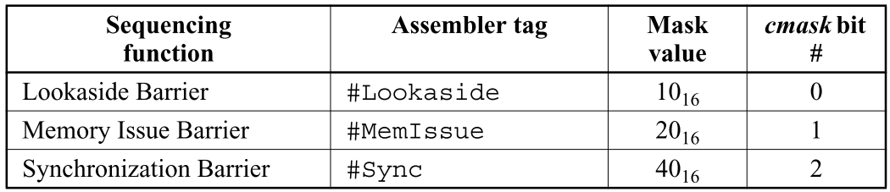

- # Memory Model
	- ## The SPARC-V9 Memroy Model
		- ### SPARC-V9 Program Execution Model
			- SPARC-V9处理器模型包含三个单元：
				- 
				- **发射(issue)**单元
					- 此单元负责从内存中读取指令，并按照**程序顺序(Program Order)**发射
				- **重排序(reorder)**单元
					- 收集发射的指令并重排序后交由执行单元执行
					- 重排序不能破坏任何内存和寄存器的**数据流限制条件**(data-flow constraints)，这些条件包括：
						- **对寄存器**：不能出现对某个寄存器的RAW，WAW，WAR冒险，WAR可以通过重命名消除而不影响重排序
						- **对内存**：不能出现对某个内存地址的WAR，RAW冒险
				- **执行(execution)**单元
			- 指令重排序可以提高性能，但是必须要保证重排序后的执行顺序符合**处理器自一致性(Processor self-consistency)**
				- 处理器自一致性要求在不考虑和其他处理器共享内存下的执行结果必须**和程序顺序的执行结果保持一致**
		- ### The Processor/Memory Interface Model
			- 
			- 每一个处理器和内存都有两条独立的数据通路相连，分别负责传输指令和数据
			- 指令的执行顺序受到**本地依赖(Local dependency)**的制约
			- 内存依据**内存顺序**(Memory Order)执行transaction，内存单元可能会对提交(submit)的transaction乱序执行，因此如果**执行单元**([[$red]]==?是指单个processor还是所有处理器的集合？==)希望transaction保持顺序执行，则不能一次提交一条以上的transaction
			- 内存接受transaction，执行，然后确认transaction的完成
			- 所有被发起的内存操作**可能以任何顺序被执行**，只有在同一内存地址上的操作会保持per-processor的偏序关系
			- 在单个内存地址上的操作顺序是一个保持了处理器transaction偏序关系的**全序关系**
		- ### MEMBAR instruction
			- 内存屏障指令分为两种，一种是**顺序屏障(Ordering MEMBAR)**，另一种是**序列屏障(sequencing MEMBAR)**
			- **顺序屏障**
				- 
				- 顺序屏障仅提供一个排序上的约束，并不保证transaction的完成情况
			- **序列屏障**
				- 顺序屏障让程序员可以显式控制内存操作的完成顺序，有三种：
				- **Lookaside Barrier**
					- 保证此指令之后的load的值是来自内存而不是write buffer
					- 保证此指令之前的所有store指令都要完成
				- **Memory Issue Barrier**
					- 保证此指令程序顺序之前的所有操作都在此指令之后的操作发起之前完成
				- **Synchronization Barrier**
					- 保证此指令之前的所有内存操作都在此指令之后的操作之前完成且所有的fault和error都对后者可见
				- 
				-
- # D3 Memory Transaction
	- ## D.3.1 Memory Transactions
		- 一个memory transaction属于以下种类之一
			- **Store**
				- 由一个处理器发起的对于某个特定内存地址值的替换请求
				- 地址和对应的值在发起就成对确定
				- 当新值对系统中所有处理器都可见时，store操作完成
			- **Load**
				- 由一个处理器发起的对于某个特定内存地址取值的请求
				- 地址和指令在请求发起时绑定
				- **[[$red]]==当返回的值无法被另一个处理器发出的store修改时==**，load操作完成
			- **Atomic**
				- 一个load/store对，且其他任何对内存状态做出修改的transaction可以出现在其之间
				- SPARC-V9定义了三种原子操作指令：LDSTUB,SWAP,CAS
			- **Flush**
				- 由一个处理器发起的强制将数据空间(data space)和指令空间(instruction space)保持一致(consistent)的请求
				- flush transaction被看作store操作
		- 一个memory transaction使用一个大写字母表示，如$X_na$表示一个由处理器$n$发出的针对内存地址$n$的transaction $X$
		- 处理器下标和内存下标可以省略
		- 谓词$S(X)$为真当且仅当X是一个store操作，$L(X)$为真当且仅当X是一个load操作
	- ## D3.2 Program Order
		- **程序顺序**定义了每**一个处理器**逻辑上执行指令顺序的全序关系
		- 使用$<_p$表示，如谓词$X_n <_p Y_n$为真当且仅当$X_n$所代表的指令在$Y_n$所代表的指令之前执行
		- 程序顺序表示了某**一个处理器**上所有memory transaction的唯一全序关系
		- **内存屏障(Memory Barrier)**(MEMBAR)指令基于$<_p$定义
			- 谓词$M(X,Y)$为真，当且仅当$X<_p y$且在X和Y之间在程序顺序上存在一个MEMBAR指令
		- 一个MEMBAR是**Ordering**或**Sequencing**的
			- Ordering MEMBAR指令会添加memory transaction顺序上的限制
			- Sequencing MEMBAR指令会增添额外的限制，这些限制用于memory transaction会产生内存模型语义以外副作用的场合
	- ## D3.3 Dependence Order
		- **依赖顺序**是一个刻画访问相同处理及寄存器或内存地址的不同指令之间约束的偏序关系
		- 假设处理器实现都使用寄存器动态重命名避免了由寄存器重用导致的假依赖
		- Memory Transaction $X$和$Y$之间存在依赖顺序记为$<_d$，**当且仅当**$X<_p Y$且满足以下至少一种情况
			- Y的执行取决于X，且$$S(Y)$$为真
				- 此规则刻画了所有的**控制依赖**(Control Dependence)
			- Y会读取X写的寄存器
				- 此规则刻画了所有由读写寄存器导致的真依赖（**RAW**）
			- X和Y访问同一个内存地址且$S(X),L(Y)$均为true
				- 此规则限制了在同一个地址上按程序顺序出现的SL对，但不限制load-store和store-store
		- 注意，依赖顺序是偏序关系，因此是**传递**的
		- 一个实际的处理器实现应该使用
	- ## D3.4 Memory Order
		- 内存最终执行的memory transaction序列叫做**内存顺序**
		- 是一个在memory transaction上的**全序关系**
		- 内存顺序并不是 **先验(a priori)**的，只能是一些列特定的作用在memory transaction上的**限制**
		- $X<_m Y$表示X在内存顺序上必须在Y之前，任何满足此限制的内存顺序，在此限制看来都是合法的
		- 不同的程序执行实例很有可能产生不同的内存顺序
- # Specification of Relaxed Memory Order(RMO)
	- ## D4.1 Value Atomicity
		- 只要是**小于等于八字节**的数据量，memory transaction对于内存值得读取和设置都是原子得
	- ## D4.2 Store Atomicity
		- 所有可能的执行都要和一个内存顺序保持一致(consisdent)，包括所有store操作
	- ## D4.3 Atomic Memory Transaction
		- 原子Memory Transaction SWAP, LDSTUB, and CAS 像单个内存操作一样执行
		- 没有任何其他memory transaction 可以分割一个atomic memory transaction 内部的load和store操作
	- ## D4.4 Memory Order Constraints
		- 一个内存顺序是合法的，当且仅当满足以下三个条件
			- $X<_d Y\& L(X)\Rightarrow X<_m Y$
				- 此条件阐明，当前置transaction是一个load时，RMO模型会维持依赖
				- 前置的store可能会被延期执行，因此其顺序并不会全局执行
			- $M(X,Y) \Rightarrow X<_mY$
				- 此条件阐明，MEMBAR指令会影响memory transaction的排序
			- $X_a<_pY_a \& S(Y) \Rightarrow X<_mY$
				- 此条件阐明，对同一个地址的store需要按程序顺序排序
				- 此条件对处理器的self-consistency是必要的
	- ## D4.5 Value of Memory Transaction
		- load操作$Y_a$的值可能是以下二者之一
			- 在内存顺序上作用在该内存地址最近的一次store操作所赋予的值
			- 同一个CPU(发起这个load操作的CPU)最近执行的一次store操作
		- 形式化描述为：
			- $\mathrm{Value}(L_a)=\mathrm{Value}(\mathrm{Max}<_m\{S\ |\ S_a<_m L_a\ \ mathrm{or}\ S_a<_p L_a\})$
			- 其中$\mathrm{Max}<_m{\ldots}$会选出给定元素集合中最近发生的元素
			- $Value()$会返回相应memory transaction 的值
	- ## D4.6 Termination of Memory Transactions
		- 任何memory transaction 最终都会被执行
		- 形式化表述为：在内存顺序上，每一个待执行的store完成以前只能由有限个 load
	- ## D4.7 Flush Memory Transaction
		- 在内存顺序上，Flush指令被作为store操作对待
		- flush指令对其在程序顺序上的所有后续指令都会引入一个**控制依赖**
- # D5 Specification of Partial Store Order
	- PSO就是在RMO的基础上增加了额外的要求，既：
		- **所有带有load语义的memory transaction后都有一个隐含的MEMBAR #LoadLoad | #LoadStore **