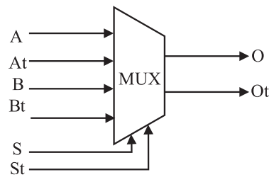
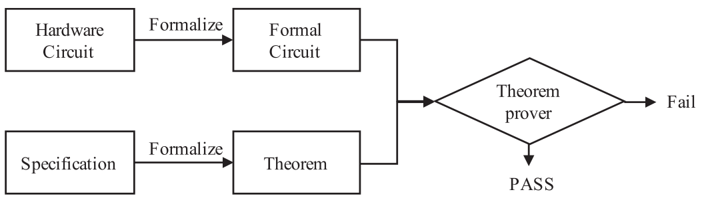
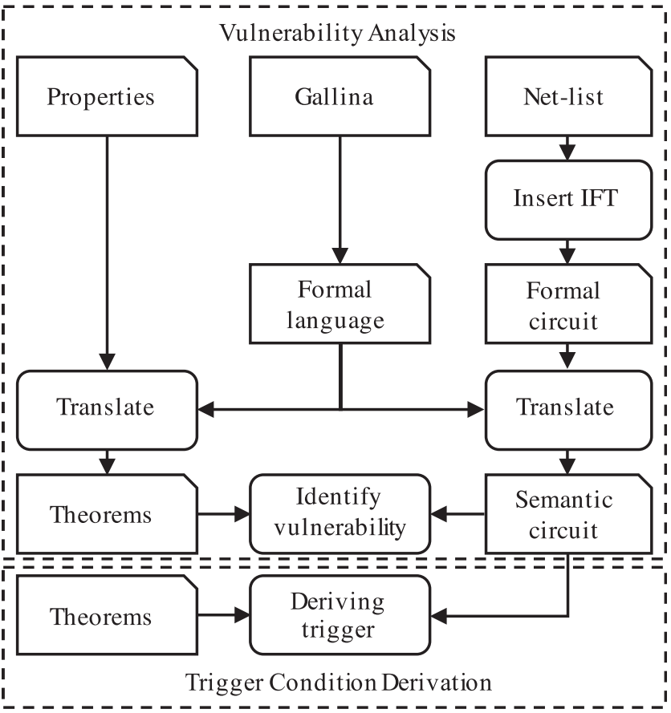
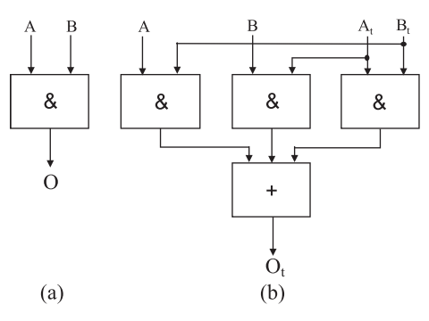

- # Introduction
	- 造成数字硬件组件安全性问题的几个原因：
		- 性能优化
		- 侧信道
		- 不安全的debug端口
		- 硬件木马
	- 现有的三种安全评估方式：
		- **功能验证(functional validation)**
			- 常规程序，通过模拟或验证，给出输入测试向量，观测输出
			- [[$blue]]==对于检测经常出现显式输出的错误来说相当有效==
			- [[$red]]==对于由稀有输入激活的硬件木马效果不佳==
		- **侧信道分析(side channels analysis)**
			- Post-silicon方法
			- 通过测量侧信道(延时，能耗，电磁辐射)来区分脆弱和安全的电路
			- [[$red]]==需要一个没被动过手脚的黄金模型(golden model)来比较==，然而在大多数情况下，这是不可能的
			- 随着硬件越来愈复杂[[$red]]==由轻量级硬件木马所造成的差异会被轻易掩盖==
		- **安全验证(security verification)**
			- 感觉就是在说IFT
			- 可以基于**模拟**，**SAT分析类，型检查**或**定理证明**
			- 一般的做法容易造成喜闻乐见的[[$red]]==**状态爆炸**==
			- 基于定理证明的方法，比如PCH(Proof-Carrying Hardware)被认为是一种很有前途的方法
			- 将硬件设计转化为Coq表示，但是现行的相关模型都是采用保守的验证模型[[$red]]==(?)==
	- 本文提出的方法实现了**[[$blue]]==精确IFT==**
	- 将RTL或者门电路网表转化为一种“**语义电路(semantic circuit)**”
		- 使用自定义的形式化语言和转化法则
	- 可以获取硬件木马的激活条件，通过coq辅助的反向推理
- # Related work
	- 一句话，除了定理证明，别的方法都不好使(介绍了模拟，SAT，类型检查和定理证明在硬件security verification方面的发展和优缺点)
- # Preliminaries
	- ## GLIFT
		- **fine-granularity**(精确IFT)
		- 使用的安全等级模型为两级，**low, high**，使用0，1来编码
		- 采用的label计算不是简单的或(有效，但是**保守**，容易导致大量假阳)，而是更为精确的计算方式
		- 例：
			- 
			- 上图中的选择器，At，Bt，St，Ot分别是A,B,S,O的label位
			- $O_t = S\cdot A_t + \overline{S} \cdot B_t + (A\oplus B) \cdot S_t + A_t\cdot S_t + B_t \cdot S_t$[[$red]]==**(?)**==
				- **解释**：
					- 当S为1时，O会采用A的值，因此此时O的label等于A的label
					- 当S为0时，O会采用B的值，因此此时O的label等于B的label
					- 当A和B的值不相同(异或在AB不相同时为1)时，则可以通过O的输出推断出S的值，因此此时O的label 等于S的label、
					- [[$red]]==最后两项无法理解==
						- **解答**：[[$blue]]==时时牢记：在不改变low输入的情况下，不能产生任何可观测(low)的输出变化==
						- 所以，当A和S都是high的时候，B保持不变，输出也可能发生变化，因此O必须是high的，不然就会产生IFT安全策略的违反
	- ## Theorem proving based formal verification
		- 将电路(HDL, 网表)转化为形式化电路(公理和假设)
		- 将specification描述为Theorem
		- 
- # Design methodology
	- {:height 469, :width 434}
	- 验证方法包括两部分，**脆弱性分析**和**触发条件推导**
	- 提出了专门用与描述硬件的语言
- # Theorem proof based gate level information flow tracking
	- ## Precise IFT Model
		- $\mathtt{hi}$：逻辑1，secret/untrusted
		- $\mathtt{lo}$：逻辑0，unclassified/trusted
		- 例子：
			- {:height 240, :width 314}
			- $O_t = A\cdot B_t + B \cdot A_t + A_t \cdot B_t$