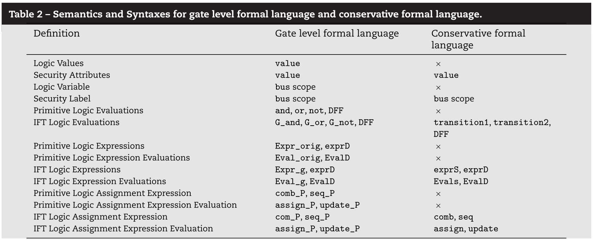
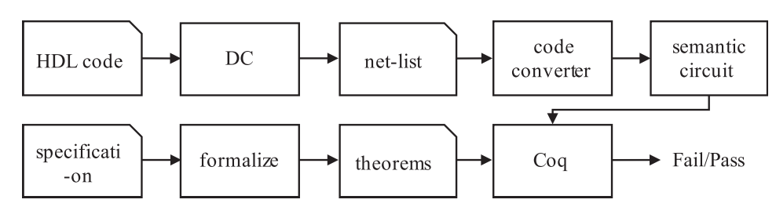
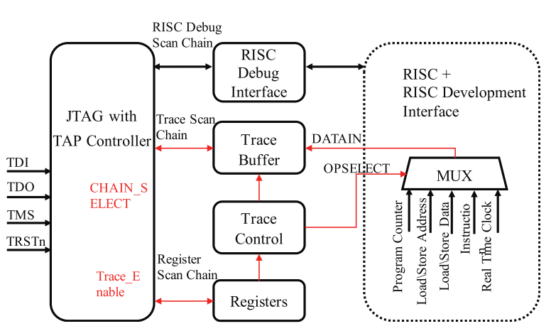
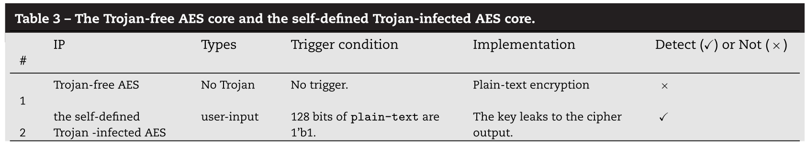
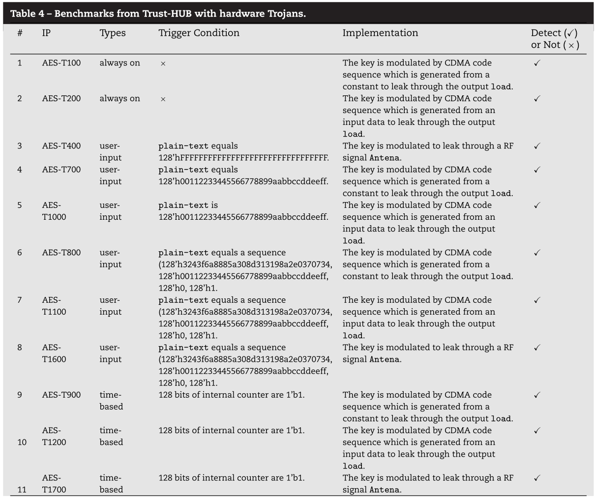
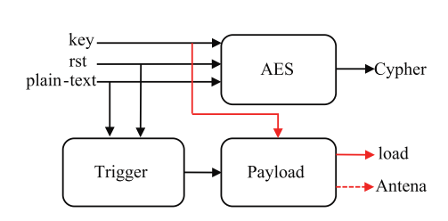

- # 图例
	- [[#green]]==生词==
	- ==重点==
	- [[#red]]==疑点==
	- [[#blue]]==附注==
- # Introduction
	- 造成数字硬件组件安全性问题的几个原因：
		- 性能优化
		- 侧信道
		- 不安全的debug端口
		- 硬件木马
	- 现有的三种安全评估方式：
		- **功能验证(functional validation)**
			- 常规程序，通过模拟或验证，给出输入测试向量，观测输出
			- [[$blue]]==对于检测经常出现显式输出的错误来说相当有效==
			- [[$red]]==对于由稀有输入激活的硬件木马效果不佳==
		- **侧信道分析(side channels analysis)**
			- Post-silicon方法
			- 通过测量侧信道(延时，能耗，电磁辐射)来区分脆弱和安全的电路
			- [[$red]]==需要一个没被动过手脚的黄金模型(golden model)来比较==，然而在大多数情况下，这是不可能的
			- 随着硬件越来愈复杂[[$red]]==由轻量级硬件木马所造成的差异会被轻易掩盖==
		- **安全验证(security verification)**
			- 感觉就是在说IFT
			- 可以基于**模拟**，**SAT分析类，型检查**或**定理证明**
			- 一般的做法容易造成喜闻乐见的[[$red]]==**状态爆炸**==
			- 基于定理证明的方法，比如PCH(Proof-Carrying Hardware)被认为是一种很有前途的方法
			- 将硬件设计转化为Coq表示，但是现行的相关模型都是采用保守的验证模型[[$red]]==(?)==
	- 本文提出的方法实现了**[[$blue]]==精确IFT==**
	- 将RTL或者门电路网表转化为一种“**语义电路(semantic circuit)**”
		- 使用自定义的形式化语言和转化法则
	- 可以获取硬件木马的激活条件，通过coq辅助的反向推理
- # Related work
	- 一句话，除了定理证明，别的方法都不好使(介绍了模拟，SAT，类型检查和定理证明在硬件security verification方面的发展和优缺点)
- # Preliminaries
	- ## GLIFT
		- **fine-granularity**(精确IFT)
		- 使用的安全等级模型为两级，**low, high**，使用0，1来编码
		- 采用的label计算不是简单的或(有效，但是**保守**，容易导致大量假阳)，而是更为精确的计算方式
		- 例：
			- {:height 265, :width 386}
			- 上图中的选择器，At，Bt，St，Ot分别是A,B,S,O的label位
			- $O_t = S\cdot A_t + \overline{S} \cdot B_t + (A\oplus B) \cdot S_t + A_t\cdot S_t + B_t \cdot S_t$[[$red]]==**(?)**==
				- **解释**：
					- 当S为1时，O会采用A的值，因此此时O的label等于A的label
					- 当S为0时，O会采用B的值，因此此时O的label等于B的label
					- 当A和B的值不相同(异或在AB不相同时为1)时，则可以通过O的输出推断出S的值，因此此时O的label 等于S的label、
					- [[$red]]==最后两项无法理解==
						- **解答**：[[$blue]]==时时牢记：在不改变low输入的情况下，不能产生任何可观测(low)的输出变化==
						- 所以，当A和S都是high的时候，B保持不变，输出也可能发生变化，因此O必须是high的，不然就会产生IFT安全策略的违反
	- ## Theorem proving based formal verification
		- 将电路(HDL, 网表)转化为形式化电路(公理和假设)
		- 将specification描述为Theorem
		- 
- # Design methodology
	- {:height 469, :width 434}
	- 验证方法包括两部分，**脆弱性分析**和**触发条件推导**
	- 提出了专门用与描述硬件的语言
- # Theorem proof based gate level information flow tracking
	- ## Precise IFT Model
		- $\mathtt{hi}$：逻辑1，secret/untrusted
		- $\mathtt{lo}$：逻辑0，unclassified/trusted
		- 例子：
			- {:height 240, :width 314}
			- $O_t = A\cdot B_t + B \cdot A_t + A_t \cdot B_t$
	- ## Gate level formal language
		- 用于描述性质和精确语义电路
		- ### 逻辑值和安全性质
			- 一个递归集合
			- $\mathtt{Inductive\ value: Set := |lo:value\ |hi:value}$
			- lo表示逻辑0，unclassified，trusted
			- hi表示逻辑1，secret，untrusted
		- ### 逻辑变量和安全标签
			- 定义一个bus类，实际是一个从自然数到$\mathtt{value}$的映射，代表了某一变量在某一时刻(自然数)的逻辑值或安全值
			- $\mathtt{Definition\ bus: Set :=nat \text{->} value}$
		- ### 在value类上的操作
			- 实际是机械化翻译之前的真值表
			- 小写字母表示的操作为**原操作**，开头加了一个大写字母G的操作表示**精确IFT逻辑**
			- ```
			  Definition and (A B : value):value := 
			  	match A with 
			      	|lo => match B with 
			      		| lo => lo 
			          	| hi => lo... 
			      	| hi => match B with... 
			  end.
			  Definition G_and (A A_t B B_t :value):value:= 
			  	match A with 
			      	|lo => match A_t with 
			          	| match B with... 
			          |hi => match A_t with... 
			  end.
			  ```
			- [[$red]]==**三个点是表示省略吧？**==
		- ### Bus处理操作
			- 创建一个expression 类来描述bus处理的逻辑操作
			- Expr_orig描述原操作
			- Expr_g描述精确IFT操作
			- ```
			  Inductive Expr_orig:= |expr_orig_conb: bus -> Expr_orig ...
			  					  |expr_orig_and: Expr_orig -> Expr_orig -> Expr_orig 
			  Inductive Expr_g:= |expr_g_conb: bus -> Expr_g ...
			  				   |expr_g_and: Expr_g -> Expr_g -> Expr_g -> Expr_g -> Expr_g
			  ```
			- 表达式的值解析：
				- ```
				  Fixpoint Eval_orig (e:Expr_orig)(t:nat):value:= match e with
				  	|expr_orig_conb E => E t ...
				  	|expr_orig_and E A => and (Eval_orig E t)(Eval_orig A t) 
				  end.
				  
				  Fixpoint Eval_g (e:Expr_g)(t:nat):value:= match e with 
				  	|expr_g_conb E => E t ...
				  	|expr_g_and E E t A A t => G_and (Eval_g E t)(Eval_g E_t t)
				      								 (Eval_g A t)(Eval_g A_t t) ... 
				  end.
				  ```
				- t应该表示的时间戳
			- 到目前为止还无法描述时序逻辑，加入DFF的相关定义来补足对于时序逻辑的表达能力
				- ```
				  Definition DFF (I CLK Q:bus) := fun t:nat => Q (S t) = I t.
				  Inductive exprD := |expr_D:bus-> bus-> bus-> exprD. 
				  Fixpoint EvalD (e:exprD)(t:nat) := match e with 
				  	|expr_D I CLK Q => DFF I CLK Q t 
				  end.
				  ```
		- ### 赋值操作
			- coq没有可以直接使用的block赋值和nonblock赋值，因此需要自己定义
			- comb_P表示阻断赋值，seq_P表示非阻断赋值
			- ```
			  Inductive seq_P := 
			  	|expr_up_orig: exprD -> seq_P 
			      |expr_up_g: exprD -> seq_P. 
			  Inductive comb_P := 
			  	|expr_ass_orig: bus -> Expr_orig -> comb_P 
			      |expr_ass_g: bus -> Expr_g -> comb_P.
			  ```
			- comb_P和seq_P的估值分别由assign_P和update_P完成
			- ```
			  Definition update_P (u:seq_P) (t:nat):= match u with 
			  	|expr_up_orig e => EvalD e t 
			      |expr_up_g e => EvalD e t 
			  end. 
			  Definition assign_P (c:comb_P)(t:nat):= match c with 
			  	|expr_ass_orig b e => b t = Eval_orig e t 
			      |expr_ass_g b e => b t = Eval_g e t
			  end.
			  ```
	- ## 代码转换
		- ### 转换规则
			- 编写了一个python converter
	- ## 定理生成和证明
		- 使用公理来给需要标记的为进行标记
		- $\mathtt{Axiom\ key\_taint:forall t:nat, key_t t = hi.}$
		- 使用定理来指出不应该泄露信息的输出位
		- $\mathtt{Theorem\ no\_leaking\_information:O_t t = lo}.$
		- [[$red]]==**纯手工证明？**==
	- ## 触发条件推导
		- 反向推理，根据每一个门来写一个引理或命题来反向证明
		- [[$red]]==**但是这个复杂度和人工工作量也太大了吧？真的有实用价值吗？**==
- # Accelerating security verification
	- 精确IFT成本太高，采取保守IFT模型来加速验证
		- [[$red]]==最终还是回到了保守IFT嘛。。。。==
	- **IFT标签传递策略：**任何输入的标签为hi，那么输出的标签就会标记为hi
	- ## Conservative formal language
		- {:height 290, :width 706}
		- 用于描述conservative semantic circuits
		- 取消了所有和变量逻辑值相关的建模
			- [[$red]]==这么搞，我都不敢想象会有多少假阳....==
		- 函数 $\mathtt{transition2}$ 对有两个输入的组合逻辑进行估值
		- 函数 $\mathtt{transition1}$ 对有一个输入的组合逻辑进行估值
		- 函数 $\mathtt{DFF}$ 对保守IFT时序逻辑进行估值
		- ### Conservative conversion rules
			- 网表 -> 保守IFT电路 -> 保守语义电路
- # 实验结果
	- ## setup
		- 
		- 实验流程如上
	- ## 基于定理证明的的GLIFT方法的精确性
		- {:height 328, :width 538}
		- OpenRISC development interface core的结构如上图
			- [[$red]]==这个东西的工作流程没太看懂==
		- 说白了就是对这个东西在精确和保守IFT模型下分别进行了建模，并发现结果不一样，以此得出结论：精确度不一样
			- [[$red]]==这不废话嘛。。。这小节到底想证明什么，我还以为能说明这套方法的建模是准确的==
	- ## 计时信道检测
		- 用了一个RSA模块的作为例子
		- [[$red]]==从他语言的表达能力，我没法直观看出他对于计时信道的表达能力==
		- [[$red]]==具体是怎么做的？会不会只是因为他所谓的precise IFT也不够精确？==
		- [[$red]]==为什么是4，一个个试出来的还是最多就到4个周期？==
		- [[$red]]==细节太少了，很多地方完全没法理解==
	- ## 硬件木马检测
		- 
		- 
		- ### AES-T1600
			- 
			- 当观测到一个特定的plain-text时激活
			- 通过一个RF天线泄露信息
			- 声明key的label为hi，然后要证明cipher输出为hi，antena的输出应该为lo
	- **[[$red]]==检测过程感觉是把木马看作一个白箱，什么细节都知道，那当然好检测==**
	- [[$red]]==**看完这一节感觉仍然不知所云......**==
	- [[$red]]==完全没有了解到其具体是怎样通过定理证明一步步证明性质成立与否的==
	- [[$red]]==建模方式感觉有点awkward..==
	- [[$red]]==Coq能够遍历128甚至更长的输入？那也太神了..==
- # 总结
	- 没啥好看的
	- 自己也说了不能建模物理侧信道，这个是肯定的
	- ## 个人感受
		- [[$red]]==工作不成体系==
		- 感觉开创性是有的，但是完全没写出来[[$red]]==是怎样从公理，precondition，一步步到各种lemma，和theorem的==，我最关心，最想看到的东西完全没写..
		- [[$red]]==**实用性有待商榷**==