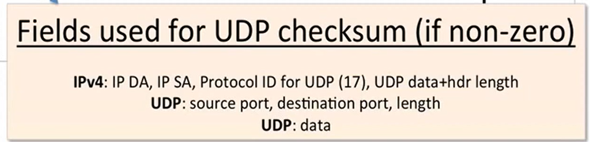

- UDP的模型相较于TCP异常简单
- **UDP头结构**
	- 
	- 校验和在IPv4下是可选的，如果发送者不发送校验和，则校验和会被填零
	- 校验和如果使用，则：
		- 
- UDP也是一个能完成解多路复用(Demultiplexing)协议，因为两台电脑上的不同进程可以通过UDP共享网络层通信信道和能力，而通过端口号来区分接收方(码分多路复用)
- **UDP的性质和行为**
	- **无连接数据报服务**
		- 不建立连接
		- 包可能以任意顺序呈递给应用层
	- **独立数据报**(self-contained)
		- 单独一个数据包就包含了足够完成路由的信息
	- **不可靠递送**
		- 没有确认
		- 没有检测确实和错位数据报的机制
		- 没有流控制
	-