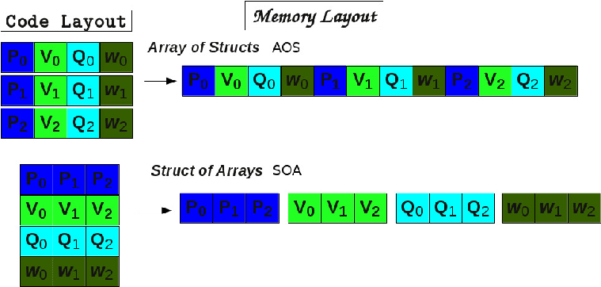
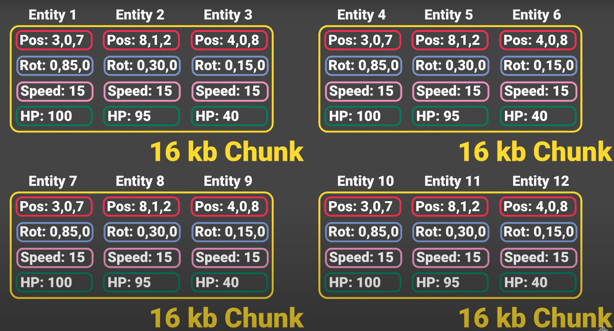

# 概念
	- ## ECS,
		- **Entity, Components, System**
		- ### Entity
			- **实体**，即一个带有若干Component的物体
			- 在实际实现中，Entity自身往往只是一个整数ID，作为一个**键**连接若干个Component的
			- 在Unity中，Entity本身并不存储组件，也不存储到底有哪些组件在Entity上，其主要包含两种信息
				- 索引(Index)，作为一个Entity的Identifier指向唯一entity
				- 版本(Version)
					- 在unity中，Entity的索引是循环赋予的，同样的索引可能被回收之后赋予其他Entity
					- 因此Version用于区分这个Entity的Index是第几次被赋予一个Entity，其值会在这个Index每次赋予一个新的Entity时加一
					- 所以判断两个Entity是否相等，不仅要判断Index是否相等，还要判断版本是否也相等
						- 使用``Equals``函数
				- 索引和版本都是一个**四字节整数**
		- ### Component
			- **组件**，即实际数据存储的最小逻辑单位
			- 一个实体可能会挂载多个组件
			- 相同类型的组件在内存中一般会被紧密相邻储存，以达到最大效率
		- ### System
			- **系统**，即实际完成各种逻辑的controller
			- 系统一般是对除了给定的实体以外无副作用，无状态的
			- 针对各个实体，实际上是针对组件进行操作
			- 各个系统之间为了最大化并发，需要指定各自之间的运行顺序，因此需要对系统进行**分组**
				- Unity提供了一些默认Group，包括：
					- **InitializationSystemGroup**
						- 一些负责进行初始化的System应该被置于此处
					- **SimulationSystemGroup**
						- 大多数游戏逻辑系统置于此处
					- **PresentationSystemGroup**
						- 通才在Simulation之后执行，用于准备和提交渲染数据
		- ### 相较于OOP
			- 和OOP相比，ECS最大的特点是数据和逻辑完全分离
			- OOP中一个对象同时会有一些改变自身或其他对象状态的函数，而在ECS中，实体和组件完全没有任何逻辑，知识单纯的数据，而系统则没有状态，不存储任何数据，仅负责进行逻辑操作
	- ## DOTS
		- **Data Oriented Technology Stack**
		- Unity中的，用以完成数据导向编程的三个套件的组合，包括：
			- #### ECS
				- 组要是``Unity.Entity``，包含了一些用于完成ECS的组件
			- #### Job Systems
				- 任务系统，可以将一些工作高效安全地分配给多线程去完成
			- #### Burst Compiler
				- Unity提供的一个基于**[[$red]]==LLVM==**的，**将`.NET`中间语言(IL, CIL)代码翻译成高度优化之后的[[$red]]==原生(Native)代码==**的编译器
				- Burst编译器转为任务系统而生
				- 利用CPU提供的**SIMD(Single Instruction, Multiple Data)**指令集，生成高效代码
				- 在Unity中，如果要实际使用Burst Compiler，那么要首先include ``Unity.Burst``，然后在需要使用Burst编译的Job structure上加上`[BurstCompile]`注解
	- ## Unity ECS概念：
		- Unity实现的ECS版本有一些独特的概念
		- ### Chunk
			- 一个16KB大小的连续内存空间
			- Unity ECS实现中实际用于存储的内存环境
			- #### SoA和AoS
				- {:height 144, :width 319}
				- **SoA: structure of Arrays**
					- chunk中存放entity的方式
					- SoA中的Array被叫做Parallel Arrays，即：
						- 每一个Array中的相同下标的元素一定属于同一个Entity
						- 例如，``pos[2]``和``hp[2]``一定都是属于下标为2的实体的
				- **AoS: Array of Structures**
					- 传统布局
				- [[$red]]==**采用了SoA是Unity ECS高效的关键！**==
			- {:height 280, :width 502}
			- 所以如果某种entity所具有的组件越多，一个Chunk能装下的entity就越少
			- 但是有一些component的开销在单个entity上是0，即**Zero Cost per Entity**，包括：
				- Tag Component
				- Shared Component
				- Chunk Component
				- 0开销的原因是这些component是在一个chunk中共享而不是每个entity都有一个
		- ### ArcheType
			- 拥有特定component的Entity类型
			- 创建后全局只有唯一实例，即单例
			- 例如，既拥有translation又拥有speed component即为一个ArcheType
			- 可以理解为一个用于快速查询符合条件的entity的identifier
			- Unity实现保证**一个Chunk中的所所有Entity都属于同一个ArcheType**
				- 因此如果不仔细规划，可能会出现内存利用率极低的情况，大量属于不同ArcheType的entity会被分散分配到内存各处
			- 使用ArcheType可以：
				- 创建符合ArcheType的Entity
				- 查询Entity
				- 查询一个Chunk可以容纳多少个此ArcheType的Entity
					- 使用`ChunkCapacity`函数
				- 查询目前用于容纳此ArcheType的Entity的Chunk的数量
					- 使用`ChunkCount`函数
				- 对比两种类型的ArcheType有什么不同
					- 使用``CalculateDifference``函数
				-