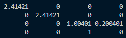
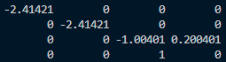
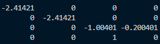
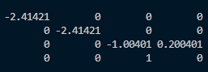

# 整体框架
	- 分为三部分，驱动文件(main.cpp)，光栅化类(rasterizer.cpp)，三角形类(triangle.cpp)
	- ## `rasterizer.cpp`
		- 主要负责生成渲染器界面并绘制图形
-
- 什么都不改
	- 
- ``float t = -std::tan(eye_fov/2.0/180.0*MY_PI) * std::abs(zNear);``
	- 
- `zNear`，`zFar`都取负
	- 
- 将$M_{persp}$矩阵的前两行取负
	- 