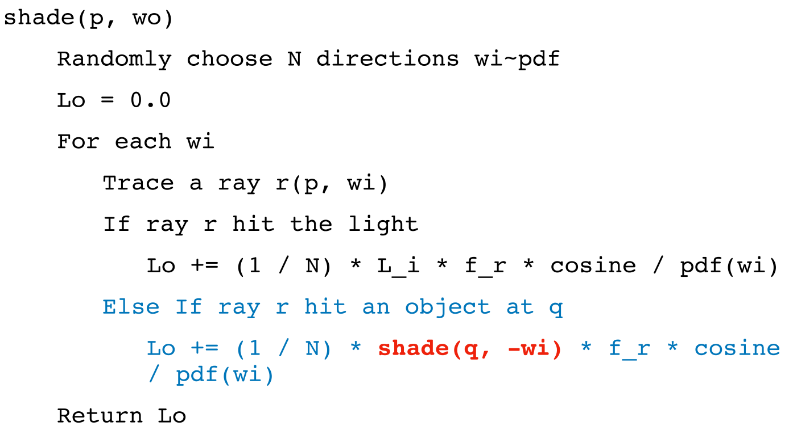

- 这次作业比较难，虽然实际代码量并不大，但是要完全正确地实现，需要相当多的思考和对于path tracing的细致正确理解
- # 回顾path tracing实现思路
	- **[[$red]]==牢记：== 路径追踪本质上是在求解一个渲染方程**
	- ## 第一步：到底要求什么
		- ### 像素的颜色是怎么来的？
			- 从现实的角度来看，人眼看到的某点的颜色来自于该点物体表面所反射的光
			- 由于光路的可逆性，我们选择对于每一个像素，从人眼(摄像机位置)处向该像素所在的位置发出一道光线，该光线若击中某个物体，则计算该表面会反射的光线
		- ### 如何计算某个物体表面某个点会反射的光线？
			- 这就是辐射度量学介入的地方
			- 在传统的递归式光追(Whitted-Style)中，直接从像素方向处发射若干光线，每一根光线递归地计算其碰撞之后地反射方向，最后加权求平均贡献度，得到最终颜色
			- 但是在辐射度量学告诉我们，某个点向**某个方向反射**的光线和其在**某个方向吸收**的光线是有关系的，满足一定的分布模式，**BRDF**函数就是用于描述这种关系的
			- 这最终导出了**渲染方程**：
				- {:height 63, :width 574}
		- **[[$red]]==我们要求的，就是对每一个被集中的物体表面的点，求解这个渲染方程==**
	- ## 第二步：如何求解？
		- 仔细观察渲染方程，可以法线求解其主要有两个难点：
			- **如何计算积分？**
			- **存在递归计算情况，什么时候递归结束？**
		- 因此对于此方程的求解主要围绕这两个问题进行：
		- ### MC采样计算积分
			- 使用MC采样来进行积分计算，那么首先要选择一个合适的PDF。考虑到是在半球上做积分，那么可以选择在半球上均匀分布的PDF，即$\frac{1}{2\pi}$
		- ### 使用RR解决递归结束条件
			- 直接设定一个预期的最大递归深度是无法得到正确答案的，这也是Whitted-Style光追选择的方法
			- 在path tracing中使用俄罗斯轮盘赌(RR)来解决递归问题，即对于每次计算：
				- 有$P$的概率发射光线，假设发射之后的计算结果为$Lo$，则返回$\frac{Lo}{P}$
				- 有$1-P$的概率不发射光线，这种情况直接返回0
			- 通过RR，能够得到正确的期望，同时递归的层次的期望也维持在一个可接受的范围内
		- 通过以上两种方式，得到伪代码：
			- {:height 240, :width 419}
			- 随机选择符合pdf分布(由于选择了$\frac{1}{2\pi}$，也就相当于在半球上均匀采样)的N个方向
				- 向这N个方向发用光线并计算
	- ## 第三步：优化采样方式，完成路径追踪算法
		- 上述方式有一些问题
			- 每次计算都进行N次采样，在递归计算时非常容易发生状态爆炸，每递归一层，其状态数就多一层指数。
			- 某些光源面积很小，进行随机采样效率低且效果不好
		- 针对上述两种问题，分别进行解决
		- ### 仅进行一次随机采样
			- 只要在每次采样仅进行一次的情况下才不会发生状态爆炸，这样一来每次计算都相当于是在追踪光线传播的路径，因此也叫路径追踪
			- **仅采样一次导致的[[$red]]==噪点过多==如何解决？**
				- 答案是**针对每个像素点进行多次采样**，最终求平均
					- 也因此引入了**Samples Per Pixel**，SPP的概念
				- 因为我们修正了MC采样的方式，因此不会产生状态爆炸，在每个像素点上增加采样次数不会产生指数级的复杂度上升，而只是倍数
		- ### 直接对光源进行采样
			- 将采样分为两项，对光源，即**直接光照**在光源的面积上进行采样，对由其他物体反射出的光线，即**直接光照**，使用RR进行递归式地计算
		- 得到最终的路径追踪算法：
			- {:height 364, :width 504}
			- 注意此算法中，对于间接光照仅采样一次
- # 代码实现
	-