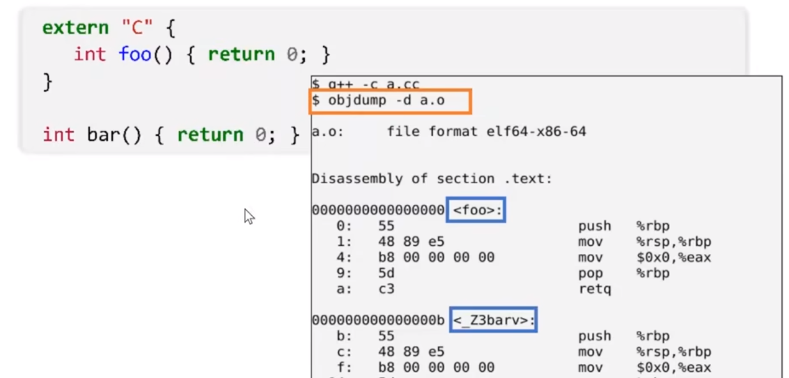

- 不加任何参数会生成.out文件，该文件可以直接执行
- # 预处理
	- `gcc -E hello.c -o hello.i`
	- 基本上是一个replace的过程
	- 删除所有 \#define，展开宏定义
	- 处理所有条件编译指令，\#if, \#ifdef等
	- 处理\#include，插入文件到预编译位置，递归进行
	- 删除所有注释
	- 添加行号和文件标识
	- 保留所有\#pragma编译器指令
	- **发生在编译之前**，使用宏的过程也成为**元编程**
- # 编译
	- `gcc -S hello.i -o hello.s`
	- 会首先通过编译器前端获得平台无关的中间码，由中间码生成汇编代码
	- 获得汇编代码，为AT&T格式
- # 汇编
	- `gcc -c hello.c -o hello.o`
	- 获得机械码
- # 链接
	- 连接器ld将各个目标文件组装拼接在一起，解决符号依赖，库依赖关系，生成可执行文件
	- 每一个需要被链接的文件叫做**编译单元(compilation unit)**
	- 只要是目标代码都可以连接在一起，和从什么语言编译而来无关（语言无关，平台相关）
	- **[[$red]]==为什么c不允许函数重名，而c++允许(函数重载)？==**
		- 因为c在编译为目标文件的时候，每个函数的命名时直接以函数名命名的
		- 而c++在编译为目标文件时，为给每个函数增添一些前缀或后缀，来表明其返回值类型和参数类型
		- 
	- ## 静态链接：
		- 静态链接库是一些.o文件的集合
		- 连接时将相应.o文件添加到可执行程序中
	- ## 动态链接
		- 连接时之创建一些符号表，运行时将有关库代码装入内存，映射到运行时相应进程的虚拟地址空间
	- ## 链接过程与符号表
		-