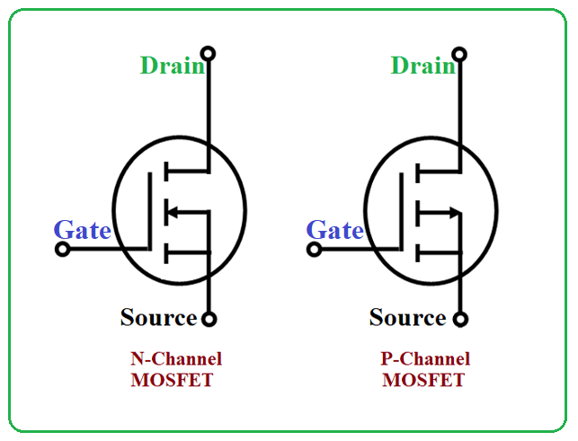

- 由np节组成
- **保持mos管的打开不需要持续的电流**，只要寄生电容完成充电就能够持续导通
- # 三个部分
	- **gate**
		- 栅极，上电压可以控制mos管的打开和关闭
	- **drain**
	- **source**
- # 等效模型
	- 可以看作一个被电压控制的电阻
- # 重要参数
	- ## 封装
		- mos管的外形
		- 一般来说封装越大，能承受的电流也就越大
	- ## VGS
		- gs两端的电压差
	- ## RDS
		- ds之间的电阻
	- ## Vgsth
		- ds导通和不导通之间的临界值
		- 对于nmos来说，超过该电业则导通
	- ## Rdson
		- 导通时ds之间的电阻
		- 无限接近于0，但还是有的
		- rdson越小的mosfet管性能越优良，也越贵
	- ## Cgs
		- g和s之间的寄生电容
		- 影响mos打开速度
		- 越大的cgs充电速度越慢，打开也就越慢
		- 一般来说和rdson成反比
- # nmos和pmos
	- 
	- nmos：Gate高电压则导通
	- pmos：Gate低电压则导通
	- 一般来说nmos的rdson比pmos要小
	- pmos的vgsth是负值，即g处的电压要低于s处的电压才能导通
	- np之间的ds相反
		- n：d接正极，s接负极
		- p：d接负极，s接正极