- # pre笔记
	-
- 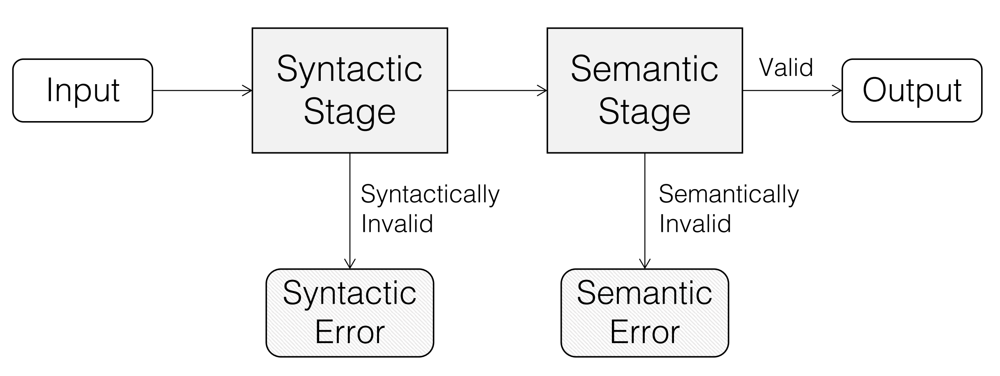
- # 目标
	- 拥有复杂输入的程序一般都会有一个事先处理输入数据的input handler，该类handler会把复杂的输入转换为运行时数据结构，方便后续程序进行实际性的工作（说白了就是某种程度上编译器）
	- 验证input handler程序
	- 该类程序有两个阶段，语法分析阶段和语义分析阶段
		- 语法分析阶段将输入拆分成内部数据结构便于后续处理
		- 语义分析阶段检测输入是否满足一些语义约束，并且执行核心程序
	- 对于该类程序进行自动测试有两个难点
		- 生成能够满足复杂语法约束的输入
		- 生成的输入能够深入语义分析阶段且执行足够多的路径
	- ## 目前广泛使用于该类程序自动测试的几种方法
		- **QuickCheck**
			- generator-based 测试方法
			- 短时间内生成大量合乎语法的随机测试用例
			- [[$red]]==缺点==：
				- 生成的输入并不能很好地深入语义阶段的执行路径
		- **Coverage-guided fuzzing**
			- 例如AFL
			- 对已知地输入进行突变来生成新的输入
				- 突变手段包括
					- 位翻转
					- 字节连接
			- 如果突变的输入覆盖了之前不曾覆盖的代码，则该输入会被保存下来用于新一轮的突变
			- [[$red]]==缺点==：
				- 生成的输入大多不符合语法规范，大多数时候无法穿透语法分析阶段，能够找出的bug大多处于语法分析阶段
				- 需要大量时间的fuzzing才能发现深层次的bug，无法在时间预算不充裕的持续集成系统中使用
	- 因此提出Zest，结合了两种方法的优点，
		- 既能生成大量符合语法规范的输入，又能够利用返回的覆盖报告进行突变
		- 将随机生成改为根据随机种子定向生成，给定随机种子，生成的输入是确定的
			- 改进的生成器叫做**[[$blue]]==参数化生成器（parametric generator）==**
			- 如此一来，对*参数*的位级别突变会导致最终输入的结构性突变，且该突变后的输入也是符合语法规范的（区别于直接对输入的随机突变可能导致生成大量非法输入）
	- ## contribution 总结：
		- 提出一个新的反馈驱动型生成器算法，该算法利用参数成成结构化的输入，并根据反馈进行搜索
		- 基于java实现了Zest，并且进行了Zest和AFL，QuickCheck的对比试验，验证了Zest在真实环境中能够更加高效地找出语义分析阶段的bug
- # Generator-Based Testing
	- 用户可以根据需求自己编写生成器，测试灵活度较大
	- 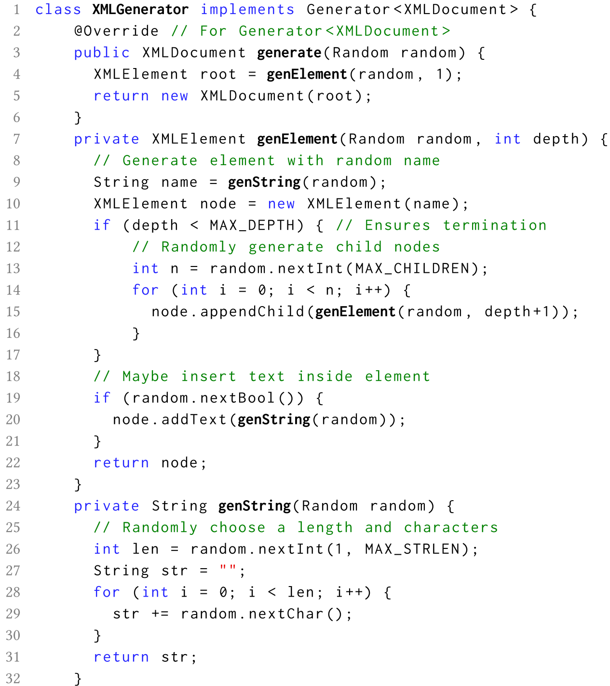{:height 537, :width 451}
	- 上面的示例可以生成一个随机的XML输入。
		- 该生成器接受一个随机对象输入
		- 事先指定最大生成
		- 首先生成一个根节点，然后一层一层随机生成子节点，每个子节点的数量都是随机的
		- 生成某一结点时，会用一个随机字符串作为其tag名，同时其是否含有内容也是随机的，如果含有内容则会用一个随机字符串去填充
	- 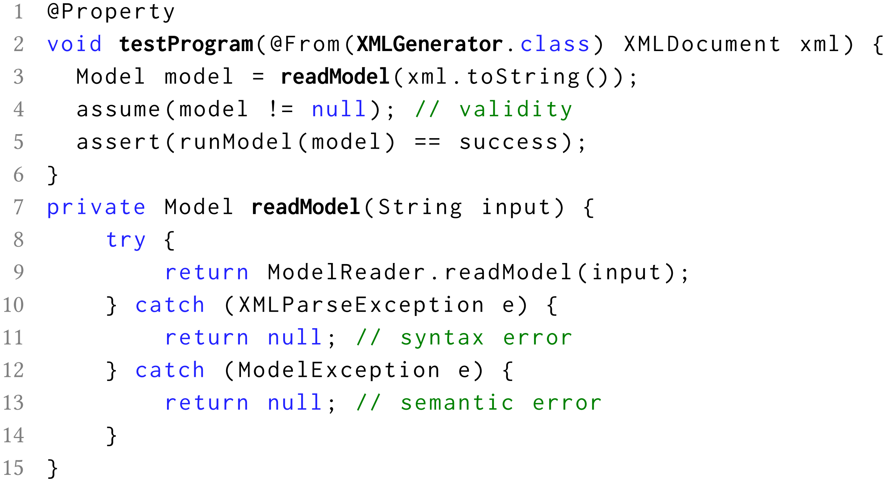{:height 374, :width 411}
		- 上面的示例给出了一个测试程序的例子，每次随机生成一个xml文件，然后丢给被测程序跑，如果不符合语义规范就抛弃该输入
		- 实际上第11行应该是永远不会被执行的
	- ## 实际效果
		- 在用该方法实际测试apache maven model reader时，仅有0.09%的生成输入是语义正确的
		- 哪怕生成了语义正确的输入，也不足以搜索若有的分支，在实验中，语义分析阶段的代码分支分概率仅有1/3
			- 原因是生成器和被测试程序之间的结合不够紧密
- # CGF
	- 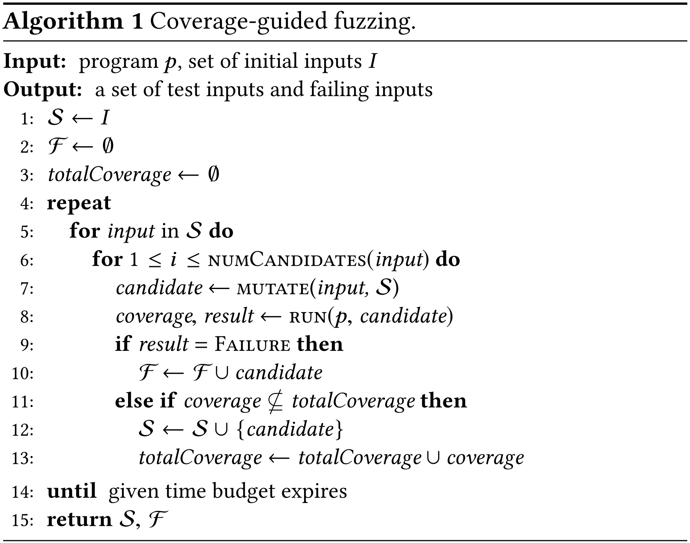{:height 317, :width 393}
	- 接受一个待测程序和一个初始种子输入
	- 初始化时，将初始输入放入输入集，将failure set置为空，totalcoverage置为0
	- 循环的每一次执行，从input中获取一个输入，对其进行若干次突变，每一个输入的突变次数取决于相关实现（implementation-specific heuristic）
	- 突变操作包括将其他输入的子集集合起来等
	- 突变形成的新输入将被输入程序执行
	- 如果成功且找到了新的覆盖点，则将该输入放入输入集中以便后续的fuzzing，且更新total coverage
	- 反之则将该输入返给failure set
	- 所给的时间预算使用完之前，该循环会一直执行
	- [[$red]]==缺点==
		- 现行的CGF工具虽然会利用覆盖度报告，但是对于生成输入的语法合法性是完全不关心的
		- 最新的CGF工具都将输入作为一个字节序列来看待
			- 因此其突变操作包括
				- 位翻转
				- 字大小段落的算术运算
				- 将随机的字节置为随机值，或一些容易引起异常的值，比如最大整形数
			- 导致其生成的输入大多是无法通过语法检查的
		- 虽然在寻找语法分析阶段的内存相关bug时（例如buffer overflow）相当有用，但明显在测试对于输入的结构性要求很高的程序时效率较为低下
		- 一个典型的CGF生成的输入为：<a b>ac&#84;a>，这样的输入根本无法进入语义分析阶段，对于其进行突变所得到的新输入同样难以穿透语法分析
		- 需要花费很多时间才能找到一个non-trivial的bug
- # Zest
	- 利用参数序列来生成确定性的结构化输入
	- 回馈驱动型
	- 实质上就是一个生成器算法
	- 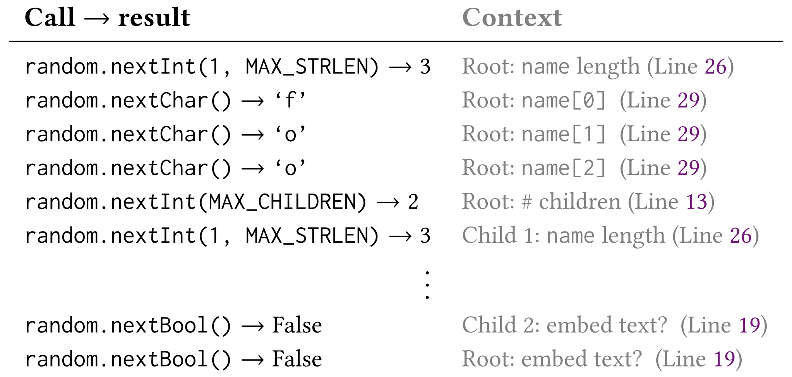{:height 253, :width 513}
	- 原有的生成算法利用一个随其对象在每一次需要随机数时生成所需的随即结果
	- 对其进行改动，现在的生成器会需要一个二进制串输入，这一个二进制串被称为无类型参数序列。
		- 生成器每次需要一个随机参数时，不再利用随机对象生成，而是消耗掉参数序列中的一部分二进制位，即一个参数，利用某些确定的算法生成确定的结果。
	- 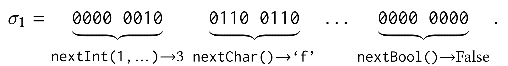
		- nextInt的生成函数可能为n % (b − a) + a，n是从二进制串中获取的一部分二进制位转义而来，a是下限，b是上限
	- 经过修改之后的生成器就叫做参数化生成器，接受一个无类型的二进制串作为输入，生成一个结构化的测试输入
	- 修改只需重载随机类就能实现，使其不再每一次调用都生成一个伪随机对象而是从一个参数序列中中消耗部分二进制位来生成所需类型数据。
	- ## 两个重要的观察
		- 只要生成器只生成语法合法输入，则任何一个无类型参数序列都会经过该生成器生成一个合法输入
		- 对无类型参数序列进行位级别的突变会导致最终生成的输入发生结构性突变，且突变之后的输入也是语法合法的。
		- 一些例子
		- 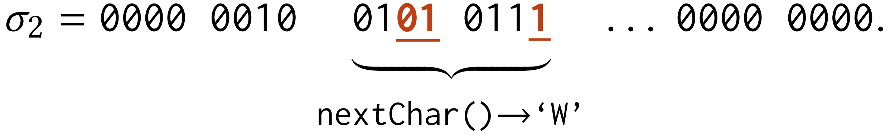
		- 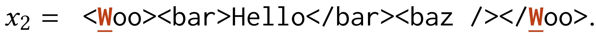{:height 60, :width 716}
		- 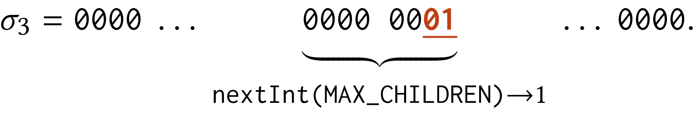
		- 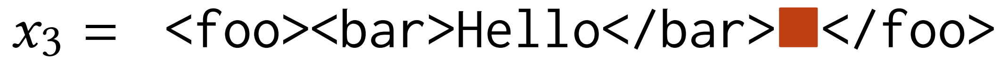
			- 末尾未使用的多余参数会被简单地忽略掉
		- 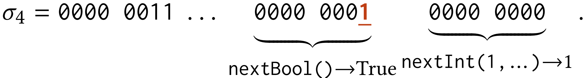
		- 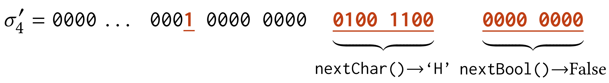
		- 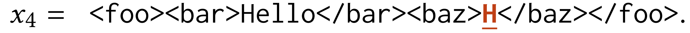
			- 如果参数不够用，则会在其后添加随即位直到足够为止
	- ## 基于参数化生成器的算法
		- 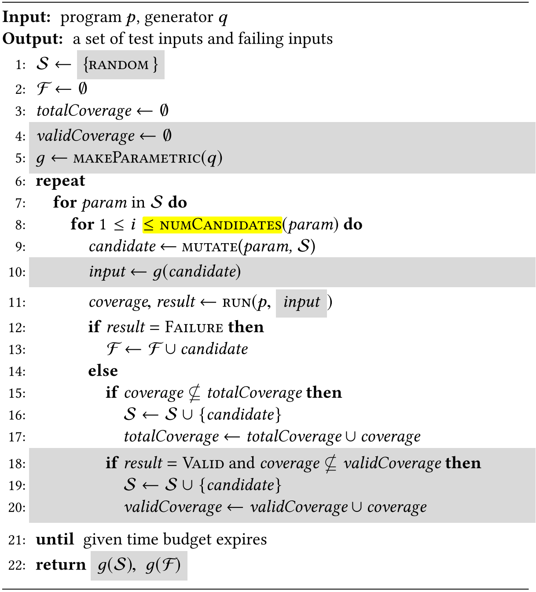{:height 399, :width 357}
		- 给出一个生成器，q，然后把其变成一个参数化生成器g
		- S是种子集
		- F是失败集合
		- 对于每一个参数序列，都会进行fuzzing，fuzzing的数量体现出了feedback-directed 的特性
			- 对于每一个参数序列，都会对其进行一定的评价，确定fuzzing的次数
- # 实现
	- Zest基于JQF实现，JQF通过一系列技术可以获取代码的覆盖情况，达到feedback-directed 的目的
	- 另一个实现重点是重写随机类，Zest的实现涉及到将一个伪随机类改写为参数化的随机类
	- 对于参数序列的突变通过以下方法完成字节级别的突变
		- 随机选择将要突变的次数
		- 对于每一次突变，随机选择突变字段的长度l和突变偏移量k
		- 将k到k+l的字节替换为另外l个随机字节
		- m和l的选择采取几何分布，大概率的到小的值，其平均值设为4，因为4字节的整型值是需求量最大的。
	-
	-
	-
	-
	-