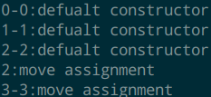

- move是**转移对象的所有权**，而不是移动对象本身
- [从汇编角度看move](https://zhuanlan.zhihu.com/p/389978619)
- # 再次理解变量
	- **变量**，是有名字的对象
	- **对象**，是存储某个类型的值的内存区域
	- **值**，是按照类型进行解释的**比特集合**
	- **类型(type)**，定义一组可能的值和(作用于对象的)操作
	- 变量可以从实用角度分为两类
		- **trivial type**：非指针，非引用变量
		- **handle type**：指针，引用变量
	- trivial type**可以**直接放在栈上，或在大小允许的情况下放在寄存器中
		- 也可以放在堆中，**new出来的**变量，其handle就是在堆中的
	- handle type实际存储时一般分为两部分，以``std::vector``为例，
		- 栈上存放有capacity，size和指向堆中数组的指针
		- 堆中存储实际数组
	- 存在于栈上的数据便叫做**handle**，如同把手一般用于**抓住堆中的数据**。
		- 因此栈上数据也是堆中数据的**所有者**(owner)
	- ``std::move``针对的是handle type，对于trivial type使用move一般不会带来好处
	- C++中对直接赋值(``=``)实际上是copy，内存中有了两份独立的数据，并没有转移所有权
- # 值类型和move的关系
	- **用prvalue初始化glvalue**：直接构建，不调用拷贝或移动构造函数
		- [[$red]]==个人理解：==如果是基础类型，使用立即数寻址直接将值存入内存或寄存器，如果是一个对象，那么直接将地址存入内存或寄存器
		- 从代码的角度上来讲就是直接调用构造函数，而**不是**移动或拷贝构造函数
	- **用xvalue初始化lvalue**：会调用移动函数
	- **用lvalue初始化lvalue**：会调用拷贝构造函数
	- xvalue**可以直接被move**(使用赋值``=``就是被move)
	- prvalue被move时会生成一个临时xvalue，实际被move的是这个**xvalue**，也是直接使用``=``就能move
	- lvalue被移动**也会**生成一个xvalue，但是要使用``std::move``才能被move
	- ```
	  class Book {
	  public:
	    int m{3};
	    Book() {
	      std::cout << gI << ":"
	                << "default constructor\n";
	    }
	    Book(Book &&b) {
	      std::cout << gI << ":"
	                << "move constructor\n";
	    }
	    Book(const Book &b) {
	      std::cout << gI << ":"
	                << "copy constructor\n";
	    }
	    Book &operator=(const Book &) {
	      std::cout << gI << ":"
	                << "copy assigment\n";
	                return *this;
	    }
	    Book &operator=(Book &&) {
	      std::cout << gI << ":"
	                << "move assignment\n";
	                return *this;
	    }
	  };
	  int main() {
	    gI = 0;
	    std::cout << gI << "-";
	    Book bb = Book(); // prvalue直接初始化 default constructor
	    gI = 1;
	    std::cout << gI << "-";
	    Book b; //  default constructor
	    gI = 2;
	    std::cout << gI << "-";
	    b = Book(); // 移动 pravlue
	  
	    gI = 3;
	    std::cout << gI << "-";
	    bb = std::move(b); // lvalue转换成xvalue，然后移动
	  }
	  ```
	- 
- # ``std::move``的一般应用
	- ## 接管资源
		- ```
		  void My::take(Book && iBook) 
		  {
		    mBook = std::move(iBook); //将没人要的iBook，拿过来据为己有
		  }
		  ```
	- ## 转移所有权
		- ```
		  auto thread = std::thread([]{});
		  std::vector<std::thread> lThreadPool;
		  lThreadPool.push_back(std::move(thread)); //现在thread pool来掌控着thread
		  ```
	- ## 避免拷贝
		- 将右值引用作为函数形参，而实参使用``std::move``传值，可以避免拷贝
		- 使用一般引用也可以避免拷贝，两者的区别可以参看 [[C++ 引用与指针]]
	- ## 自定义移动函数
		- 自定义的类可以自己设定移动构造函数和操作符到底会执行怎样的行为，会不会指控被移动对象
		- 定义构造函数和重载运算符时将右值引用作为形参就行