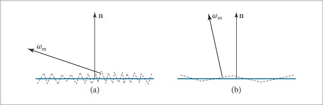
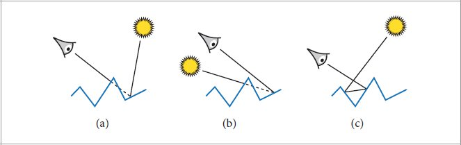
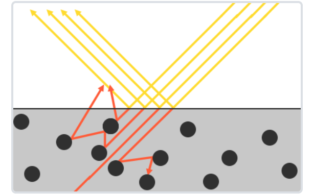

# Why？
	- 入门的Lambertian模型，Blinn-Phong模型中的简单理想反射，折射模型不够真实
	- 需要基于物理的材质模型来进行更精确的描述
- # What？
	- 将物体在宏观下的**宏表面(Macrosurface)**在微观上视作由若干**微表面(Microfacets)**组成
	- 每一个微表面是一个**完美平面**，意味着其反射率100%
	- 这些微表面的朝向约一致，那么宏表面看起来就更加光滑；如果微表面的朝向过于不规律，那么各个微表面反射出来的光线被互相遮挡，宏表面看起来就更加粗糙
		- 
		- 换言之如果某个区域内所有微表面的法线$n_f$分布基本一致，那么表面就光滑，反之则粗糙
	- 微表面反射模型由**两个部分组成**，分别是
	- ## 微表面[[$red]]==分布==的表达
		- 不仅要考虑微表面**法线**的分布，还要考虑**[[$red]]==三种局部几何效果==**
			- {:height 211, :width 643}
			- a）**Masking**：某个微表面反射的光线被其他微表面遮挡，无法到达人眼
			- b）**Shadowing**：光源被某个微表面遮挡，因此不能反射进人眼
			- c）**Interreflecting**：光源在微表面之间来回反射，最终进入人眼
	- ## 每个微表面的[[$red]]==BRDF==
		- 两种常见模拟
		- ### The Torrance-Sparrow Model
			- 将每个微表面视作**理想镜面**，**完美反射**，**[[$red]]==最常用==**的模型
				- 进一步可以；拓展为完美**玻璃面**，**完美反射**，**完美折射**
		- ### The Oren-Nayar Model
			- 将每个微表面都视作**理想漫反射面**(Lambertian)
			- 适用于对完全粗糙的表面进行建模
				- 例如塑料
		- 基于这两种BRDF的选择，微表面模型可分为两种
- # Cook-Torrance模型
	- 是微表面模型的一种
	- 其对**漫反射**有另外一种解释：
		- {:height 246, :width 365}
		- 光线折射进入物体内部之后会与物体内部的微小粒子不断发生碰撞
		- 有的光线在物体内部反射若干次之后能量消耗殆尽没能重新射出表面，这部分光线的能量会被物体完全吸收，转换为内能
		- 有的光线在若干次反弹之后重新射出表面，这部分就光就形成了漫反射
			- 不过注意漫反射出来的光有可能出射点不再是入射点，但是在此模型中不考虑这种情况
			- **次表面反射(Subsurface Scattering)**技术考虑了这一特性
	- 在此模型下，**BRDF的定义为**：
		- $f_r = k_d f_{lambert}+k_s f_{cook-torrance}$
		- $k_d$表示入射光线中被折射部分的能量占比
		- $k_s$表示入射光线中被反射的比率，一般由**菲尼尔项**决定
			- 菲尼尔项见第七章笔记
		- $f_{lambert}$指漫反射的BRDf
		- $f_{cook-torrance}$指镜面反射的BRDF
	- 总的来看，是漫反射项，镜面反射项两部分的BRDF结合在一起得到最终的BRDF
	- ## 漫反射项
		- 由于漫反射会均匀反射到各个方向，因此漫反射项的的BRDF是一个常数
		- 由于入射光均匀分布在半球上，则在没有能量损耗，所有能量都均匀漫反射出去的情况下，BRDF为$\frac{1}{\pi}$
		- 如果存在损耗，那么增加一个小于1的修正项$\rho$，最终的BRDF为$\frac{\rho}{\pi}$
	- ## 镜面反射项
		- 镜面反射项的形式记作：$f_{cook-torrance} = \frac{F(l,h)G(l,v)D(h)}{4(n\cdot l)(n\cdot v)}$
			- $l$为入射方向
			- $v$为观察方向，或反射反向
			- $n$为**宏表面法向量**
			- $h$为**微表面法向量**
			- 函数$D$为**法线分布函数(Normal Distribution Function)**
				- 表示所有微表面法线的分布情况
			- 函数$G为$**几何函数(Geometry Function)**
				- 描述了微表面平面自我震荡的属性
				- 越粗糙的表面越容易出现自遮挡
			- 函数$F$为**菲尼尔方程(Fresnel Equation)**，描述了物体表面不同入射角和观察角度之间反射光线的比例
		- 函数$G$和$F$均描述了某些光线因为入射方向和观察方向能否反射的性质，本质上规定了反射比例
			- $0\le G(l,v)\le 1$
			- $0\le F(l,h) \le 1$
		- ### 法线分布函数$D(h)$
			-
		-