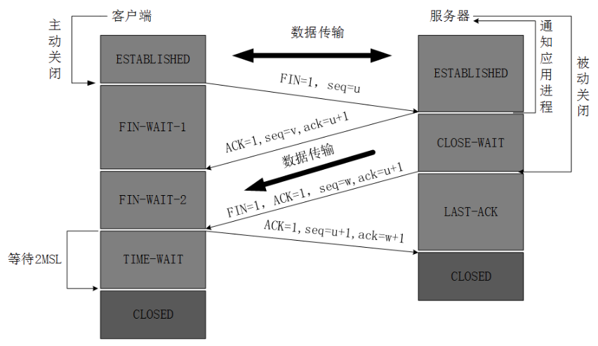
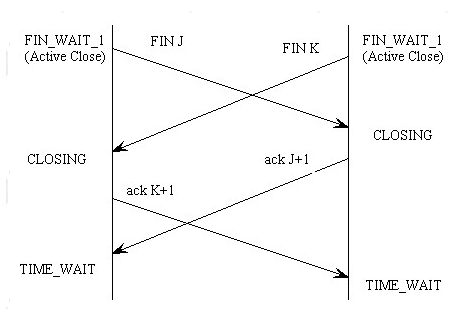

- {:height 440, :width 746}
- 发送FIN为1的报文表示本方**已经完成了数据传输**，之后不再发送数据
- 而TCP连接是双向的，所以要两方都完成了数据传输才能完全关闭一个tcp连接
- 也可以存在同时关闭
	- 
- **如何[[$red]]==安全==关闭连接并清理状态？**
	- 在关闭连接的过程中可能会出现一些意外
		- 例如对于FIN报文段丢失的情况如何处理
	- 已经完成的连接因该被回收(主要是回收端口)
		- 如果刚结束一个连接，立即重用其端口号时也有可能因为序列号重叠导致数据损坏
	- **解决方案**：主动提出关闭连接的一方需要进入**TIME WAIT**状态
		- 只要是在**收到一个FIN报文段之前**发出一个FIN报文段的都属于主动关闭连接方
		- 在此状态下，将连接的socket**保留2MSL**(Maximum Segment Lifetime)
	- 但是等待两个MSL可能会在服务器端导致一些问题
		- 太多的socket处于等待状态会减慢运行速度
		- 可以使用一些方法来跳过这个状态
			- 设置SO_LINGER的I_linger为0
				- [[$red]]==存在风险，可能会导致丢失最后一点未发送的数据==，谨慎使用
			- 设置SO_REUSEADDR，可以重新绑定端口号(操作系统通常不允许在正在使用的端口号重启服务)
				- 设置好后，若端口忙，但是该端口是处于TIME WAIT状态，则可以复用该端口
					- 如不是处于TIME WAIT，设置了SO_REUSEADDR也无法重用被占用的端口
					- 允许重用的是本地端口，但仍然存在重用之后**收到非期望数据**的情况，谨慎使用
				- SO_REUSEADDR允许同一port上启动同一服务器的多个实例(多个进程)。但每个实例绑定的IP地址是不能相同的(多网卡或使用IP Alias技术)
				- SO_REUSEADDR允许单个进程绑定相同的端口到多个socket上，但每个socket绑定的ip地址不同
				- SO_REUSEADDR允许完全相同的地址和端口的重复绑定。但只用于UDP的多播，不用于TCP
	-
	-