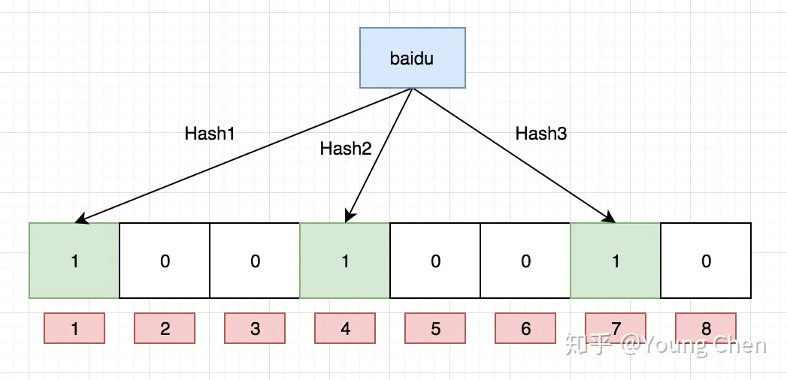
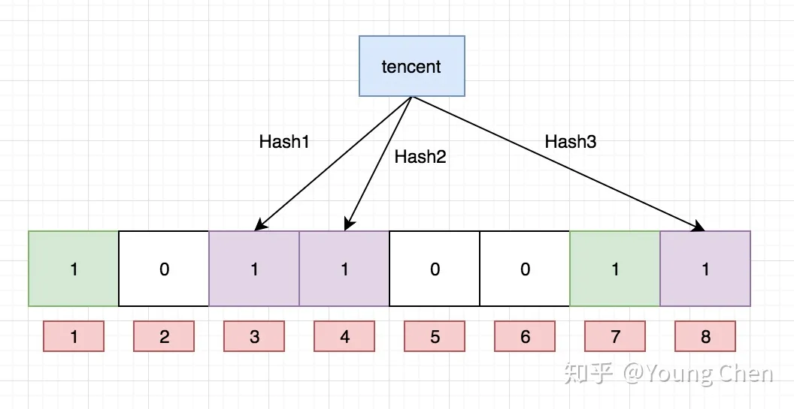
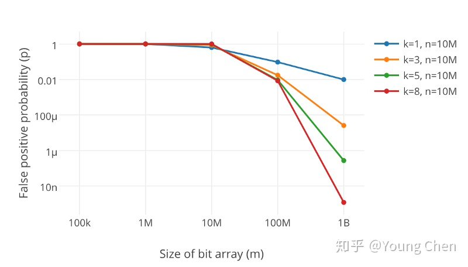

# 大数据量中判断数据是否存在
	- [参看](https://bbs.huaweicloud.com/blogs/338328)
	- ## 典型问题
		- 数亿个整数中，如何判断重复？如何判断某一个数是否在这些数中？
	- ## 方法1：位图
		- 核心思想很简单，就是一个数用一个位表示，为0表示不存在，为1表示存在
		- 此方法的最大限制是其占用内存大小受到数据范围的限制，例如对于一个32位整数来说，假设每一个数用1位来表示存在与否，则存储$2^{32}$次方范围的数需要512 MB
		- 一个简单的位图实现
		  collapsed:: true
			- ```c++
			  class BitMap{
			      private:
			          std::vector<int> map;
			          uint32_t _size;
			      public:
			          BitMap(uint32_t range):map(),_size(0){
			              map.resize((range>>3));
			          }
			          void rerange(uint32_t range){
			              map.resize((range>>3));
			          }
			          bool contains(uint32_t ele){
			              int si = ele>>3;
			              int i = ele % 8;
			              return (map[si] & (1<<i))>>i;
			          }
			          void set(uint32_t ele){
			              if(!contains(ele)) _size++;
			              int si = ele>>3;
			              int i = ele % 8;
			              map[si] |= (1<<i);
			          }
			          void unset(uint32_t ele){
			              if(contains(ele)) _size--;
			              int si = ele>>3;
			              int i = ele % 8;
			              map[si] &= ~(1<<i);
			          }
			          size_t size(){
			              return _size;
			          }
			  };
			  ```
	- ## 方法2：Bloom Filter
		- 本质上还是一个bit数组，但是其会将一个元素随机映射到若干个位
		- 加入一个新的元素时，将其被映射到的位置为1
		- 
		- 
		- 如果某个元素所映射到的所有位都为1，那么其**[[$red]]==可能==**存在于此集合中
			- 由于hash冲突的原因，在加入了足够多的元素之后，完全有可能一个元素并不在其中，但是其所映射的所有位都已经被其他的元素置1
		- 如果某个元素所映射的某个位在数组中尚不为1，那么其**[[$red]]==一定==**不再集合中
		- ### 优点
			- 占用空间小
			- 速度快
		- ### 缺点
			- 有假阳的概率
			- 无法删除
				- 有的实现会将每个bit扩充为若干位的counter来支持所谓的删除，但是这样做会导致几倍的空间代价，并且可能会出现**假阴**
		- 
		-
-