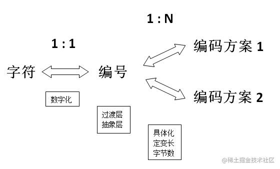
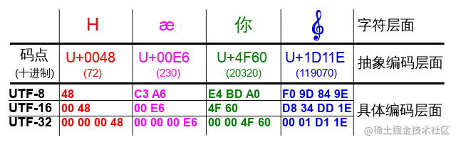

- TODO 看完此文
- [参看](https://juejin.cn/post/6844904159314116622)
- {:height 329, :width 562}
- 编码方案就是如何将一个编号存储到计算机中的过程
	- 例如，对于一个码点``U+0061``(即小写字母a)，具体使用多少个字节来存储，如何存储
		- 对于纯ASCII码来说，使用七个bit位足以``110 0001``
		- GB类编码模式中，使用两个字节存储，即``0000 0000 0110 0001``
			- 这种重新使用两字节编码的ASCII字母和符号，即**全角**字符
			- 原本的单字节编码的ASCII字母和符号即**半角**字符
- # Unicode
	- unicode是一个**字符集(Character set)**，也即一个字符到编号的一一映射
	- 字符集中的每一个字符集中**全局唯一**的编号也就是**码点**(Code Point)
	- unicode中码点的**[[$red]]==表现形式==**为``U+[XX]XXXX``，`X`是一个十六进制数位
		- 一般为4-6位补足4位的补足前导零
		- 超过4位则是多少位就多少位
		- 具体范围为``U+0000 ~ U+10FFFF``，即大概111万个字符
			- 以Unicode官方的说法已经够了， 以后也不扩充了，目前仅使用了11万个左右
	- ## Unicode编码
		- Unicode字符集衍生出了**三种编码方案**，分别是**UTF-32**，**UTF-16**，**UTF-8**
		- {:height 189, :width 638}
		- 码点到UTF-32的转换最为简单，填充到四字节即可，属于**定长编码**
		- 超过``0XFFFF``的码点，一般被称为**大码点**
		- ### UTF-8
			- 对于只有**一个字节**的符号，字节第一位置0，后7位为此符号的Unicode码
				- 因此，可以使用ASCII表示的字符，UTF-8编码模式和ASCII完全相同
			- 大于1字节的符号，假设其大小为n字节，则**第一个字节的前n位全置为1**，第**n+1位设为0**，后面**所有字节的前两位均为10**。剩余没有提及的二进制位组合起来即为此符号的Unicode码点
			- |Unicode 码点范围(十六进制)|UTF-8编码方式(二进制)|字节数|
			  |--|--|--|
			  |0000 0000 ~ 0000 007F|0xxxxxxx|1字节|
			  |0000 0080 ~ 0000 07FF|110xxxx 10xxxxxx |2字节|
			  |0000 0800 ~ 0000 FFFF|1110xxxx 10xxxxxx 10xxxxxx|3字节|
			  |0001 0000 ~ 0010 FFFF|11110xxx 10xxxxxx 10xxxxxx|4字节|
			- 解码UTF-8时，只要一个字符开头是0，那么就意味着这是一个单字节字符，直接作为值返回；如果开头为1，那么有多少位1就代表着包含目前字节在内的往后多少个字节是一个字符编码，按规则取出有效位即可
		- ### UTF-16
			- UTF-16使用**2字节或4字节**边长编码
			- Unicode最初被设计为纯16位编码，即所有码点都采用16位编码，总计65536个码点
			- 随着时间推移，16位编码不再足够，因此最大编码位数被扩充到32位
			- 因此，范围在``U+0000 ~ U+FFFF``之间的码点被称为**BMP(Basic Multilingual Plane，基本多语言平面)**，范围在``U+10000 ~ U+10FFFF``之间的码点被称为**SP(Supplementary Planes，增补平面)**
			- UTF-16利用**BMP代理**对字符既定编码
				- **代理**就是一种实现变长编码的方式
			- 为了适配UTF-16，Unicode规定**``U+D800 ~ U+DFFF``不包含任何字符，专为UTF-16保留**
			- 因此对于超过``U+FFFF``的码点，UTF-16可以直接通过``111010``作为第一部分的标识符，``111011``作为第二部分的标识符，例如：
				- ``111010xx xxxxxxxx 111011xx xxxxxxxx``
				- 构成了20位码点，加上0x10000即可
					- 因为用20位即可表示``U+10000 ~ U+10FFFF``的前提是去掉开头``0x10000``的偏移，其范围会变为``0xFFFF ~ 0xFFFFF``
	- ## Private Use Area
		- 为了和一些机构自己定义的字符码不冲突，Unicode专门保留了一些码点空间让用户可以自行定义
		- 在这些区间的Unicode值不能被视作标准的Unicode字符，对其的解码可自由发挥
		- 在BMP中，PUA的范围是：``U+E0000 ~ U+F8FF``
		- 在15和16平面中也有两块PUA区域，分别是
			- ``U+F0000 ~ U+FFFFD``
			- ``U+100000 ~ U+10FFFD``