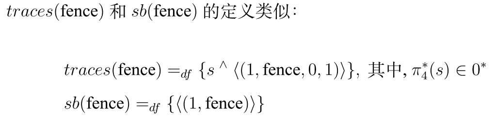

- 补充： [[C++中的memory order]]
- 补充：[[The Denotational Semantics of Programming Languages]]
- # 背景
  collapsed:: true
	- ## 弱内存模型
	  collapsed:: true
		- [[$blue]]==Weak/slack memory model==
		- 为了提高并发程序的执行效率而提出
		- 各个模型得弱化行为
			- TSO：每一个线程拥有一个储存缓冲区
			- PSO：每一个线程中得每一个内存位置拥有一个储存缓冲区
			- ARMv8弱内存模型：线程内前瞻执行，乱序执行和储存缓冲区
			- C++11弱内存模型：Promise，时间戳以及线程试图概念的引入
		- ### TSO 弱内存
			- Total Store order
			- 应用在x86和sparc中
			- store-load顺序(在某一内存地址上)被破坏，但是其余三种顺序仍然被保持，会维护两个读（写）操作之间的顺序
			- 这一放松打破了程序执行的顺序一致性，在并发程序执行时，会出现一些在顺序一致性下不会出现的结果
		- ### PSO 弱内存
			- Partial Store Order
			- 在TSO的基础上进一步放松对于内存操作之间顺序的限制
			- #### 内存屏障
				- **全屏障(full fence)**
					- 必须先把之前内存操作的结果迁移到共享内存中才能进行之后的内存操作
				- **store-store fence**
					- 两个写内存操作之间，必须前一个写迁移到功效内存中之后才能进行下一步内存操作
		- ### ARMv8弱内存模型
		  collapsed:: true
			- 早期满足非多副本原子性(non Multi-Copy Atomic, nMCA)
			- 由于验证和实现成本问题，修改为满足多副本原子性（MCA）
				- MCA：当一个线程对某一其他线程可见时，它要对其他所有线程可见。
			- **单线程中可能出现的打破SC的情况**
				- 当两条语句之间没有依赖之时就会放宽两条语句之间执行关系的约束
					- 具体的，假设有两条语句``x:=e;y:=f``
					- 若：
						- 变量x和y不相同
						- x没有出现在表达式f中
						- 表达式e中不包含变量y
						- 表达式e和f没有读取相同的全局变量
					- 则可以说两条语句之间没有依赖关系
				- 在**前瞻执行**时也会打破本有的执行顺序，分支执行在两种情况下会发生
					- 当分支指令是一条赋值语句``x:=e``时：
						- x是局部变量
						- e和分支判断语句h不会读取相同的全局变量
						- x不在h中自由出现
			- **并发执行**时，由于单线程中可能出现的乱序优化，可能会出现在SC和TSO模型下都不会出现的行为
		- ### C++11弱内存模型
		  collapsed:: true
			- 通常被定义成公理内存模型
			- 会将任意程序的可能执行结果形式化表达成内存访问事件图(Graphs of Memory Access Events)
				- 表达需要遵循一系列的公理
			- C++弱内存模型引入了多种内存顺序，本文关注两种内存顺序
				- **松弛内存顺序(Relaxed Memory Ordering)**
					- 最弱的内存顺序，不会给沦胥执行增加额外的约束条件，亦不涉及任何同步信息
				- **释放/获取内存顺序(Release/Acquire Memory Ordering)**
					- 为线程之间引入了轻量级的线程间同步关系
					- Acquire表示读之后的内存语句不能重排到acquire之前，可以用在load-store，load-load顺序中
					- Release表示写之前的内存语句不能重拍到release之后，可以用在store-load，store-store顺序中
			- #### Relaxed Access(松弛访问)
				- 对于某一个线程T来说，其内存视图是由T中所有出现过的内存位置的时间戳构成的
				- 用于确定内存访问上的正确语义
				- 一个例子，见论文正文15页
				- **松弛原子更新操作(relaxed atomic update)**是对同一内存位置的一对访问操作
					- 包括：读后改(Read-Modify-Write)，比较交换(Compare-and-swap)，取后加(Fetch-and-add)
					- 在promise语义中，需要做出的操作无非是将时间戳更换为时间段，本质上没有区别[[$red]]==(?)==
			- #### Release-acquire access
				- C++11通过内存屏障指令实现线程间的同步操作
	- ## 形式语义学
	  collapsed:: true
		- ### 操作语义
			- 完整描述程序执行过程中可以采取的每一个执行步骤
			- 聚焦于程序**如何(how)**运行
			- 补充： [[小步操作语义和大步操作语义]]
		- ### 指称语义
			- 指称语义是指一个程序**做了什么**
			- 指称语义的优势在于：
				- 可以在没有真实地执行程序的前提下，预测每个程序的行为
				- 基于数学理论，可以对程序进行推导
					- 例如证明一个程序是否和另外一个程序等价
		- ### 轨迹语义
			- 轨迹(trace)是一条记录该进程倒霉事可位置参与行为的符号的有限序列
		- ### 代数语义
			- Algebraic Sematics
			- 不关心一个程序的含义，而是如果两个写法不同的程序有着相同的内涵，则它们可以从代数表达上形成等式关系
			- 代数等势还可以看作是从左到右的重写规则
	- ## 统一理论
		- Unifying Theories of Programming
- # TSO 弱内存模型的形式语义
	- ## TSO的轨迹语义模型
		- ### 一个简单的命令式程序语言
			- 用于帮助描述TSO弱内存模型下的各种程序
			- 
			- v表示实数，e是在实数上的表达式，h是布尔表达式，p是程序，fence是全屏障指令，被隔开的两个内存访问操作不能乱序执行
		- ### 轨迹语义
			- 一个轨迹是一个**快照**的序列
				- 快照的形式为：(id,cont,oflag,eflag)
					- id表示一条可能会带来数据状态变化的程序语句的唯一标识
					- cont表示程序语句带来的数据状态变化，有两种形式
						- (var,val)，表示变量var的值为val
						- fence，表示全屏障指令
					- oflag用于区分不同类型的操作
						- 0，表示全屏障指令
						- 1，表示写入储存缓冲区，针对全局变量
						- 2，表示出队并写入内存，针对全局变量
						- 3，表示写入寄存器，针对局部变量
					- eflag用于表示某一操作是由该线程完成还是由环境线程完成。
						- 1表示是由线程本身操作完成
						- 0表示由环境完成
			- 引入一个函数$\pi_i$，表示从某一快照中获取第i个元素
				- 例：$\pi_1(id,cont,oflag,eflag)=id$
			- 如果cont的形式是(var,val)，则可以双重调用$\pi_i$来获取相应的值
				- 例：$\pi_1(\pi_2(id,cont,oflag,eflag))=var$
			- traces(P)表示程序P的所有可能的轨迹集合
			- sb(P)表示程序P的语句顺序
				- 可以用于检查穿插后的轨迹刻画是否符合程序规范
			- sb序列中的每一个元素的形式为(id, cont)含义和trace中的含义相同
				- sb只包含程序语句，而trace在实际操作中一条赋值语句可能会被拆分为多条trace(一条写入store buffer，一条写入内存)
	- ## TSO的轨迹语义
		- ### 局部变量赋值语句的轨迹语义
			- 局部变量被直接写入到寄存器中
			- 通过将oflag置为3来表达
			- 线程堆内存的[[$blue]]==感知==来源于**[[$red]]==对过往trace中所有快照的扫描==**
		- ### fence的轨迹语义
			- 
		- ### 全局变量赋值语句的轨迹语义
			- 对全局变量的赋值语句会被分解为两个操作
				- 将值写入本线程的储存缓冲区中
				- 在将来的某一时刻将值从store buffer迁移到共享内存中
				- [[$red]]==这两个操作的顺寻是固定不变的==，一定要先到store buffer中才能写入内存
			- 
			- **源于同一条语句的写入store buffer和写入内存操作拥有同样的ID**
			- 
		- ### 顺序组合的轨迹语义
			- 能够体现**线程内**的乱序执行
			- 分为两个步骤
			  collapsed:: true
				- 对进行顺序组合人操作的两个线程的轨迹s和t进行穿插操作
					- 函数inleave(s,t,pc)表示对两条轨迹进行穿插操作
						- pc用于记录顺序组合过程中每条程序语句的出现次序，总是从1开始计数
						- {:height 63, :width 399}
						- {:height 34, :width 419}
							- $inleave_l,inleave_r$分别表示将s的第一个快照进行穿插和将t的第一个快照取出进行穿插
				- 运用能够描述程序顺序和内存改变顺序的po和mo函数提出不符合程序规范所规定行为的轨迹
					- 在包含fence的语句上做简单的上文定义的穿插操作显然会出现一些违反规定的trace
					- 因此使用相应的函数去除掉这些不合规的操作
					- $po$函数用于描述语句之间的程序顺序
						- 输入为一条trace，输出为(id,cont)键值对序列
						- 针对一个快照的oflag进行筛选
							- 返回所有oflag为0,1,3的快照对应的键值对
					- $mo$函数用于描述程序在共享内存上的更改次序
						- 只记录写入内存操作，全屏障指令
			- 整体上顺序组合$P;Q$的语义被分四个步骤定义
				- 选择程序P的一条trace s和Q的一条trace t，对其进行穿插操作
				- 程序P语句出现的次序记录为$sb_1$，程序Q语句出现的次序记录为$sb_2$
				- 对于一条穿插后的轨迹u，检查po和mo作用在它上面的结果是否都是$sb_1+sb_2$的子序列
					- 若检查不通过，意味着该trace不符合规定们需要删除
				- 如果P和Q的所有轨迹都穿插完成，并且穿插后的轨迹都通过了检查，那么得到顺序程序$P;Q$的轨迹语义
		- ### 条件语句的轨迹语义
		- 
		- ### 循环语句的轨迹语义
			- 使用不动点理论定义
		- ### 并发程序的轨迹语义
			- #### 函数merge
				- 通过在并发程序的各自的trace上进行merge操作获得并发之后的最终trace
					- {:height 259, :width 686}
					- $M_1,M_2$函数的作用类似于穿插操作中的$inleave_l,inleave_r$函数，主要是为了特殊处理写入store buffer和写入内存操作之间id必须一致的问题
			- 在定义了merge操作的基础上，给出并发组合的最终轨迹语义
			- 
				- s是P的环境产生的trace，t是Q的环境产生的trace，$\pi^*_4(s)\in 0^*,\pi_4^*(t)\in 0^*$
					- 这意味着在线程执行完成之后页允许环境做任意多数目的操作
			- #### 函数generate
				- 引入函数$generate(tr,pc)$来从程序的一条trace中生成一条sb序列
				- {:height 167, :width 654}
				- 相当于去掉所有环境和写入内存语句的操作很急
			- 并发的sb定义为：
				- 
	- ## TSO的代数语义
		- TSO弱内存模型下的程序的性质往往被用代数规则描述
		- ### guarded choice
			- $h\&(act,tid,idx)$
				- h是一个布尔条件
				- act可以是写入store buffer，写入寄存器，写入内存，也可以是全屏障指令
				- tid记录操作线程的id
					- 用一个树形的方式标记一个线程的tid
					- {:height 189, :width 254}
					- 上图中A和B的tid分别为$<1,1>,<1,2>$
				- idx用于标识一个动作在顺序程序中的位置信息
					- 也用于区分一个动作是否为向内存写入的动作，为2表示是，为1表示不是
			- 卫兵选择能够对一个程序的所有执行(包括乱序执行)进行建模
			- 一个卫兵选择的一般形式为：$h_i\&(act_i,tid_i,idx_i)\rightarrow P_i'[q_i]$
				- 如果满足了布尔条件$h_i$，则相应的程序行为就是$(act_i,tid_i,idx_i)\rightarrow P'_i[q_i]$
				- 如果$act_i$是一个写入存储缓冲区的动作，那么$q_i$的形式为$h'_i\&(act'_i,tid_i,idx_i')$
					- $act'_i$是对应的写入内存的迁移操作，且$h'_i$的值也应该为真
				- 如果$act_i$是一个局部变量赋值操作，或全屏障指令，那么$q_i$为$\varepsilon$
				- 当遇到一个if或while，$h_i$用于记录分支判断语句，对应的$act_i$为$\varepsilon$
				- $q_i$可能会和程序$p_i'$中的pattern乱序执行
			- 卫兵选择在TSO若内存模型下主要有**三种类型**
				- 
					- 如果满足条件，可以进行写入store buffer的操作
				- 
					- 包含了写寄存器，全屏障指令和分支判断组件
				- 
					- 将前两种卫兵选择组合起来
		- ### 首规范型
			- 给每一个程序赋予一个规范型，名为**首规范型(Head Normal Form)**
			- 对于局部变量赋值语句，展开第一部之后没剩余部分为空
				- 
				- E表示空程序
			- 全屏障指令fence的首规范型定义类似于局部变量赋值语句
				- 
			- 全局变量赋值语句的首规范型，不同之处在于不是原子操作，会被拆分成两块执行
				- 
			- 用两个条件相反，$act_i$为$\varepsilon$的卫兵选择来生成条件语句的首规范型
				- 由于TSO弱内存模型并不允许判断语句和分支语句之间的乱序执行，使用$\rightarrow$
				- 
			- 循环语句的首规范型类似于条件语句
				- 
			- 顺序组合和并发组合的首规范型可以通过顺序展开规则和并发展开规则得到
		- ### 代数规则
			- #### 顺序展开规则
				- {:height 50, :width 465}
					- 卫兵选择可以后向与顺序组合实现分配律
				- **定义1**：$P'[q];Q =_{def}(P';Q)[q]$
					- 描述了[[$red]]==**乱序执行**==的特性。
					- 当后续的程序Q与程序P'顺序组合时，程序P'之前存在迁移操作的格局q，那么该格局可以作用在整个顺序组合程序P';Q上
				- 剩余的顺序展开规则研究可以划分为三步·
					- 首先从程序中提取出第一个格局
						- 
					- 改变后续序列中所有歌剧的位置信息（被提取格局相对应的迁移操作除外
						- 
						- 
						- $\langle1\rangle^\wedge \text{null=null}$，null表示分支判断格局的idx参数
					- 通过迁移动作和其他动作之间有条件的穿插完成所有可能格局序列的生成
						- 两个动作之间（至少有一个是迁移操作）乱序执行要满足一定条件
							- 两个迁移操作应该按照程序顺序以此执行(store buffer要求先入先出)
							- 如过一个动作和另外一个迁移动作来自同一条程序语句，则应该按顺序执行
							- 当遇到一个全屏障指令，那么指令之前语句中的迁移操作应该优先执行
						- 
						- 
			- #### 并发展开规则
				- 
			- 综上所述，任何优先程序P都可以表现为：
				- 
			-
-