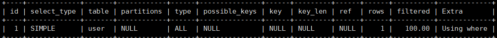

- 
- MySQL的架构分为两层
	- **Server层**
		- 负责**建立链接，分析和执行SQL**
		- MySQL的大多数核心功能模块都在此层实现，除了上图被包括在这一层的组件，还包括：
			- **所有内置函数**
				- 如日期，事件，数学和加密函数
			- **跨存储引擎功能**
				- 如存储过程，触发器，视图等
- # 第一步：连接器
	- 使用mysql的第一步是连接其服务器
		- ``mysql -h<ip> -u<user> -p<password>``
		- 如果是连接本地的mysql服务器，则不需给出ip地址
		- 和mysql服务器的连接使用的是TCP协议，**默认端口为``3306``**
	- 此时和用户打交道的就是mysql的连接器
	- 连接过程中会对用户的身份信息(用户名，密码)进行验证，验证通过后连接器会保存此用户的权限，后续此用在本次连接中的任何操作的权限都基于连接建立时所保存的权限
		- 因此管理员对某个用户权限的更改不会改变已经建立的连接，只有此用户建立新的链接时才会获取更改后的权限
	- 连接上mysql服务器之后可以通过``show processlist;``指令查看所有连接
		- 
	- 连接上mysql服务器之后过长时间不进行操作的连接会进入sleep状态，若空闲时间超过了``wait_timeout``连接会自动断开，这个变量的默认值是8小时(可通过`show variables like 'wait_timeout'`来查看)
		- 也可通过`kill connection +<id>`来手动断开指定连接
		- 被断开连接的客户端对于连接断开并不知情，直到下次发起请求时才会被服务器通过一个报错告知
	- mysql服务器能支持的**最大连接数**由`max_connections`参数控制
		- 若试图建立超过此数值的连接，会被报错提示
	- mysql类似于http也有**短连接**和**长连接**的区别
		- 短连接在连接建立之后只执行**一次**sql语句，随即立即断开连接
		- 长连接在连接建立之后会执行**若干次**sql语句
		- 长连接可以**减少连接建立和断开的开销**，但是**占用的内存会更多**，严重时可能会导致mysql服务器被系统杀掉，酿成**mysql服务器重启异常**
		- 解决长连接内存占用问题有两种方式：
			- **定期断开长连接**
			- **客户端主动重置连接**
				- **5.7版本**实现了``mysql_reset_connection()`` API
				- 客户端可以自行再执行过一个较大的操作之后手动调用此接口重置连接状态，以达到释放内存的效果
				- 此过程不需要重连和重做权限验证，仅将连接状态恢复到刚建立时的初始状态
	- ## 总结：
		- 与客户端通过TCP建立连接
		- 校对用户名和密码
		- 读取用户权限，作为后续操作的权限
- # 第二步：查询缓存(Query Cache)
	- MySQL服务器收到SQL语句之后会解析出SQL语句的第一个字段(即语句类型)
	- 如果是查询语句，MySQL会首先去查询缓存，判断是否执行过此命令
		- 查询缓存以**键值对**形式保存在内存中，key为查询语句，value为查询结果
	- 实际上查询缓存对于效率提升并不大，因为对于**更新频繁**的表，查询缓存命中率很低，因为每次更新操作都会导致查询缓存被清空
	- **从8.0版本开始**，查询缓存被删除，查询语句不再经历此阶段
	- 8.0之前的版本可以通过将``query_cache_type``设置为`DEMAND`来关闭查询缓存
- # 第三步：解析SQL
	- **解析器**负责解析SQL语句
	- 通过**词法分析**解析出各个token，再通过**语法分析**判断语法合法性并构建语法树
	- **[[$red]]==仅判断语法问题，至于某张表某个字段是否存在不在此阶段判断==**
- # 第四步：执行SQL
	- 查询语句再此阶段主要分三步处理
	- ## 预处理(Prepare)
		- 检查欲查询的表和字段是否存在
		- 将`select *`中的`*`扩展为表上的所有列
		- **8.0之前(包括5.7)判断表或字段是否存在不在解析中做，[[$red]]==也不在预处理做==，而是在解析之后，预处理之前**
			- 5.7版本的代码结构很不清晰，导致了这种情况
	- ## 优化(Optimize)
		- 预处理之后，服务器为SQL语句制定一个执行计划，这个过程又优化器完成
		- 优化过程主要是需要基于最佳效率敲定执行方案，例如**使用哪个索引**
		- 使用``explain``指令可以让MySQL报告其所选择的执行计划，包括使用了什么主键和查询类型
			- 
			- 如果执行计划的`key`一栏显示的是`NULL`，则说明进行了全表扫描(`type`为`ALL`)，此种扫描方式的效率是最低的
			- 如果是`key`一栏显示的是`PRIMARY`则意味着使用了主键
	- ## 执行(Execution)
		-
	-