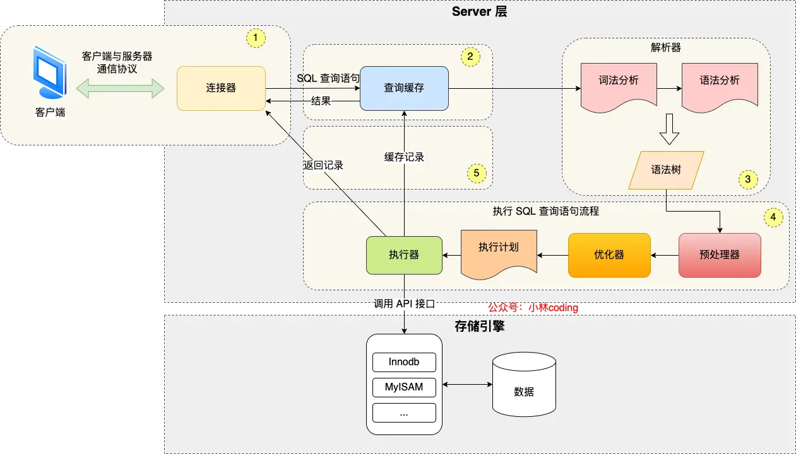
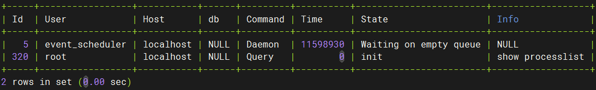

- 
- MySQL的架构分为两层
	- **Server层**
		- 负责**建立链接，分析和执行SQL**
		- MySQL的大多数核心功能模块都在此层实现，除了上图被包括在这一层的组件，还包括：
			- **所有内置函数**
				- 如日期，事件，数学和加密函数
			- **跨存储引擎功能**
				- 如存储过程，触发器，视图等
- # 第一步：连接器
	- 使用mysql的第一步是连接其服务器
		- ``mysql -h<ip> -u<user> -p<password>``
		- 如果是连接本地的mysql服务器，则不需给出ip地址
		- 和mysql服务器的连接使用的是TCP协议，**默认端口为``3306``**
	- 此时和用户打交道的就是mysql的连接器
	- 连接过程中会对用户的身份信息(用户名，密码)进行验证，验证通过后连接器会保存此用户的权限，后续此用在本次连接中的任何操作的权限都基于连接建立时所保存的权限
		- 因此管理员对某个用户权限的更改不会改变已经建立的连接，只有此用户建立新的链接时才会获取更改后的权限
	- 连接上mysql服务器之后可以通过``show processlist;``指令查看所有连接
		- 
	- 连接上mysql服务器之后过长时间不进行操作的连接会进入sleep状态，若空闲时间超过了``wait_timeout``连接会自动断开，这个变量的默认值是8小时(可通过`show variables like 'wait_timeout'`来查看)
		- 也可通过`kill connection +<id>`来手动断开指定连接
		- 被断开连接的客户端对于连接断开并不知情，直到下次发起请求时才会被服务器通过一个报错告知
	- mysql服务器能支持的**最大连接数**由`max_connections`参数控制
		- 若试图建立超过此数值的连接，会被报错提示
	- mysql类似于http也有**短连接**和**长连接**的区别
		- 短连接在连接建立之后只执行**一次**sql语句，随即立即断开连接
		- 长连接在连接建立之后会执行**若干次**sql语句
		- 长连接可以**减少连接建立和断开的开销**，但是**占用的内存会更多**，严重时可能会导致mysql服务器被系统杀掉，酿成**mysql服务器重启异常**
		- 解决长连接内存占用问题有两种方式：
			- **定期断开长连接**
			- **客户端主动重置连接**
				-