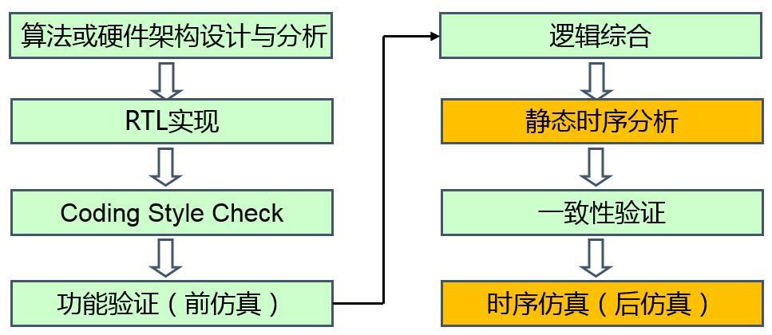
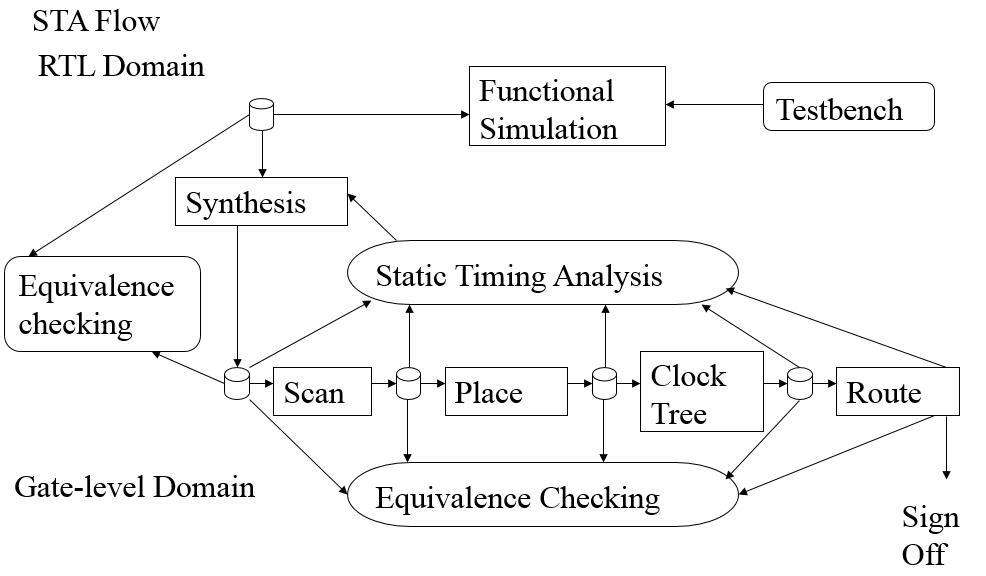

- [数字集成电路的设计流程简介](https://zhuanlan.zhihu.com/p/24476011)
- # 前端
	- 
	- ## 算法或硬件架构设计与分析
		- ### 目的
			- 完成芯片中数字部分的高层次算法或架构的分析与建模
			- 为硬件提供一个正确的软件功能模型
			- 通过大量的高层次仿真和调试，为RTL实现提供总体性的设计指导
			- **数字部分越复杂，这一步越重要。**
		- ### 工具
			- MATLAB、C++、C、System C、System Verilog等
		- ### 特点
			- 十分重要，基本上奠定了整个芯片的性能和功耗的基础。
	- ## RTL实现
		- ### 目的
			- 完成有高层次描述到Verilog HDL实现的过程
		- ### 工具
			- 各种编码工具
		- ### 特点
			- 新老手代码质量差异极大
	- ## Coding Stlye Check
		- ### 目的
			- 排除RTL代码中Clock Domain Cross、Lint等问题、
		- ### 工具
			- Syglass、LEDA、0inCDC
		- ### 特点
			- 注意跨时钟域的各种问题
	- ## 功能验证
		- ### 目的
			- 在**无延迟的理想情况下**，通过大量的仿真，发现电路设计过程中的人为或者非人为引起的bug
			- 主要指标：功能覆盖率
		- ### 工具
			- Modelsim、VCS、NC-Verilog
			- C++、C、System C、System Verilog
		- ### 特点
			- 耗时长
			- 需求大
	- ## 逻辑综合
		- ### 目的
			- 将RTL代码映射为与工艺库相关的网表
		- ### 工具
			- DesignCompiler、RTL Compiler
		- ### 特点
			- 此阶段之前，所有工作都是虚拟的，此阶段之后，现实的物理特性纳入考量
	- ## 静态时序分析
		- 
		- ### 目的
			- 从静态分析的角度，保证设计中所有的路径，满足内部时序单元对建立时间和保持时间的要求
		- ### 工具
			- PrimeTime、Tempus
		- ### 特点
			- 从逻辑综合开始，基本上每做一步大的调整，都会完成一次STA分析，以保证每步都能实现时序收敛。鉴于该特性非常重要，PrimeTime成为了Signoff的重要工具。
			- 所用到的SDC同逻辑综合；
			- 通常设计中会存在大量的违例路径，STA要修大量的setup、hold等，如何修这些违例，可以体现工作经验的重要性。此外，如果是前端修timing违例，一般会修的很快，但是会带来一个重大的问题，代码被前端修改后是否存在新的bug，还需重新仿真确认，仿真会消耗掉数以月计的时间，所以除非万不得已，不会找前端修timing。
	- ## 一致性验证
		- ### 目的
			- RTL代码和逻辑综合后的网表都可以抽象为两幅由节点和边构成的图，一致性验证阶段采用了类似于直接比较两幅图是否一致的方法，来确定逻辑综合生成的网表是否正确。
		- ### 工具
			- Formality、Conformal
		- ### 输入文件
			- RTL代码、netlist（逻辑综合输出）、约束
		- ### 输出文件
			- match（两张图节点是否一致）和verify（计算得出两张图功能是否一致）的报告
	- ## 时序仿真
		- 和功能仿真相似，但是RTL代码换成了网表
		- ### 目的
			- 在延迟等近似实际工作的条件下，观察功能是否还能保持正确
- # 后端
	- 又称物理设计
	- 将网标格式的文本转化成一个个有物理大小和位置的单元、连线
	- 实现过程中要满足面积、功耗、性能等要求
-
	-