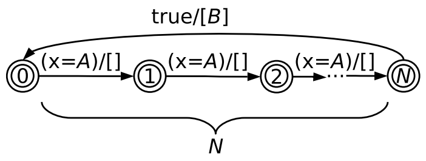
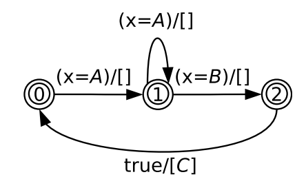

- # 绪论
	- ## 研究现状
		- ### 系统约束的表达
			- 仿真trace分析工具表达系统约束的能力决定了工具的分析能力
			- 一种对于约束的表达方式是各种**时序逻辑(Temporal Logic)**
				- LTL(Linear Temporal Logic)：线性时序逻辑
				- CTL(Computational Tree Logic)：计算树逻辑
				- GIL(Graphic Interval Logic)：图形区间逻辑
				- MTL(Metric Temporal Logic)：计量时序逻辑
				- 本文章认为，这些逻辑语言对时间的概念抽象程度过高，导致无法很好刻画SoC中“实时”property
				- 且时序逻辑语言要求使用者具备相应理论知识才能较为精确地表达系统属性，造成较高门槛
			- 另一种方式为**逻辑约束(Logic Of Constraints, LOC)**
				- 能够为实时系统属性的表达提供更高层次的抽象能力
				- 但LOC[[$red]]==**难以表达因果关系**==，而大多数系统属性都是因果属性
				- 且必须以仿真trace作为输入，不支持实时验证（是一个离线算法？）
		- ### 仿真trace的记录与分析
			- 仿真trace分析工具分为两种运行模式
				- **在线(Online)**
					- 分析工具和模拟器同时运行，实时地对模拟器产生地仿真trace进行分析
				- **离线(Offline)**
					- 模拟器首先运行并产生仿真trace文件，再交由分析工具对该文件进行分析
				- 无论哪种方式，trace都必须以一定格式生成文件保存下来
			- 因为SystemC在片上系统建模中的重要作用，其使用的VCD(Value Change Dump)仿真trace格式也被广泛使用
			- **OTF2(Open Trace Format 2)**也是一种trace文件格式，具有较强的可扩展性
- # 相关理论和技术背景
	- ## 硬件模拟器
		- ### 概述
			- **SimSoC**是一个使用C/C++和SystemC库实现的虚拟原型框架
				- 最初用来对数字电路进行建模
				- 可以通过C++编译器进行编译和运行
				- 逐渐被用于进行系统级的建模
		- ### SimSoC框架
			- {:height 351, :width 510}
			- 通过SystemC/TLM（Transaction Level Modeling, SystemC的一个模块）对硬件模块进行模拟
			- 对片上系统的模拟分为**三部分**
				- 对每个指令执行过程的模拟
					- 图中上半部分表示对指令集的模拟
				- 对系统状态和行为的模拟
					- 对内存的模拟，包括虚拟内存地址到物理地址之间的转换
				- 对系统组件和设备之间通信的模拟
					- 使用虚拟总线来表示不同模块之间的通信
			- 本文使用SimSoC作为Trap的硬件模拟平台
		- ## 时钟约束语言
			- **MARTE(Modeling and Analysis of Real-Time and Embedded)**是UML的一个扩展，用以弥补UML在时间行为上表达能力的不足
			- MARTE定义了定义了**时钟约束语言(Clock Constraint Specification Language，CCSL)**来描述“时间”相关的约束条件
			- 其中，**时钟(Clock)**是一种用来表示时间的数据结构，分为两种
				- **同步时钟**
					- 和物理时间，即真实时间相关
				- **逻辑时钟**
					- 离散逻辑上的时间，用来表示时序关系
					- 对“事件的抽象化描述”
					- 在时间轴上产生一个个**时刻(Tick)**
					- 拥有一个属性，**ID**，用于对不同的逻辑时钟进行区分
					- 属性**时间戳(Timestamp)**用来表示逻辑时钟作用的事件，用以定义时序
			- CCSL中和逻辑时钟相关的语句分为两种
				- **时钟表达式(Clock Expression)**
					- 选取一个或以上的逻辑时钟作为输入，并引入一个新的逻辑时钟
					- 如果条件满足，表达式引入的逻辑时钟起效，并产生一个新的时刻
				- **时钟关系式(Clock Relation)**
					- 用于描述两个逻辑时钟之间的时序，作用数量等关系
					- 表示逻辑时钟所在的系统的属性
		- ### 建模框架
			- 基于**EMF(Eclipse Modeling Framework)**
			- **Xtex**是一个文本建模框架，用于**领域特定语言(Domain Specific Language, DSL)**的开发
				- 定义了一套语法规则，用来描述DSL语法
				- [[$red]]==感觉是一个很方便的，可以构建编译器特定语言编译器的工具==
			- TRAP使用Xtex定义了若干DSL语言来结构化仿真trace，描述时间映射和系统属性等
			- 使用了Xtex的三个特性
				- **验证器(Validator)**
				- **代码生成器(Generator)**
				- **Eclipse IDE 支持**
			- ### Xtend 程序设计语言
				- Xtext的开发语言之一
				- 是一种静态强类型语言
	- ## 相关自动机理论
		- **有限自动状态机(FSA)**
		- **有限状态变换器(Finite-State Transducer, FST)**
		- 以上两种状态机都存在状态爆炸的问题
		- **符号有限自动机(Symbolic Finite Automaton, SFA)**和**符号有限变换器(SFT)**分别扩展了FSA和FST，其二者的字母表可以是无限的
		- TRAP使用SFA和SFT构建属性系统的底层自动机模型
		- ## 符号有限自动机(SFA)
			- 符号有限自动机的状态迁移基于**有效逻辑代数**，定义如下：
			- **定义2.4.1：**
				- 有效逻辑代数是一个八元组$A=(D,\Psi,\llbracket\_\rrbracket,\bot,\top,\vee,\wedge,\neg)$
				- D是字母表
				- $\Psi$是使用逻辑连接符构建的**迁移条件集合**
				- 且$\bot,\top\in\Psi$
				- $\llbracket\_\rrbracket:\Psi\rightarrow 2^D$是一个函数，且满足以下条件
					- $\llbracket\bot\rrbracket=\empty$
					- $\llbracket\top\rrbracket=D$
					- $\forall\alpha,\beta\in\Psi,\llbracket\alpha\vee\beta\rrbracket=\llbracket\alpha\rrbracket \cup \llbracket\beta\rrbracket,\llbracket\alpha\wedge\beta\rrbracket=\llbracket\alpha\rrbracket\cap\llbracket\beta\rrbracket$
			- 基于该定义，符号有限自动机可以形式化定义为五元组
			- **定义2.4.2**
				- 符号有限自动机$M=(A,Q,q^0,F,\Delta)$
				- A是有效逻辑代数
				- Q是有限的状态集合
				- $q^0\in Q$是自动机的初始状态
				- $F\subseteq Q$是终止状态集合
				- $\Delta \subseteq Q\times \Psi_A\times Q$是状态迁移集合
			- SFA字母表D中的元素称为字母，由它们构成的有限序列成为字串
			- 给定字串w，其是否可以被一个SFA接受的定义如下
			- **定义2.4.3**
				- 给定字串$w=a_1a_2\ldots a_k$，若$w$被符号有限自动机$M$接受，则当且仅当对于$1\le i\le k$，存在状态迁移$q_{i-1}\rightarrow q_i$，有$q_0=q^0$且$q_k\in F$
		- ### 符号有限变换器
			- 是SFA的变体，不同之处在于，对于给定的输入字串，SFT可以输出一个字串
			- **定义2.4.4**
				- 符号有限变换器$T=(A,Q,q^0,\Delta,F)$
				- A是有效逻辑代数
				- Q是有限的状态集合
				- $q^0\in Q$是自动机的初始状态
				- $\Delta$是集合$Q\times\Psi\Lambda^*\times Q$的有限子集，表示状态迁移集合
					- $\Lambda$是自动机的函数项集合
				- $F\subseteq Q$是终止状态集合
			- SFT的一次状态迁移为$(p,\varphi,f,q)$，或表示为$p\overset{\varphi/f}{\rightarrow}q$
				- f表示自动机的输出，当STF的所有迁移都输出空($\varepsilon$)是，SFT退化为相应的SFA
- # 系统设计
	- 在DSL中定义了四种语言
		- **仿真trace条目描述语言**(Trace Item Specification Language, **TISL**)
			- 定义了模拟器在运行过程中，能够向用户提供的信息
		- **逻辑时钟描述语言**(Logical Clock Specification Language, **LCSL**)
			- 对用户系统中发生的事件进行抽象表示
		- **模拟仿真trace映射语言**（Simulation Trace Mapping Language, **STML**)
			- 定义将一个或多个仿真trace条目映射为一个逻辑时钟时刻的映射规则
		- **仿真trace属性描述语言**(Trace Property Specification Language, **TPSL**)
			- 描述用户系统运行中产生的trace必须满足的系统约束
			- 引用LCSL中定义的逻辑时钟和作用域，以若干条规则的形式对系统的玉树进行描述
	- TRAP的**使用流程**
		- **模拟器开发者**使用TISL定义trace item，对模拟器在仿真过程中提供的信息进行抽象，并使用TRAP生成的代码重新编译模拟器
		- **模拟器使用者**使用LCSL定义逻辑时钟和作用域，规定用户系统的事件和规则的作用范围(何时起效)
		- **模拟器用户**使用STML定义trace item与逻辑是中之间的映射关系，TRAP[[$red]]==生成动态库链接==
		- **模拟器用户**使用TPSL定义系统运行过程中trace需要满足的属性，[[$red]]==TRAP生成部分验证器代码==
		- **模拟器用户**使用TPSL生成的代码编译验证其，运行模拟器和验证其，得到分析结果
	- TRAP工具链包含：
		- 模拟器
		- trace映射库
		- 验证器
	- ## TISL
		- 有模拟器开发者定义
		- 描述仿真过程中，模拟器能够为为使用者提供哪些信息
		- 定义若干trace item，每一个trace item之间包含名字和若干属性，trace item之间可以存在但继承关系
		- 语法和C++十分相似
		- ### 语法
			- 用户须在TISL文件的开头通过generates关键词指定本地文件系统中的一个文件夹来存放TRAP生成代码的放置位置
	- ## LCSL
		- 定义两个基本元素，主要用于TPSL中描述系统约束
			- **作用域**
				- 用于表示TPSL中每条规则在系统运行的什么阶段内有效
				- 对系统运行过程进行分段
			- **逻辑时钟**
				- CCSL中的概念，在TPSL中表示基本事件
				- 每一次作用都产生一个时刻，时刻拥有两个属性
					- 逻辑时钟标识(名称）
					- 时间戳
		- 比TISL的抽象层次更高，将模拟器的底层信息与系统属性隔离，便于表述系统约束
		- ### 语法
			- {:height 212, :width 457}
			- 作用域和时钟列表均可为空
	- ## STML
		- 定义TISL中定义的trace item和逻辑时钟的关系
		- 一个逻辑时钟往往由若干个trace条目映射出来，用不同的“**周期**”来区分
			- {:height 252, :width 454}
		- 周期表示在映射过程中，最早被纳入考虑的条目和最晚产生的条目之间的最大时间差
		- 在同一个周期内的trace条目都被STML视为同时发生，拥有同样的时间戳
			- 仍然存在先后次序，只是条目之间的时间差被忽略不计
		- **[[$red]]==个人理解：引入周期的意义==**
			- 在从trace item到逻辑时钟时刻的映射过程中，并非是一个trace item对应一个逻辑时钟时刻，而是存在着多个trace item映射出一个逻辑时钟时刻的情况
			- 因此需要定义一个最大周期，当新产生的trace item和之前存储于队列中最早的trace item的时间戳大于等于周期时，就意味着需要进行一次影射了
			- 周期的选择需要考虑到映射过程中素有映射规则所需要的trace item之间的最大时间间隔
		- 一个STML文件由两部分组成
			- **文件头**
				- 对TISL和LCSL的引用声明
				- 对TISL生成的代码进行引用的声明
				- 对生成代码放置位置的声明
				- 全局变量声明
			- **文件体**
				- 若干映射规则
					- 每条规则以TISL中的一个条目为起点，定义一颗**模式(Pattern)**树
			- 映射规则采用递归方式进行定义
			- 每个模式代表一个时间周期中，trace条目出现的先后顺序
				- {:height 167, :width 231}
				- 上图例子包含了四个模式：ABC，ABD，AC，AD
			- 还需定义模式匹配后采取的**动作(Action)**，分为两种
				- **简单动作**
					- 不采取任何动作
					- 或进行一系列基础动作，包括
						- 进入或者离开一个作用域
						- 产生一个逻辑时钟时刻
						- ......
					- 每一个动作都可以更新全局变量的值
				- **复合动作**
					- 包含条件判断语句，根据判断结果决定是否进行动作
					- 进行的动作可以是一个简单动作，也可以嵌套符合动作
					- 判断条件包括当前模式中trace item的属性和全局变量
	- ## trace 属性描述语言(TPSL)
		- 头文件中会指定引用的LCSL文件的位置
		- 文件体包含三部分内容：
			- 使用``define``关键字定义声明常量
				- 一个define关键字可以定义多个常量，以逗号隔开
				- 一个常量的定义包括一个常量名，和其值
			- 使用``clock``关键字定义**虚拟逻辑时钟**，通过逻辑时钟表达式进行定义
			- 若干规则的声明，包括
				- **作用域**定义
				- **规则体**
		- ### 逻辑时钟表达式
			- 以逻辑时钟作为输入，输出虚拟逻辑时钟时刻
			- 从语义上说，使用虚拟逻辑时钟等价于使用逻辑时钟的表达式
			- 有三种虚拟逻辑时钟
			- #### 子时钟(subclocking)
				- 格式为``B = A by N``
				- A是一个时钟，N是一个正整数
				- 当时钟A产生了N个时刻，则产生一个B时钟的时刻，且该B时钟的时刻时间戳和A适中的第N个时刻时间戳相同
			- #### 时钟并(clock union)
				- 格式为``C = A union B union ...``
				- A，B和后续都是时钟
				- 当并中的任何一个时钟产一个时刻时，虚拟逻辑时钟C产生一个时刻，且C时钟时刻的时间戳和任意时钟时刻时间戳相同
			- #### 时钟交(clock interset)
				- 格式为``C= A intersect B intersect ...``
				- A，B和后续都是时钟
				- 只有交中的所有时钟同时产生一个相同时间戳的时刻，才产生一个拥有相同时间戳的C时刻
			- 有一些**特殊的虚拟逻辑时钟**并非独立定义，而是跟随规则出现而定义，包括：
			- #### 时钟次序
				- 一种特殊的逻辑始终表达式，只能在因果关系<cause-rule>和一一对应因果关系<each-cause-rule>中使用
				- 格式为``A before B``
				- 表示在一个或多个A时刻出现后，若接收到B时刻，则产生一个新的虚拟逻辑时钟时刻，时间戳和B时刻的时间戳保持一致
				- 若干个before可以连起来构成一个若干逻辑时钟时刻一次出现的关系
			- #### 一一对应时钟次序
				- before关键词也可以被**each**修饰
				- 对每一个接收到的A时钟时刻，若有一个B时刻在其后出现，则生成一个内部虚拟逻辑时刻
			- #### 时钟序列
				- 格式为``A <> B <> C <> ...``
				- 当若干逻辑时钟时刻不分次序先后出现时产生一个内部虚拟逻辑时钟时刻，时间戳与最后一个出现的时刻时间戳相同
		- ### TPSL 规则
			- 每条规则定义一个系统属性，TRAP验证trace的能力取决于TPSL的表达能力
			- 一条TPSL规则包含**作用域列表**和**规则体**两部分
			- #### 规则作用域
				- 使用LCSL中生命的作用域来定义规则的作用域
				- 分为三种形式：
					- 关键词**always**定义了全局作用域，表示该规则在用户系统运行过程中激活
					- 关键词**inside**定义了内部生效作用域，表示此规则在给出作用域内激活
					- 关键词**outside**定义了外部生效作用域，表示此规则在给出的作用域外激活
				- 如果一条规则定义了多个作用域，则只有在这些作用域条件都满足时，该规则才生效
			- 规则有八种类型，分别是：
			- #### 轮替关系(alternate rule)
				- 使用关键词**alternate**声明
				- 格式为``A alternates B``
				- 表示在时间轴上时钟A和B必须以ABABABA....的方式轮流产生时刻
				- 在规则给出的作用域内，A和B时刻必须**轮流出现，**且数目**必须相等**
			- #### 缺失关系
				- 使用关键词**absent**声明
				- 格式为``target absent from start to end``
				- target，start，end都是时钟
				- 表示在规则给定的作用域内，时钟target产生的时刻时间戳不能处于任何strat和end产生的时刻的时间戳形成的区间之内
				- 例如，``start ... target ... end``就不符合要求，而``start ... end ... target``则符合要求
			- #### 因果关系
				- 使用关键词**causes**声明
				- 格式为``trigger causes target unless ... if ... satisfies ...``
				- trigger 和 target都是逻辑时钟
				- 当在作用域内检测到trigger的时刻之后，规则自动机会激活，持续接受trigger的时刻直到target时刻的产生
					- 若到作用域结束还没有target产生，则规则不满足
				- trigger可以是单个逻辑时钟，也可以是时钟次序和时钟序列构成的因果链
				- cause可以使用**!**修饰，使得含义发生改变
					- ``A causes B`` 表示A和B之间满足充分条件的关系，即在规则作用域内，当A产生一个时刻，则在将来的某个时间点必须有B的时刻产生
						- “A的发生必然导致B的发生”
					- ``A causes! B`` 表示A和B之间满足充分必要条件的关系，即在规则作用域内，在满足``A causes B``的同时，对于每一个产生的B时刻，都必须有至少一个A时刻在其之前出现
						- “A的发生必然导致B的发生，且B的每次发生必然是因为A”
				- unless，if，satisfies均是补充语句，可以试因果关系更加灵活
					- **unless语句**
						- 以关键词unless开始，包含了由and关键词连接的若干个inside语句
							- inside语句格式为``A inside B to C``
							- 表示处于任意B和C产生的时刻之间
						- 当处于任一unless语句指出的区间时不适用此规则
					- **if语句**
						- 以关键词if开始，包含了由and关键词连接的若干条件
						- 当if语句中的条件满足时，规则自动机的下一个输入必须是一个target时刻，否则出错
						- TRAP支持对时刻出现的数目进行比对，例如``if count A-B > N``
							- 如果规则被global修饰，则对比整个验证其范围内的时刻数目
							- 否则比对规则自动机已经接受到的时刻
					- **satisfies语句**
						- 以关键词satisfies声明
						- 在规则自动机运行的**末尾**执行
						- 在接收到target之后，若satisfies语句满足，则规则成立，否则不成立
						- 有三种类型的satisfies语句
							- **count**用于对比时刻出现的次数，类似于if语句
							- **delay**指明对时刻时间戳的对比，例如``delay B.last - A.last < N``
							- **absent**指明对时刻出现与否进行判断，类似于缺失关系
			- #### 一一对应因果关系
				- 是因果关系规则的扩展
				- 在causes关键词前加上**each**修饰
				- 不能使用!修饰
				- 不能使用if语句作为补充语句
				- 语义上和一一对应时钟次序类似，在作用域内，每出现一个trigger时刻，必须在之后出现一个target时刻与之对应
			- #### 抖动(jitter)
				- 指信号传输过程中出现的周期性偏差
				- 用户往往希望系统的抖动控制在一定范围内
				- 使用**jitter**关键字定义抖动规则
				- 格式为``jitter(clock, start, period, margin)``
					- clock为需要验证的逻辑时钟
					- start为一个起始的时间戳
					- period表示从起始时间戳开始clock需要每隔多少时间产生一个时刻，且误差不应该超过margin
				- 规则假定有一个“标杆时钟”，该时钟从start开始每隔一个period时间就产生一个时刻，该时钟产生的时刻会用于和clock产生的时刻之间进行比较
			- #### 间距
				- 格式为``period (clock, period, margin)``
				- 表示在作用域内，时钟clock的任意两个时刻之间的差距与period相比必须小于margin
				- 与抖动类似，但是不存在一个标杆时钟用于对比，永远只对比前后两个时刻之间的间隔，因此可能会存在逐渐偏移的现象(每次都相差一定的量)
			- #### 吞吐量(throughot)
				- 格式为``throughout (clock, period, count)``
				- 表示逻辑时钟clock在任何长度为period的时间片段内都必须产生**至少**count个时刻
			- #### 突发性(burstiness)
				- 格式为``burstiness(clock, period, count)``
				- 表示在规则作用域中的任何一个长度为period的时间片内，逻辑时钟clock**最多**产生count个时刻
- # 系统实现
	- 主要使用c++，Xtend和java实现
	- 工作过程大致分为三个步骤：trace生成，属性描述，属性验证
	- ## Trace生成
		- ### 架构
			- {:height 322, :width 573}
			- 途中斜线部分表示TRAP以外的结构，灰色部分表示由DSL生成的代码
			- 原始模拟器和TISL生成的代码共同编译，得到新的模拟器
			- 主要由两部分构成
				- **模拟器平台**
				- **Trace映射库**
					- TraceMapper类是trace生成的接口
						- 模拟器使用其成员函数``push_item()``来生成trace item
						- 模拟器创建若干TraceWriter实例，将其和时间周期一起作为参数初始化TraceMapper
							- 控制了输出trace的格式
							- 通过TraceStreamWriter和TracePipeWriter实现，分别对应文件输出和管道输出
					- MappingRule类被STML生成的所有映射规则类集成，包含：
						- 一个树状结构的**Pattern**，为STML中提到的模式树
						- 一个虚函数**apply()**，用于实现用户在映射规则中定义的动作
					- 每一个STML定义的规则都会生成一个类，该类继承MappingRule并实例化Pattern且实现apply虚函数
		- ### Trace映射
			- TraceMapper中的成员函数push_item()是trace生成的接口
				- 接收一个TraceItem类型的指针
				- 每次调用会将传入的trace item加入内部队列
				- 当新的条目的时间戳与队列中第一个条目的时间戳之差超过一个**时间周期时**，对队列进行处理，输出相应的逻辑时钟**时刻流**
				- TraceMapper 映射算法如下：
					- 
					- 先做匹配，再入队trace item
					- item_queue是TraceMapper类的成员变量
					- period是模拟器提供的时间周期
		- ### 模式匹配
			- 输入：一个trace item队列和一个模式列表
			- 将队列中的每一个条目匹配出符合的模式，并满足以下要求：
				- 队列包含了该模式定义的所有trace
				- 对模式匹配的先后顺序符合模式树进行前序遍历的顺序
				- 同一trace item只能被成功匹配一次
			- {:height 410, :width 619}
	- ## 系统属性描述
		- 介绍TPSL中时钟表达式和关系式与CCSL的对应关系
		- 介绍TPSL中每个时钟表达式和时钟关系式对应的符号有限变换器和自动机模型
		- 每个TPSL表达式，关系式和其他系统属性都在底层对应了一个自动机模型
		- 每一个TPSL实例文件生成的C++代码包含两个部分
			- 对TPSL自动机模板进行实例化的部分
			- 对输入时刻进行分配的**调度器**
				- 调度器负责将输入的时刻分配给相关自动机
				- 对于自动机来说，所有不相关的逻辑时钟都被忽略
		- 自动机模型在用户系统运行处实例化
		- 系统运行结束之后，验证其将验证所有的自动机是否处于终止状态，以确定是否存在违犯系统属性的情况
		- ### 时钟表达式
			- 时钟关系式接收输入时刻序列并产生相应的虚拟逻辑时刻
			- 每一个时钟表达式均对应一个符号有限变换器
				- 由于时钟表达式的作用是产生虚拟逻辑时刻，因此**每一个状态都是终态**
			- #### 子时钟
				- 子时钟表达式``B = A by N``表示每产生N个A时刻，B产生一个时刻
				- **CCSL对应**：$\mathrm{A\subset B}$
					- 是时钟关系而非表达式
					- 表示对于时钟B产生的每一个时刻，都有一个时钟A的时刻与之对应
					- TPSL中新增加了参数N，增强表达能力
				- **SFT模型**
					- {:height 193, :width 485}
					- 每收到一个A时刻便向后转移一个状态，直到状态N
					- 状态N无条件转移会状态0，并输出一个B
			- #### 时钟并
				- **CCSL对应**：$$\mathrm{A+B}$$
					- 表示任意AB时刻产生将伴随产生新时钟的一个时刻
					- TPSL中``C = A uion B``将新时钟命名为C，并支持多个时钟的union链
				- **SFT模型**
					- 
			- #### 时钟交
				- **CCSL对应**：$\mathrm{A * B}$
					- AB同时产生时刻时，产生一个新时钟的时刻
					- TPSL中``C = A intersect B``，也支持链
				- **SFT模型**
					- {:height 308, :width 511}
				- [[$red]]==思考==：这种SFT模型如果要支持链，可能会比较麻烦
			- #### 时钟次序
				- 虽然在TPSL中只出现于因果关系中，但本质是哦一个定义了内部使用逻辑时钟的表达式
				- **CCSL对应**：sample表达式
					- $\mathrm{A \searrow B}$
					- 表示AB时刻先后出现时，在B时刻产生的同时产生一个新的时钟时刻
					- TPSL中``A before B``
				- **SFT模型**
					- {:height 232, :width 392}
			- #### 一一对应时钟次序
				- 在时钟次序基础上添加each关键字修饰
				- **CCSL对应**：无
				- **SFT模型**
					- {:height 201, :width 310}
					- 引入了内部计数器y
			- #### 时钟序列
				- **CCSL对应**：$\mathrm{A \searrow B + B \searrow A}$
					- 以任意顺序出现均可
					- TPSL中``A <> B``
					- 当多个逻辑时钟通过``<>``连接时，可以看作多个二元时钟序列的组合[[$red]]==(?)==
				- **SFT模型**
					- {:height 288, :width 293}
		- ### 时钟关系式
			- 不产生新的逻辑时钟(没有输出)，大部分时钟关系式都可以用SFA来描述
			- #### 轮替关系
				- **CCSL对应：** $A \prec B \wedge B\prec A\ \^{}\ 1$
					- $\prec$ 表示“严格次序”，即每个A时刻都必须严格在B时刻产生之前产生
					- 符号^i表示时钟的第i个时刻
				- **SFA模型**
					- {:height 237, :width 438}
			- #### 缺失关系
				- **CCSL表达**：无，但其是常见的CPS属性
					- TPSL中：``C absent from A to B``
				- **SFA模型**
					- {:height 177, :width 408}
			- #### 因果关系
				- **SFT模型**
					- 给出完整形式(包括unless和satisifies)的完整语句
						- ``A causes! B unless ... if ... satisfies ...``
					- 
			- #### 一一对应因果关系
				- **SFT模型**
					- 
					- [[$red]]==图中少画了一条1到自身的边，代表可以接受多个A==
			- #### 其他CPS属性
				- 抖动，间距，吞吐量和突发性四个CPS属性难以使用SFA和SFT表达，不再详述
	- ## Trace验证
		- 由TRAP验证器完成
		- 接收模拟器产生的trace，并验证是否满足TPSL文件中描述的系统属性
		- ### 验证器架构
			- 
			- **基础组件**：包括自动机模板和一些基础类，为其它模块提供基础功能
			- **验证器核心**：包括入口类Verifier以及实现了读取，分析trace等功能的类
			- **调试器**：包括调试器主类Debugger，用户输入命令和断点控制器等
			- 各个部分之间传递Signal的实例进行通信，Signal提供了类似回调函数的通信机制
		- ### 基础组件
			- 是验证器中最底层的部分
			- Automaton类是所有自动机模板的父类
			- 定义了一些虚函数(接口)，例如：
				- ``accept()``
					- 输入：一个Tick(时刻类)对象的指针
					- 执行内部状态变迁
					- 各个自动机按照上文所述的模型实现此函数
				- ``check_final_stae()``
					- 当trace结束时(或对应规则的作用域结束时)，验证器将调用每个自动机的check_final_state函数，检查是否处于终态
				- ``system_reset()``
					- 当整个验证器重置时，调用每个自动机的system_reset重置自动机
			- 每个自动机都包括一个**History**类的实例
				- 保存一个本地的历史记录，用于记录在当前运行中已经接收的时刻
				- 自动机运行过程中需要访问本地历史记录来正确工作
				- 本地历史记录在自动机重置时(包括正常跳转到初始状态)清空
			- Tick类是对时刻的抽象，存储逻辑时钟类别，时间戳等属性
			- VirtualTick类继承自Tick
				- 当时钟表达式产生VirtualTick实例时，会将自己的History实例挂在到VirtualTick实例上，再有Signal传递给接收该逻辑时钟的自动机，从而实现历史纪录的转移合并
		- ### 验证器核心
			- 负责验证器的核心功能，包括运行环境设定，对trace的读取和解析，对作用域的控制等
			- 包含若干类：
				- ``Verifier``
					- 验证器的主类
					- 根据用户提供的命令行参数设定验证器的运行环境
					- 存储TPSL规则对应的所有自动机实例并管理其作用域
					- 包含一个时刻调度器，自动将新时刻分配给相关自动机
				- ``Scope``
					- 对规则作用域的抽象
					- Verifier包含了一个Scope实例，并负责对所有规则自动机的作用域进行管理
				- ``TraceReader``
					- 负责读取trace
					- 有两个子类
						- ``StreamReader``
							- 从C++流读取trace
						- ``PipeReader``
							- 从Unix命名管道中读取trace
					- ``TraceParser``
						- 对treace进行解析并生成Tick实例
			- ### 调试器
				- 根据功能分为三部分
					- ``Debugger``
						- 调试器核心类
						- 整个验证器程序的入口
						- 包括Verifier和TraceParser实例，调用TraceParser相关功能并向Verifier提供Tick实例
						- 验证器在非调试模式下运行时直接调用Verfier并完成相关功能，反之负责调试器的整体运行
						- [[$red]]==个人观点==：和NEMU及其相似，也有可能这就是一种常用且成熟的结构
					- ``Command``
						- 是调试模式下素有调试命令类的父类
						- 为Debugger提供统一的运行接口
						- Debugger解析用户输入的调试命令并调用对应的Command子类
					- ``BreakPointManager``
						- 负责对用户设置的断点进行处理
- # 实例
	- 以UART(Universal Asynchronous Receiver / Transmitter)为例
	- UART是用于进行异步串口通信的硬件设备
	- 使用TRAP找到了SimSoC上ART 16550硬件模拟模块的实现错误(极难发现)
	-