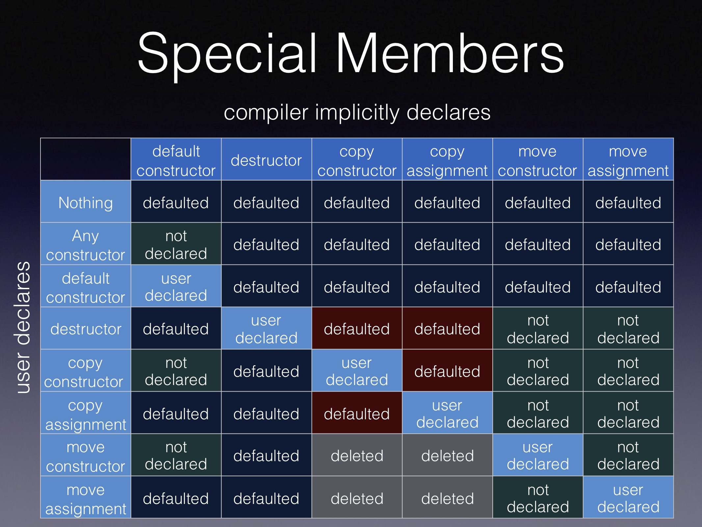

- 一个类可以定义**六种**特殊成员函数
	- **默认构造函数(Default Constructor)**，即没有形参的构造含数
	- **析构函数(Destructor)**
	- **拷贝构造函数(Copy Constructor)**
	- **拷贝赋值(Copy Assignment)**
	- **移动构造函数(Move Constructor)**
	- **移动赋值(Move Assignment)**
- 特殊成员函数的特殊性就体现在编译器会为其提供缺省默认声明和定义
- 
-