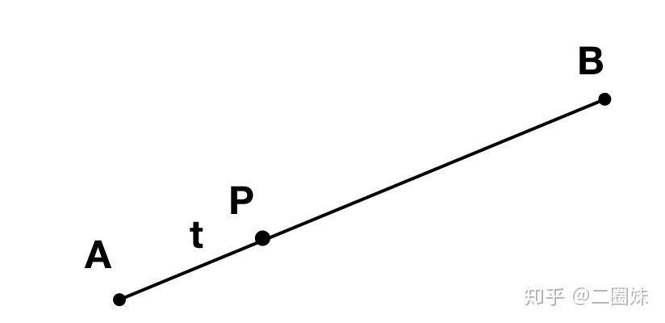
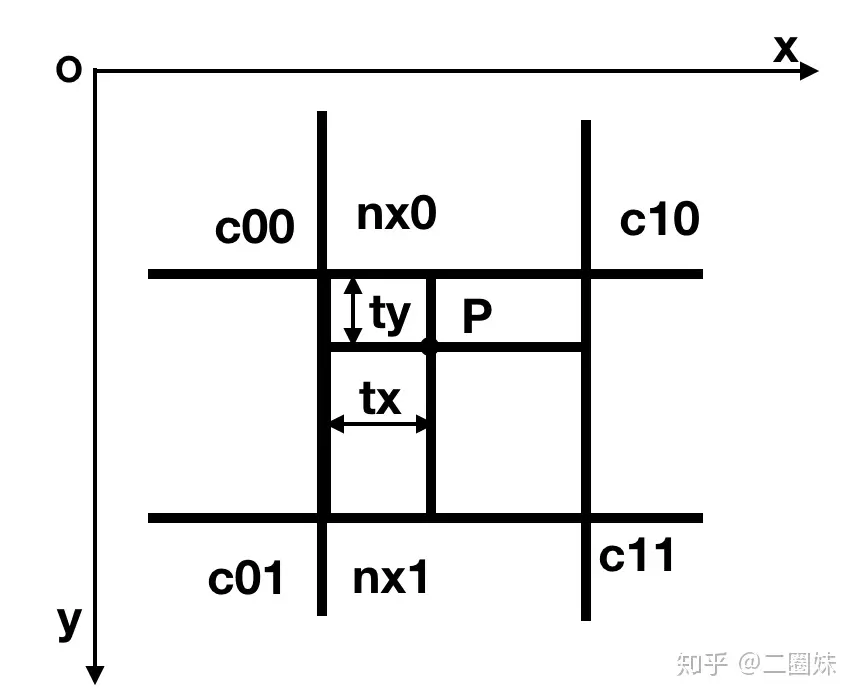
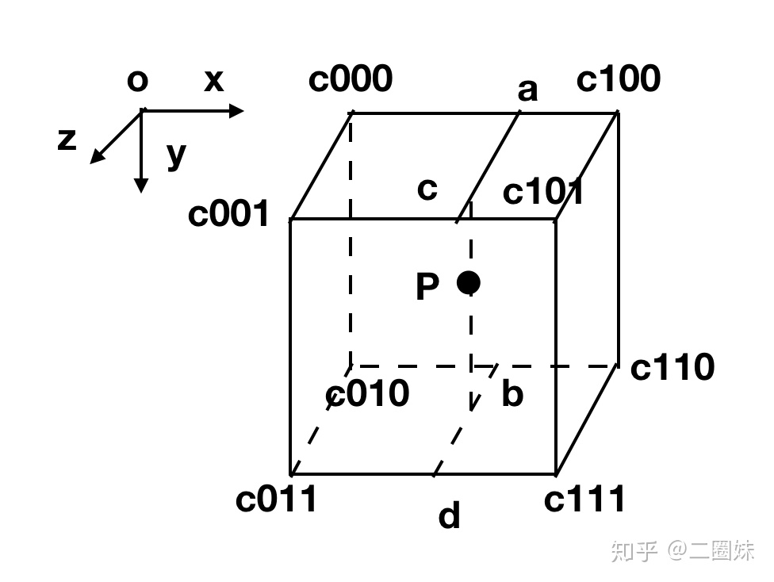
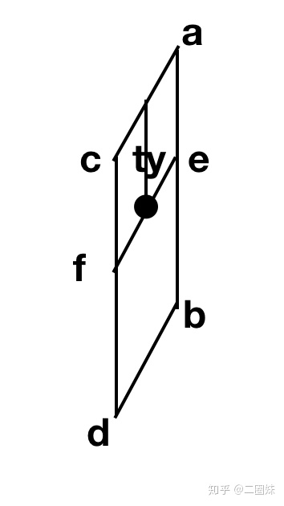

- 已知两个值，求两个值之间某个比率的值
- # 一维线性插值
	- 
	- 在C++中，使用函数``lerp``求解两个**值**之间的插值
		- 例如，``lerp(0,10,0.5)``的返回结果是5
	- P(t) = A + (B -A)t
	- P(t) = A(1-t) + Bt
	- 这个(1-t)A + B就是常用的线性插值公式
- 二维线性插值
	- {:height 314, :width 372}
	- 先在一个方向上求插值
		- nx0 = lerp(c00,c10,tx)
		- nx1 = lerp(c01,c11,tx)
	- 得到nx0和nx1的值之后问题转换为一维线性插值，得：
		- p = lerp(nx0,nx1,ty)
	- 因此公式展开得到：
		- $p = c_{00}(1-t_x)(1-t_y)+c_{10}(1-t_y)t_x+c_{01}(1-t_x)t_y+c_{11}t_xt_y$
- # 三维线性插值
	- {:height 266, :width 372}
	- 首先在x方向上做四次插值得到a,b,c,d四个值，通过这四个值将问题转换为二维插值问题
		- a = lerp(c000,c100,tx)
		- b = lerp(c010,c110,tx)
		- c = lerp(c001,c101,tx)
		- d = lerp(c011,c111,tx)
	- 然后在y方向上做两次插值得到e,f两个值
		- {:height 211, :width 127}
		- e = lerp(a, b, ty)
		- f = lerp(c, d, ty)
	- 最后在z方向上做一次插值得到最终值
		- {:height 158, :width 167}
		- p = lerp(e,f,tz)
	- 因此展开可得到各项系数：
		- c000: (1-tx)(1-ty)(1-tz)
		  c100: tx(1-ty)(1-tz)
		  c010: (1-tx)ty(1-tz)
		  c110: txty(1-tz)
		  c001: (1-tx)(1-ty)tz
		  c101: tx(1-ty)tz
		  c011: (1-tx)tytz
		  c111: txtytz
	- 通过一个三重循环可完成插值计算：
		- ```c++
		  float accum = 0;
		  for (size_t i = 0; i < 2; i++)
		      for (size_t j = 0; j < 2; j++)
		          for (size_t k = 0; k < 2; k++)
		              accum += (i*tx+(1-i)*(1-tx))*
		                     (j*ty+(1-j)*(1-ty))*
		                     (k*tz+(1-k)*(1-tz))*c[i][j][k];
		  ```
-