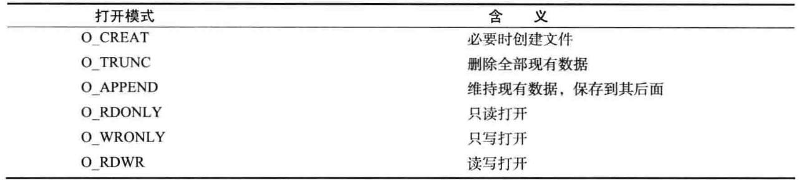

- 网络编程就是编写程序使两台联网计算机相互交换数据
- 操作系统会提供socket
- # 理解网络编程和套接字
	- ## 以打电话作为例子
		- 套接字大致分为两种，TCP套接字和UDP套接字，前者可以以电话来类比
		- ### 接听
			- 首先调用``socket``函数，相当于安装电话
				- **头文件**：``sys/socket.h``
				- **参数**：``int domain, int type, int protocol``
				- **返回值**：成功时返回文件描述符，失败时返回-1
			- 得到一个socket之后调用``bind``函数绑定ip地址和端口号，相当于分配电话号码
				- **头文件**：同上，之后若同上则不再标出头文件
				- **参数**：``int sockfd, struct sockaddr* myaddr, socklen_t addrlen``
				- **返回值**：成功时返回0，否则返回-1
			- 调用``listen``监听请求，相当于连接电话线
				- **参数**：``int sockfd, int backlog``
				- **返回值**：成功返回0，否则-1
			- 调用``accept``获取连接成功的socket，相当于拿起话筒
				- **参数**：``int sockfd, struct sockaddr *addr, socklen_t *addrlen``
				- **返回值**：成功返回文件描述符，否则-1
				- socket的连接实际上是发生在系统内核的，accept只是获取连接成功的socket
		- ### 拨打
			- 只需要先创建套接字，然后请求连接即可
			- 调用``connect``函数请求连接
				- **参数**：``int sockfd, struct sockaddr* serv_addr, socklen_t addrlen``
				- **返回值**：成功0，失败-1
- # Linux文件操作回顾
	- 在linux下，socket也是文件的一种，可以直接将socket看作文件进行读写操作
	- 在linux下，打开的文件都有一个整数类型的**文件描述符**(file descriptor)，windows也有类似概念，不过叫做**句柄**(handle)
	- 文件操作相关的一些函数和类型封装在``<fcntl.h>``头文件中，包括``open``
	- 调用`open`函数打开文件
		- **头文件**：``<fcntl.h>``
		- **参数**：``const char* path, int flag``
			- flag包括以下权限，不同权限之间可以通过or组合
				- 
				-
		- **返回值**：成功返回文件描述符，否则-1
	- 调用``close``函数关闭文件
		- **头文件**：``unistd.h``
		- **参数**：``int fd``
		- **返回值**：成功0，失败-1
	- 调用``write``函数写文件，``read``函数读文件
- # Windows下的套接字编程
	- Windows套接字(winsock)大部分参考BSD的UNIX套接字，因此很多地方类似
	- 调用``WSAStartup``函数初始化
		- **头文件**：``<winsock2.h>``
			- winsock2.h是微软socket的2.0+版本实现，win95以后的系统编程时都应该适用此版本头文件
			- winsock.h只有在目标平台低于win95时才应该使用
		- **参数**：``WORD mVersionRequested, LPWSADATA lpWSAData``
			- 第一个参数是winsock的版本信息，WORD为一个内建的unsigned short类型
				- 一个winsock版本号由16位构成，高8位为副版本号，低八位为主版本号
				- 如，版本1.2应表示为``0x0201``
				- 使用``MAKEWORD``宏可以方便构建版本类型，如``MAKEWORD(1,2)``
			- 第二个参数的类型LPWSADATA是结构体WSADATA的指针
				- WSADATA记录了一些可自定义的信息
		- **返回值**：成功返回0，否则返回非零错误代码
	- 在对该库使用完毕之后，调用``WSACleanup``函数注销
		- **参数**： 无(void)
		- **返回值**：成功0，失败返回SOCKET_ERROR
		- 调用此函数之后，无法再使用Winsock相关库，一般在程序末尾调用
	- windows下的socket，bind，listen，accept，connect函数和linux下的相关函数基本相同，不过失败时会返回错误代码，accept和socket失败会返回INVALID_SOCKET，其余返回SOCKET_ERROR
		- socket 成功时返回的类型是SOCKET，本质上是一个无符号整型或长整型(平台相关)
	- windows下关闭套接字不是使用文件系统的close，而是调用专用的closesocket(SOCKET s)，失败时返回SOCKET_ERROR
	- Linux下socket被看作文件的一种
	- Windows下文件和套接字在实际使用时都用句柄描述，但是区分了文件handle和套接字handle，适用的函数自然也有所区别
	- ## Windows对套接字的读写操作
		- 使用``send``函数对发送数据
			- **参数**：``SOCKET s, const char* buf, int len, int flags``
				- flag表示各种选项信息，后续再介绍
			- **返回值**：成功返回传输字数，失败返回SOCKET_ERROR
		- 使用``recv``函数接收数据
			- **参数**：``SOCKET s, const char* buf, int len, int flags``
			- **返回值**：成功返回接受的字数(接受到EOF时为0)，否则SOCKET_ERROR
		-
		-