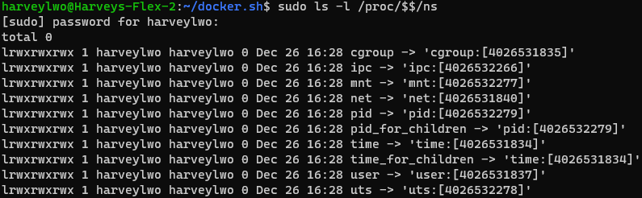
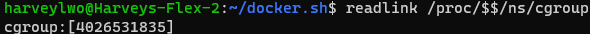
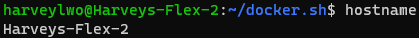

# Namespace再介绍
	- [[Linux 命名空间]]
	- Linux中许多资源都是全局的，例如PID是一个内核中管理的全局列表，每个用户也都拥有一个全局位的UID标识
	- 多有调用者通过``uname``系统调用范围的系统相关信息都是相同的
	- 而namespace可以将上述全局资源进行隔离和虚拟化。
		- 被加入到某个namespace的进程**只能看到分配给该namespace的资源**
		- linux下每个进程都有一个`/proc/<pid>/ns`目录，该目录包含了进程`<pid>`u送在的namespace信息
			- 
			- Linux为了兼容之前的全局资源管理方式，Linux为某种资源准备了一个全局的namespace
			- 补充一个小知识点：linux下``$$``指当前进程的pid，使用`echo $$`可以打印当前进程的pid
			- 此目录下有很多符号连接，每个连接代表一个该进程所属的namesapce，使用`readlink`可以读取这些符号链接，查看相应的namespace id
				- 
	- ## uts namespace
		- 用于隔离系统的**主机名**等信息
		- ### 查看全局uts namespace信息
			- 使用``hostname``指令可以查看当前的主机名
				- 
		- ### uts namespace
			- 使用`unshare`指令可以创建新的namespace，同时在新的namespace中执行一条命令
				- 执行`unshare`需要root权限
			- ``unshare [options] [program [arguments]]``，使用不同的`options`可以指定要创建的namespace
				- ``–uts``创建新的uts namespace
				- ``–mount``创建新的mount namespace
				- ``–pid``创建新的pid namespace
				- ``–user``创建新的user namespace
			- 创建一个新的`uts`命名空间，并查看该命名空间的id：
				- ```bash
				  sudo unshare --uts /bin/bash
				  hostname
				  readlink /proc/$$/ns/uts
				  ```
				- 可以看到新的uts命名空间的id和之前并不相同，说明新的bash已经运行在新的uts namespace中了
				- 在此空间下任意修改主机名都不会影响处于其他uts namespace进程能看到的主机名
			- 在默认情况下**子进程会直接处于父进程的namespace中**，除非使用类似`unshare`这样的命令显式指明要创建新的namespace
		-