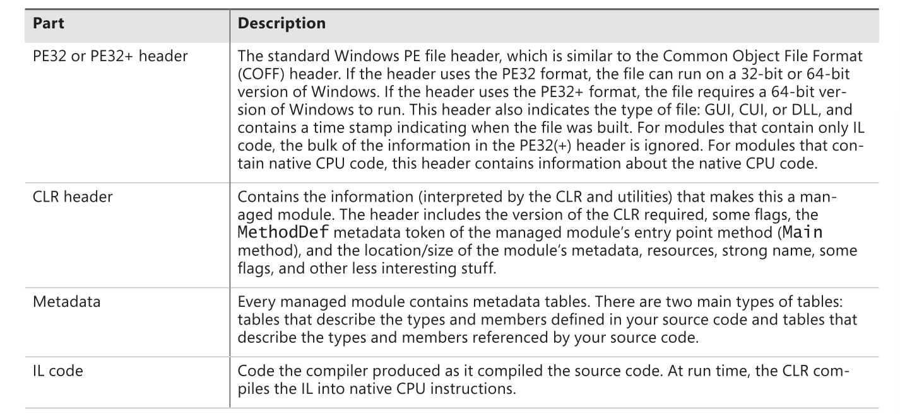
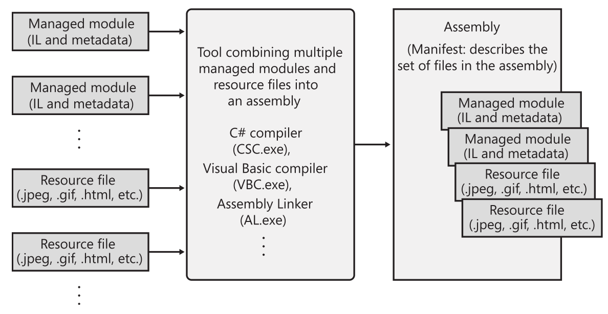

# 将源码编译为托管模组（Managed Modules）
	- 源码（高级语言代码）经过编译器编译之后的结果就是一个**[[$red]]==托管模组==**
		- 个人理解：一般来说，一个源码文件对应一个编译后的托管模组
	- 托管模组是一个**[[$red]]==PE32==**(32位)或一个**[[$red]]==PE32+==**(64位)文件
		- 虽然和传统的原生windows文件共用一个文件格式，CLR托管模组的执行依赖于CLR
	- 既然托管模组是一个PE32结构的文件，因此其结构类似于传统PE32结构，拥有一个PE32头
		- 但是其其他结构则完全不同，具体来讲，其大致结构如下：
		- 
	- Metadata节的用途主要包括：
		- 包含了所有的引用信息，例如代码中所使用的库函数的引用。这些信息可用于IDE辅助进行语法检查，代码补全等。
		- 确保类型安全。
		- 帮助进行序列化和反序列化
		- 允许GC追踪object的生命周期
	- 托管模组文件的后缀一般为.exe或.dll
- # 将托管模组合并为程序集(Assembly)
	- CLR实际最小载入单位并非托管模组，而是**[[$red]]==程序集(Assembly)==**
	- 一个程序集是：
		- 若干托管模组或**资源文件**的逻辑整合
		- 重用、安全和版本管理的最小单位
	- 被载入进CLR的程序集被称为一个**[[$red]]==组件(Component)==**
	- 一个程序集最终也会被组成成为一个PE32文件，其结构大致如下：
		- {:height 379, :width 719}
		- 程序集会包含一个**Manifest**，也是一种metadata，主要描述该程序集包含了：
			- 哪些文件
			- 哪些由该程序集实现的导出类型
			- 相关资源或数据文件
		- 向一个托管模组中添加一个manifest就可以把该模组变成只含一个模组的程序集
	- 程序集提供另一种管理资源（包括源代码）的视角，并可以自由地进行逻辑分组
		- 例如，可以将程序中一些不常使用地代码打包到一个独立地程序集中。当需要使用该程序集中地代码时再从网络下载。可以节省硬盘空间
	- 程序集中的模组带有其所依赖的程序集的基本信息（包括版本号）
- # 加载CLR
	-