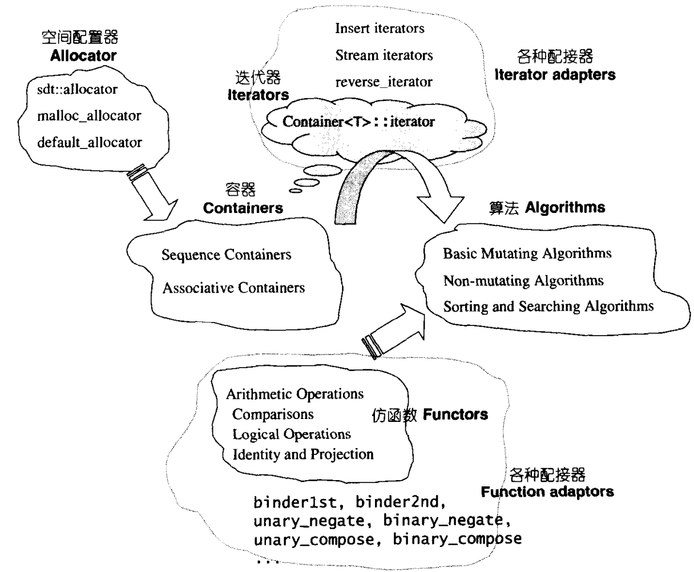

- STL所实现的，是根据**泛型思维**构建的概念结构
- STL最初是在Ada语言中的一个标准程序库，于1994年被决定引入C++标准，1998年正式进入C++标准规格
- 作为C++标准，任何C++编译器都会有一份STL实现，**以源代码方式提供**
- 根据标准规定，所有的头文件都不应当包括``.h``后缀
	- 但某些编译器为了向下兼容，其使用的STL会同时存在包含``.h``和不包含的头文件，例如``vector.h``和``vector``
	-
- # STL的六大功能组件
	- 六大组件之间可以彼此组合套用
	- 
	- ## 容器(Container)
		- 各种数据结构，如``vector``, ``set``等
		- 用于存放数据
		- 从实现角度看，STL容器是若干class template
	- ## 算法(Algorithm)
		- 各种常用算法，如``sort``, ``reverse``等
		- 从实现角度看，STL算法是若干function template
	- ## 迭代器(Iterator)
		- 作为**容器和算法之间的[[$red]]==胶合剂==**，即所谓**[[$red]]==泛型指针==**
		- 从实现角度来看，迭代器是将``*``，``->``，``++``，``--``等指针相关操作符重载的class template
		- 所有的STL容器都附带有自己专属的迭代器(**[[$red]]==只有容器设计者才知道如何遍历其中的元素==**)
		- native pointer(原生指针)也是一种迭代器
	- ## 仿函数(Functor)
		- 行为类似函数，可以直接调用，可作为**算法**的某种**[[$red]]==策略==**
		- 例如调用``sort``时的比较函数
		- 从实现上来看，仿函数是若干重载了`()`操作符的class或class template
		- 函数指针也可视为仿函数
	- ## 配接器(Adapter)
		- 一种用于修饰容器或仿函数或迭代器接口的**包装类(wrapper)**
		- 例如STL中的``queue``和``stack``虽然看类似于容器，其底层实现完全借助``deque``
		- 包装functor的adapter称为function adapter
		- 包装container的adapter称为container adapter
		- 包装iterator的adapter称为iterator adapter
		- Adapter的具体实现千人千面，必须具体逐一分析
	- ## 分配器(Allocator)
		- 负责空间分配与管理
		- 从实现角度看，分配器是实现了动态控件分配，空间管理和空间释放的 class template
	- **容器**通过**分配器**获得内存空间
	- **算法**通过**迭代器**存取**容器**内容
	- **仿函数**可以协助**算法**更改策略
	- **配接器**修饰或包装**仿函数**
- # STL的各种版本
	- 全世界所有STL实现版本都基于Alexander Stepanov和Meng Lee的原始版本
	- 源码所有权在惠普公司手里，但是每一份头文件都有一份声明，允许任何人随意使用，复制修改，传播甚至**贩卖**这些代码而无任何费用。唯一要求是必须将此声明置于使用者新开发的文件内
	- ## HP实现版本
		- 所有STL实现版本的始祖
		- 每一个HP STL头文件都有一份声明，允许任何个人免费使用，拷贝，修改，传播，贩卖此软件和说明文件，唯一需要遵守的是所有这些文件中哦都必须要加上HP的版本声明和使用权限声明
			- 此license不属于GNU GPL，但属于OPEN SOURCE范畴
	- ## P.J. Plauger实现版本
		- **Visual C++**采用的版本
		- 由P.J. Plauger开发
		- 继承自HP STL，但是并不是开源软件，其所有头文件都有一个HP版本声明加上其自己的版权声明，保留了所有权利
			- 这是合法的，因为HP版本并没有要求衍生产品也必须开放源代码
		- 可读性低
	- ## RougeWave实现版本
		- **C++Builder**采用的版本
		- 由RougeWave公司开发
		- 同上，继承自HP STL，但并不是开源软件
		- 可读性尚可，但有难懂的地方
	- ## SGI STL实现版本
		- **GCC**采用的版本
		- 由Silicon Graphics Computer System公司开发
		- 继承自HP STL，也附加其版权声明，但是此声明也允许包括商用在内的一切使用，因此也属于OPEN SOURCE软件
		- 可读性高
	- ## STLport实现版本
		- 提供以SGI STL为蓝本的高度可移植性版本
-