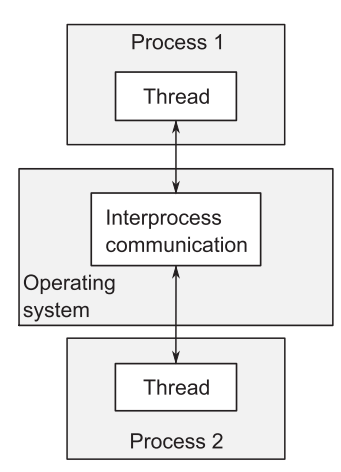
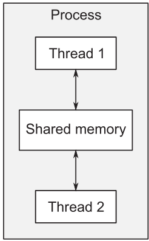

- # 什么是并发
	- 复习concurrency和parallel的区别
	- parallel，也就是真正的同时运行需要硬件的支持，所以也叫硬件并发(Hardware concurrency)
	- ## 并发的方式
		- ### 进程间并发
			- 通过若干只有一个线程的进程完成并发
			- 类似于一般的同时开启多个应用程序
			- 进程间通信通过**信号，socket，文件，管道**等方式完成
			- 
			- #### 缺点
				- 进程间通信通常较为复杂或建立速度较慢，或两者皆有
					- 原因是**操作系统**往往会采取大量的保护措施避免进程间互相修改其他进程的数据
				- 多进程会的固定开销大
					- 需要事件启动，操作系统需要划拨资源用于管理进程
			- #### 优点
				- 操作系统提供的进程间通信机制更高级且安全性更好，编写并发安全代码更容易
				- 可以通过网络实现跨机器的并发
		- ### 多线程并发
			- 在单个进程中运行多个线程
			- 线程类似于轻量级的进程，**共享地址空间**，全局变量，指针，对象的引用等可以在线程间传递
			- 
			- #### 优点
				- 地址空间共享和线程间数据保护的缺乏使得多线程开销远小于多进程
			- #### 缺点
				- 数据一致性和安全性等问题需要程序员自己解决
		- C++标准并未对进程间通信提供原生支持，其依赖于平台相关API
		- 因此C++并发多采用多线程实现
	- ## 并发与并行(Parallel)
		- 在现代多核计算机上，并发和并行大多数时候实际含义并无区别，只不过侧重点不同
		- **并发(Concurrency)**侧重于任务分离或任务响应
		- **并行(Parallel)**侧重于使用硬件提高数据处理速度
- # 为什么使用并发
	- 两点原因，分离关注点(SOC)和性能，或两者兼有
	- ## 分离关注点
		- **Separation Of Concerns**
		- 将无关代码之间进行分离可以使程序更易理解和测试，分离不同的功能区域
		- 例如对于一个DVD播放程序：
			- 读取数据和影音解码
			- 接受用户输入
		- 若不使用多线程将以上两个功能分开，则需要在播放中定期调用检查用户输入的函数
		- 此设计基于概念和功能(即使响应)的考虑，和实际CPU核心数无关
	- ## 性能
		- **任务并行**(Task Parallelism)
			- 各个线程执行算法的某一部分
			- 各个线程在不同数据块上执行相同操作(**数据并行**(data parallelism)
			- 容易并行的算法称为**易并行的**(embarrassingly parallel)，可以几乎无限地将算法分配给若干线程，随着物理核心数增加，这样的算法可以轻易获得性能加成
	- ## 什么时候不适用并发
		- 并发是一把双刃剑，有利有弊
		- 并发会导致代码难以理解，复杂性增加等问题，若这些问题带来的减益大于收益，则不要适用并发
		- 启动线程也需要成本，若实际执行任务地事件比启动线程地时间还少，则没有必要
		- 太多的线程会消耗很多操作系统资源，每一个线程都需要一个独立的堆栈，内存开销很大
- # 并发和多线程
	- C++98不支持线程
	- C++11带来了全新的内存模型，和标准库的扩展，支持了多线程操作
	- 标准库的并发部分和Boost线程库十分类似
	- C++14添加了互斥量类型
	- C++17增添了一整套并行算法
	- ## 库的性能
		- 线程库包含底层工具和高级工具，高级的功能可能会带来更高的**抽象代价**(abstraction penalty)
		- 不过C++的线程库的高级工具性能开销和手工编写函数差不了太多，且编译器会内联大部分代码
	- ## 平台相关工具
		- 某些平台会提供额外的工具
		- 线程库提供一个`native_handle`函数，其执行的操作全都依赖于平台
- # 开始入门
	- ## 来到并发世界
		- ``thread``头文件包含了管理线程的函数和类
		- ``std::thread``是线程库中提供的线程类
		- 每一个线程都必须有一个**初始函数**(initial function)，相当于新线程的entry point
			- 对于一个进程的初始线程来说，初始函数就是main函数
		- ``std::thread.join``函数让调用者等待一个线程返回后再继续执行