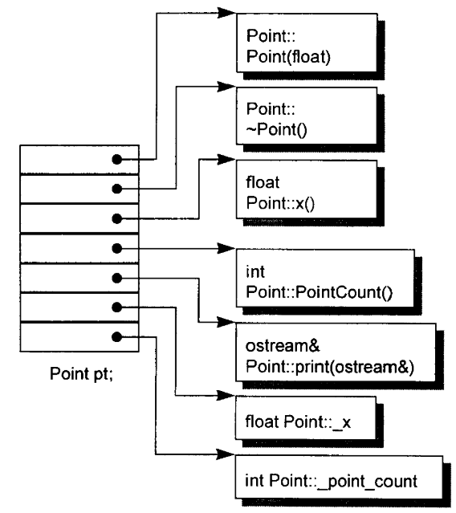
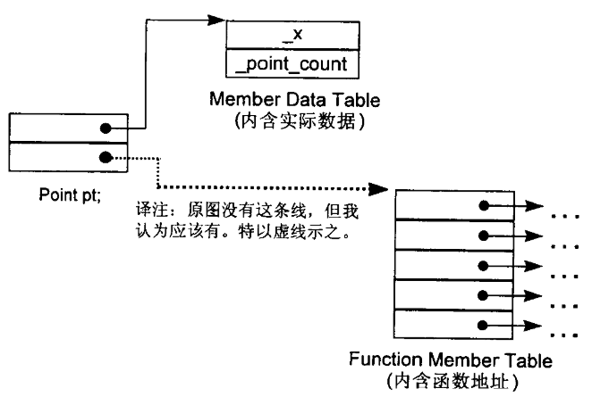
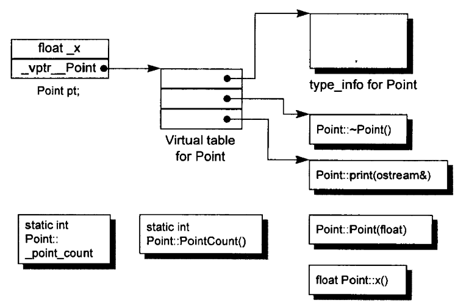
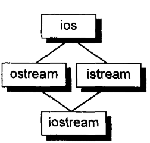
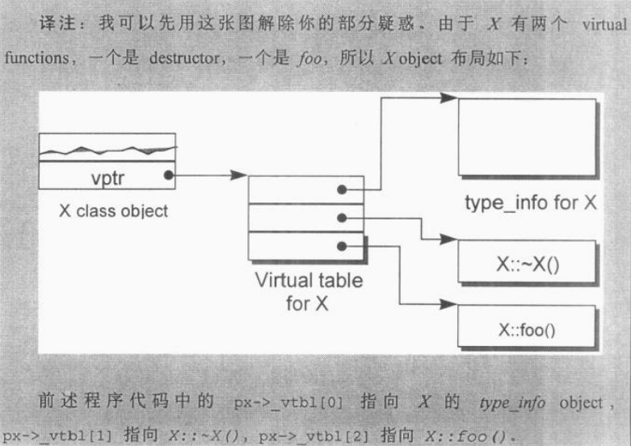

- C++中的一个类，也叫**ADT(abstract data structure)**
- ADT并不会在因为封装而带来额外开销(布局成本(Layout Costs)：
	- 数据成员(data member)直接内含在每一个class object中
	- 非内联成员函数并不出现在object中，每一个非内联成员函数**只会诞生一个函数实体**
	- 内联成员函数会在调用者处产生一个函数实体
- 实际上，C++在布局和存取时间上主要的额外开销来自于**virtual**，包括
	- **虚函数机制(virtual funcion)**，用于支持一个有效的运行时绑定(runtime binding)
	- **虚基类机制(virtual base class)**，用于实现“多次出现在继承体系戏中的基类，有一个**单一而被共享的实体**”
- # C++对象模型·(Object Model)
	- 对象模型用于刻画一个类对象会**如何在内存中存储**
	- **类数据成员(aka成员变量)**有两种：
		- static
		- nonstatic
	- **类成员函数**有三种
		- static
		- nonstatic
		- virtual
	- 以如下的Point类声明作为例子
		- ```
		  class Point{
		  public:
		  	Point(float xval);
		      virtual ~Point();
		      float x() const;
		      static int PointCount();
		  protected:
		  	virtual ostream& print(ostream &os) const;
		      float _x;
		      static int _point_count;
		  }
		  ```
	- ## 简单对象模型
		- Simple Object Model
		- 为降低C++编译器设计复杂度而设计，十分简单
		- 代价是牺牲空间核执行效率
		- 一个对象是一系列的slots，每一个slot指向一个member
		- 函数成员核数据成员都有一个slot
		- {:height 311, :width 266}
		- 成员本身并不在object之中，只有指向members的指针
		- 方便快捷，存储object本身不用担心不同数据类型所占据的空间大小
	- ## 表格驱动对象模型
		- **Table-driven Object Model**
		- {:height 174, :width 247}
		- 一个对象包含两个slot，每个slot各指向一张表
		- 一张表是成员数据表，其中直接存放了对象的数据成员
		- 另一张表是指向所有成员函数slot的表，表项为某个成员函数的地址
	- ## C++对象模型
		- **之前两种模型都没有实际应用到C++编译器中**
		- 从简单对象模型派生而来，对内存空间核存取时间做了优化
		- **nonstatic data members**被配置与每一个class object之内
		- **static data members**核**所有成员函数**都被存放在class object之外
		- **虚函数**通过以下两个步骤获得支持
			- 每一个class产生出一对指向vitual function的指针，放在一个被称为**Virtual Table(vtbl)**的表格中
				- 每一个class所关联的***type_info* object**(用于支持**runtime type identification(RTTI)**)也由vtbl存放，通常存放于此表的第一个slot
			- 每一个class object都有一个指向相关vtbl的指针，此指针**通常被称作vptr**
				- vptr的设置和重置由每一个类的**构造函数，析构函数，拷贝赋值函数**自动完成
		- {:height 276, :width 399}
		- 本模型的缺点在于，哪怕程序代码本身未改变，但是用到的class的nonstatic data member有序哦修改，那么应用程序代码同样得重新编译
		- ### 加上继承(Inheritance)
			- C++支持**单一继承**：
				- ``class A : public B``
			- 也支持**多重继承**
				- ``class iostream: public istream, public ostream``
			- 甚至继承关系也可以是**虚拟**(virtual，在C++语境下，virtual也就是**共享**的意思)
				- ``class istream: virtual public ios``
				- 虚拟继承情况下，不管基类在继承链中被**派生**(derived)多少次，永远只会存在一个实体(subobject)，**例如**，iostream中就只有一个ios class实体
			- {:height 137, :width 136}
			- 对于virtual 基类的存放，不同的实现可能有不同的策略，有的可能直接将虚基类对象的指针直接存放在类对象中，有的增添一个指向virtual base class table的指针 ，还有的在原有的virtual table上扩充以存放virtual base class的信息
	- ## 对象模型如何影响程序
		- 不同的对象模型可能会导致**必须修改现有代码**或**增添新代码**的结果
		- 例如，如下的函数：
			- ```
			  X foobar(){
			  	X xx;
			      X* px = new X;
			      xx.foo();
			      px->foo(); //foo是一个虚函数
			      delete px;
			      return xx;
			  };
			  ```
		- 在经过**编译器处理之后**，可能会变成下面的样子：
			- ```
			  void foobar(X &_result){
			  	_result.X::X();
			      X* px = _new(size(of(X)));
			      if(px!=0) px ->X::X();
			      foo(&_result);
			      (*px->vtbl[2]) (px);
			      if(px!=0){
			      	(*px->vtbl[1])(px);
			          _delete(px);
			      }
			      return;
			  }
			  ```
		- {:height 263, :width 362}
- # 关键词带来的差异(Keyword Distinction)
	- sturct和class关键字在C++中的差异
	- 答案是**基本没有差异**，本来就是为了兼容C才保留的
	- 一般除非是要自定义复杂纯数据对象或封装数据传入C函数，其他场景下都可以使用class代替struct
- # 对象的差异
	- ## C++支持的三种程序设计典范(programming paradingms)
		- ###  过程模型(procedural model)
			- 就像C一样
		- ### 抽象数据类型模型(abstract data type model,ADT)
			- 一组表达式(public接口)和数据**一起提供**
		- ### 面向对象模型(Object-oriented model)
			- 一系列彼此相关的类型通过基类被封装起来
	- 完全只使用某一种范式来设计程序有助于整体行为的良好稳固，如果混用则可能导致无法预期的后果
	-