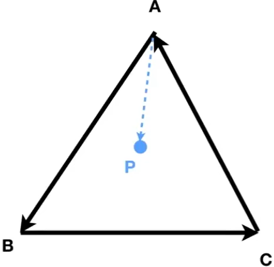

# 向量
	- DONE 把这一章学完
	- 包含方向和长度
	- 表示方法：$\mathop{a}\limits^\rightarrow$，或者为粗体小写字母：$\bold{a}$
	- 长度表示为：$\| \mathop{a}\limits^\rightarrow \|$
		- $\| \vec{a}\| = \sqrt{x^2+y^2}$
	- 单位向量表示为：$\hat{a}$，$\hat{a}=\mathop{a}\limits^\rightarrow / \| \mathop{a}\limits^\rightarrow\|$
	- 向量可以**相加**
		- 几何：平行四边形法则或则三角形法则
		- 代数：向量的每个项直接相加
	- 图形学中默认向量为**列向量写法**
		- {:height 52, :width 77}
	- ## 点乘
		- **点乘的结果是一个[[$red]]==标量==**
		- ### 定义
			- $\mathop{a}\limits^\rightarrow\cdot \mathop{b}\limits^\rightarrow= \| \mathop{a}\limits^\rightarrow\| \| \mathop{b}\limits^\rightarrow \| \cos\theta$
			- 点乘满足：
				- **交换律**：$\vec{a}\cdot\vec{b} = \vec{b}\cdot\vec{a}$
				- **针对向量相加的分配律**：$\vec{a}\cdot(\vec{b}+\vec{c})=\vec{a}\cdot\vec{b}+\vec{a}\cdot\vec{c}$
				- **数乘结合律**：$(k\mathop{a}\limits^\rightarrow)\cdot \mathop{b}\limits^\rightarrow = \mathop{a}\limits^\rightarrow\cdot(k\mathop{b}\limits^\rightarrow)=k(\mathop{a}\limits^\rightarrow\cdot \mathop{b}\limits^\rightarrow)$
		- ### 计算：
			- 二维情况：
				- $$\mathop{a}\limits^\rightarrow \cdot \mathop{b}\limits^\rightarrow = \begin{pmatrix}x_a\\y_a\end{pmatrix}\cdot \begin{pmatrix}x_b\\y_b\end{pmatrix}=x_ax_b+y_ay_b$$
			- 三维情况：
				- $$\mathop{a}\limits^\rightarrow\cdot \mathop{b}\limits^\rightarrow = \begin{pmatrix}x_a\\y_a\\z_a\end{pmatrix}\cdot \begin{pmatrix}x_b\\y_b\\z_b\end{pmatrix} = x_ax_b+y_ay_b+z_az_b$$
		- ### 应用
			- **计算两个向量之间的夹角**
				- $\cos \theta =\frac{\mathop{a}\limits^\rightarrow\cdot \mathop{b}\limits^\rightarrow}{\|\mathop{a}\limits^\rightarrow\| \| \mathop{b}\limits^\rightarrow\|}$
				- 对于两个单位向量来说：$\cos \theta = \hat{a} \cdot \hat{b}$
			- **投影**
				- {:height 121, :width 186}
				- ${\mathop{b}\limits^\rightarrow}_\bot$ 是$\mathop{b}\limits^\rightarrow$在$\mathop{a}\limits^\rightarrow$上的投影
				- ${\mathop{b}\limits^\rightarrow}_\bot$是沿着$\mathop{a}\limits^\rightarrow$或$\hat{a}$的
					- 意味着：${\mathop{b}\limits^\rightarrow}_\perp=k\hat{a}$
				- $k = \|{\mathop{b}\limits^\rightarrow}_\perp\| = \|\mathop{b}\limits^\rightarrow\| \cos \theta$
				- $\vec{b}_\bot =(\vec{a}\cdot \vec{b} )\hat{a} = \frac{(\vec{a}\cdot \vec{b})\vec{a}}{\| \vec{a\|}}$
				- $\mathop{b}\limits^\rightarrow - {\mathop{b}\limits^\rightarrow}_\perp$的结果是一个垂直于${\mathop{b}\limits^\rightarrow}_\perp$的向量
					- {:height 110, :width 189}
			- **判断方向有多接近**
				- {:height 174, :width 203}
				- 如果$\mathop{a}\limits^\rightarrow\cdot \mathop{b}\limits^\rightarrow$的值**小于零**说明两个向量的**指向不一致**
				- 否则**[[$red]]==基本==一致**
				- 如果为0则说明垂直
				- 如果两个向量都是**单位向量**，则**指向越相同越接近1**，越不相同其值越小直到**0为垂直**，然后到**-1**，表示**完全相反**
	- ## 叉乘
		- 叉乘会产生一个和两个输入向量都垂直的[[$red]]==**向量**==
		- 新产生的向量**方向由右手定律确定**
			- 右手摆出点赞的姿势，**四指指向表示旋转的方向**
				- 例如，$\vec{a}\times \vec{b}$，那么四指应该由$\vec{a}$指向$\vec{b}$
			- **大拇指指向的方向就是新产生向量的方向**
				- 由此可以看出[[$red]]==**叉乘不满足交换律**==，$\vec{a}\times\vec{b}$和$\vec{b}\times\vec{a}$所指向的方向相反
			- 由右手螺旋定则得出的坐标系称为**右手坐标系**
		- 对于生成坐标系很有用
		- ### 性质
			- 在一个右手坐标系中，假设三个轴分别是$\vec{x},\vec{y},\vec{z}$，那么有：
				- $\vec{x}\times\vec{y}=+\vec{z},\ \vec{y}\times\vec{x}=-\vec{z}$
				- $\vec{y}\times\vec{z}=+\vec{x},\ \vec{z}\times\vec{y}=-\vec{x}$
				- $\vec{z}\times\vec{x}=+\vec{y},\ \vec{x}\times\vec{z}=-\vec{y}$
			- $\bold{a}\times \bold{b} = - \bold{b}\times \bold{a}$
			- $\| \bold{a} \times \bold{b}\| = \| \bold{a}\| \|\bold{b}\| \sin \varphi$
			- $\vec{a} \times \vec{a} = \vec{0}$
				- **[[$red]]==注意==**：得到的**不是标量0**，而是一个**0向量**
			- **针对向量加法的结合律**：$\vec{a}\times(\vec{b}+\vec{c})=\vec{a}\times\vec{b}+\vec{a}\times\vec{c}$
			- $\vec{a}\times(k\vec{b})=k(\vec{a}\times\vec{b})$
		- 满足针对向量加法的分配律和数乘结合律
		- ### 计算方法
			- $$\vec{a}\times \vec{b}=\begin{pmatrix}y_az_b - y_bz_a \\ z_ax_b - x_az_b \\ x_ay_b - y_a x_b\end{pmatrix}$$
			- 后面会用到：
				- $$\vec{a}\times \vec{b}=A^*\vec{b}=\begin{pmatrix}0 & - z_a & y_a \\ z_a & 0 & -x_a \\ -y_a & x_a & 0\end{pmatrix} \begin{pmatrix} x_b\\y_b\\z_b\end{pmatrix}$$
				- 注意$A^*\vec{b}$并不是$A*\vec{b}$，是矩阵$A^*$和向量$\vec{b}$(也是一个矩阵)进行矩阵乘积。
				- $A^*$是一个$3\times 3$的矩阵，叫做向量$\vec{a}$的**Dual Matrix**
		- ### 应用
			- **判明左和右**
				- {:height 96, :width 177}
				- 叉乘的结果如果**Z方向是正的**，说明被叉乘的在叉乘的左侧
				- 例如上图中，$\vec{a}\times\vec{b}$的结果中，Z轴是正数，那么$\vec{b}$在$\vec{a}$的右侧
			- **判明内和外**
				- {:height 149, :width 144}
				- 有一个多边形，**每个顶点按逆时针或顺时针构成的向量**都和边**起始点到点P的向量**做叉乘，如果结果都是在同一个方向（同左或同右，根据所选的是逆时针或顺时针决定），则说明该点在该多边形内部
				- 如果正好是0，属于corner case(点在某一条边或就是某一个顶点)，自行决定是在内还是在外
	- ## 坐标系(Coordinate Frames)
		- 也称Orthonormal Bases
		- 图形学中，坐标系用于表示点，位置等，非常重要
		- 通常会有多个坐标系集合，例如：全局坐标系，本地坐标系，世界坐标系，模型坐标系等
			- 因此，**不同坐标系之间的变换**是图形学中一个非常重要的话题
		- 任何三个向量，满足以下情况即可形成一个**直角(Orthonormal)**坐标系：
			- **每个向量的长度都是1**：$\|\bold{u}\| = \| \bold{v}\| = \|\bold{w}\| =1$
			- **任意两个向量之间都是正交的**：$\bold{u}\cdot \bold{v} = \bold{v}\cdot \bold{w} = \bold{u}\cdot \bold{w}=0$
			- **右手系**：$\bold{w} = \bold{u}\times \bold{v}$
		- 任何一个向量都可以表示为在这三个向量上的投影：
			- $\bold{p} = (\bold{p}\cdot \bold{u})\bold{u} + (\bold{p}\cdot\bold{v})\bold{v} + (\bold{p}\cdot \bold{w})\bold{w}$
- # 矩阵
	- 矩阵(的乘积)常被用于向量的变换
	- ## 矩阵的乘积
		- 必须要**第一个矩阵的列数**等于**第二个矩阵的行数**，才能进行矩阵间的乘积
		- 结果是一个**行数等于第一个矩阵行数**，**列数等于第二个矩阵列数的一个矩阵**
		- ### 性质
			- **矩阵的乘积[[$red]]==不满足==交换律**
			- **结合律**：$(AB)C = A(BC)$
			- **（针对矩阵加法的）分配律**：
				- $A(B+C)=AB+AC$
				- $(A+B)C=AC+BC$
	- ## 矩阵的转置（Transpose）
		- 将行和列对换
		- **性质：**
			- $(AB)^T = B^TA^T$
	- ## 单位矩阵：
		- 又称**对角矩阵**，即只有对角线(左上到右下)上全为1，其余位置的元素都是0
		- 一个3*3的单位矩阵：
			- $I_{3\times 3}=\begin{pmatrix} 1&0&0\\0&1&0\\0&0&1\end{pmatrix}$
		- 用于定义矩阵的逆
			- 对于一个矩阵A,其逆矩阵$A^{-1}$的定义为：
				- $AA^{-1} =A^{-1}A=I$
				- $(AB)^{-1}=B^{-1}A^{-1}$
	- ## 点积和叉乘都可以用矩阵相乘表示
		- ### 点乘
			- $\vec{a}\cdot \vec{b} = \vec{a}^T\vec{b}$
		- ### 叉乘
			- $\vec{a}\times \vec{b}=A^*\vec{b}=\begin{pmatrix}0 & - z_a & y_a \\ z_a & 0 & -x_a \\ -y_a & x_a & 0\end{pmatrix} \begin{pmatrix} x_b\\y_b\\z_b\end{pmatrix}$