- 材质：Material
- 外观：Appearance
- 外观是光线和材质共同作用的结果
- 在计算机图形学中：
	- **[[$red]]==材质 = BRDF==**
	- 因为BRDF定义了光线会被如何反射
- # 一些常见的材质
	- ## 漫反射(Diffuse / Lambertian)
		- 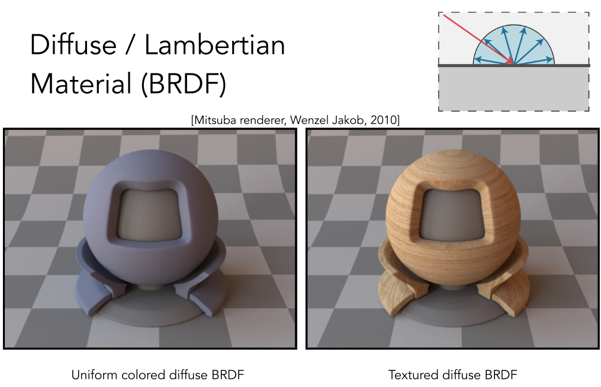{:height 268, :width 404}
		- 漫反射材质就是光线会被向四周均匀反射
		- 由于漫反射的折射光线是均匀分布，因此可以认为其BRDF为一个常数，即$f_r = c$
		- 又如果假设入射的光线也是均匀分布的，那么对入射光的积分最终会变为在$\cos$上的积分，最终得到：
			- 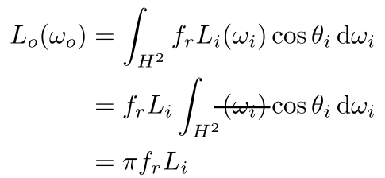{:height 158, :width 329}
		- 又如果我们认为反射不消耗能量，即入射的强度之和等于出射的强度之和，那么就有$fr = \frac{1}{\pi}$
		- 又可引入颜色的概念albedo，其值$0\le \rho \le 1$，最终的$f_r = \frac{\rho}{\pi}$，albedo可以是单通道，也可以是多通道
	- ## 毛反射/金属光泽(Glossy)
		- 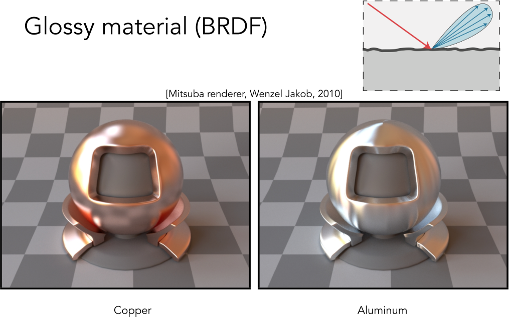{:height 344, :width 539}
	- ## 理想折射(Ideal reflective / refractive)
		- 一部分光发生镜面反射，另一部分发生折射
		- 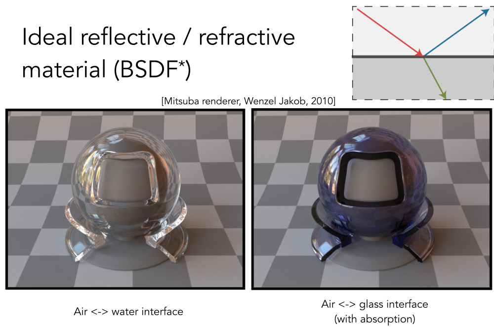{:height 341, :width 507}
		- 常用于玻璃和水
		- 此处：**BSDF** = BRDF+BTDF
			- S=Scatteirng
			- T=Transmitted
			- 即散射=反射+折射
			- {:height 435, :width 319}
	- ## 完美镜面反射(Perfect Specular Reflection)
		- 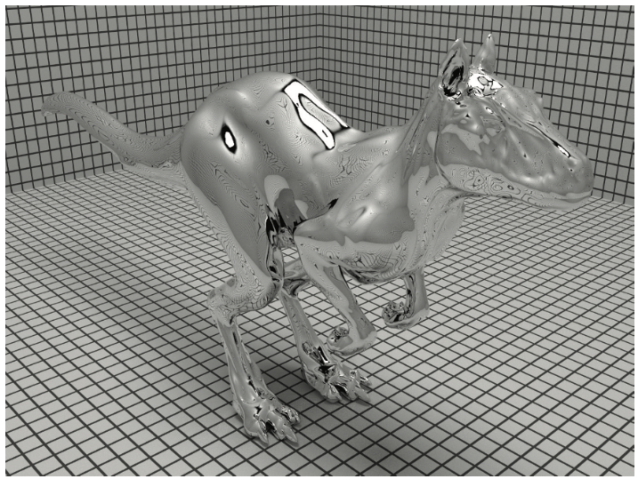{:height 261, :width 344}
		- ### 根据入射方向求解出射方向
			- 假设入射方向为$\omega_i$，初设方向为$\omega_o$，均使用一个单位向量表示
			- 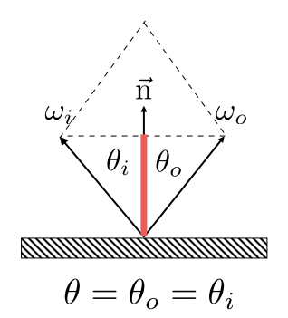{:height 195, :width 171}
			- 完美镜面反射的入射角$\theta_i$等于出射角$\theta_o$，则根据平行四边形法则有：
				- $\omega_o+\omega_i = 2\cos\theta \vec{n} = 2(\omega_i\cdot\vec{n})\vec{n}$
				- $\omega_o = -\omega_i + 2(\omega_i\cdot \vec{n})\vec{n}$
			- 从另外一个角度来说，任何一个立体角都可以拆成两个平面角$\theta$和$\phi$
				- 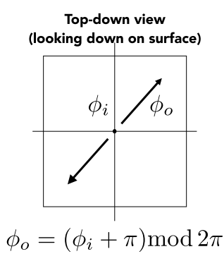{:height 214, :width 181}
				- $\phi_o$和$\phi_i$相差180度，刚好反向
	- ## 折射(Specular)
		- 不发生镜面反射，而是描述光从一个介质进入另一种介质时发生的光路变形
		- 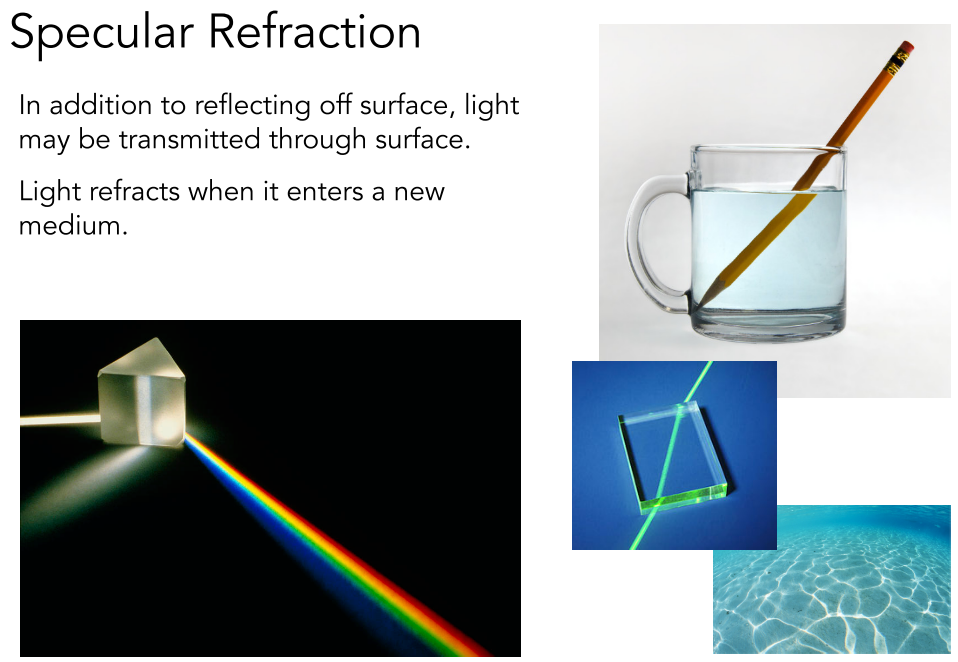{:height 287, :width 407}
		- ### 折射定律(Snell's Law)
			- 折射发生在入射面上
			- 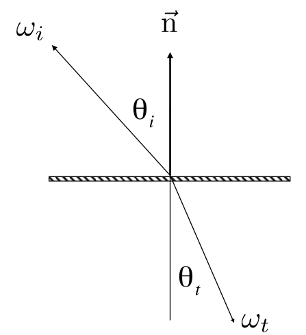{:height 252, :width 223}
			- 入射角和出射角的正弦值满足：$\eta_i\sin\theta_i = \eta_t \sin\theta_t$
				- 不同的材质有不同的$\eta$值，即折射率
				- 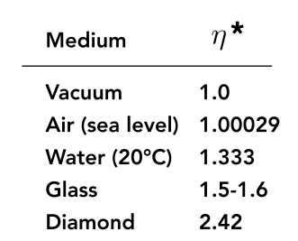{:height 176, :width 216}
			- 同样，$\varphi_i$和$\varphi_t$相差一个$\pi$
				- 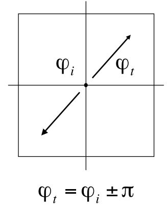{:height 242, :width 187}
		- ### 计算出射角的余弦
			- 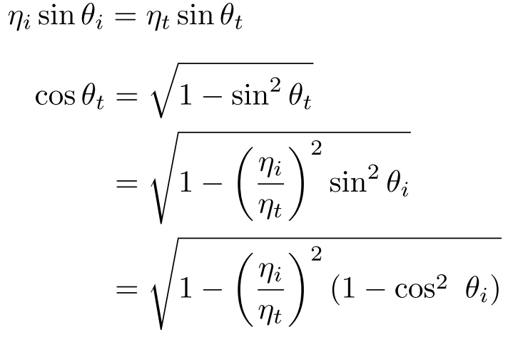{:height 193, :width 285}
			- 可以看到，当$1-(\frac{\eta_i}{\eta_t})^2(1-\cos^2\theta_i)<0$时，不存在实数解
				- 又因为当一般折射都是从密度小的介质进入密度大的介质，因此$\frac{\eta_i}{\eta_t}>1$
				- 所以得出结论，当入射角大到一定程度之后，**折射不再发射**，即光线不再能走出介质，也称全反射现象
				- 这也会导致所谓**Snell's Window / Circle**现象，即在水下看向水面时，只能看到一块锥形区域
					- 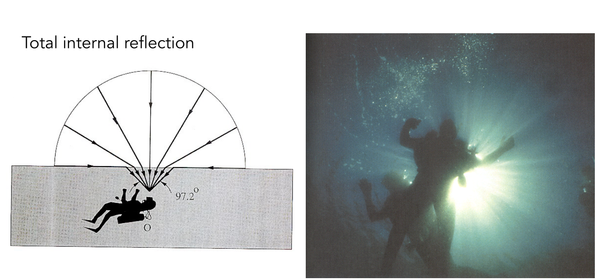
	- ## 菲涅尔项(Fresnel Reflection / Term)
		- 反射程度和入射角度有关
		- 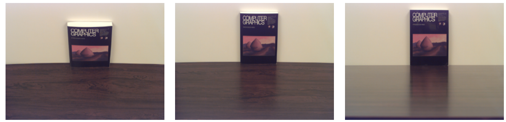
		- 一般认为，入射角度**越接近表面的法线方向**，就越容易被反射
			- 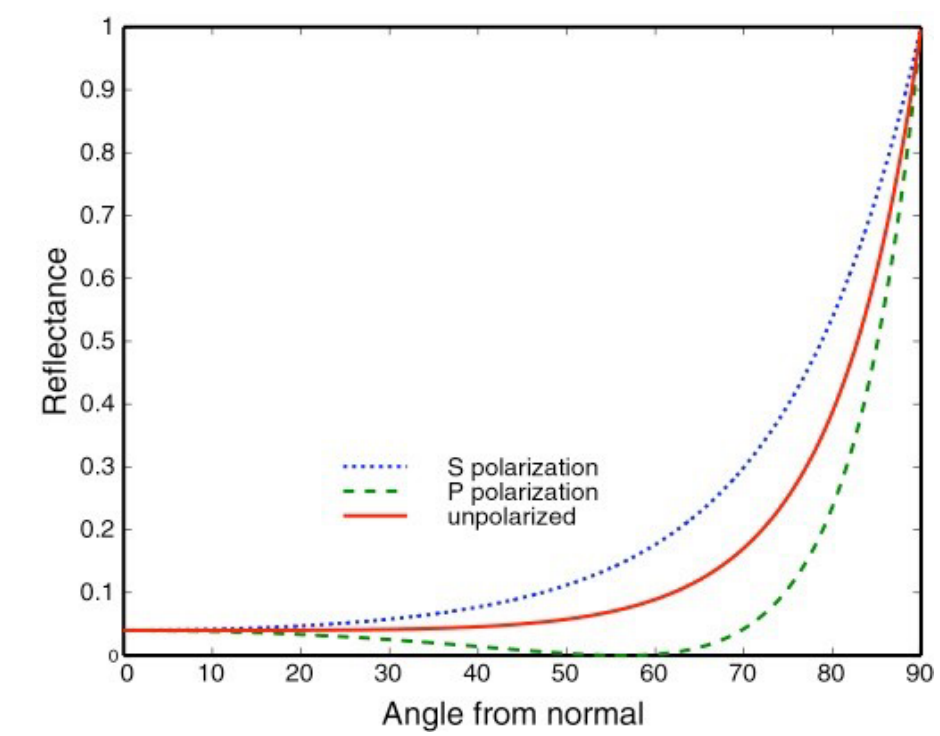{:height 389, :width 490}
			- 其中蓝绿虚线表示**极化**的光，在图形学中一般不考虑
			- 此图反映的是一个$\eta=1.5$的**绝缘体(Dielectric)**的菲尼尔项
		- **导体(Conductor)**有着不同的菲尼尔项，例如金属
			- 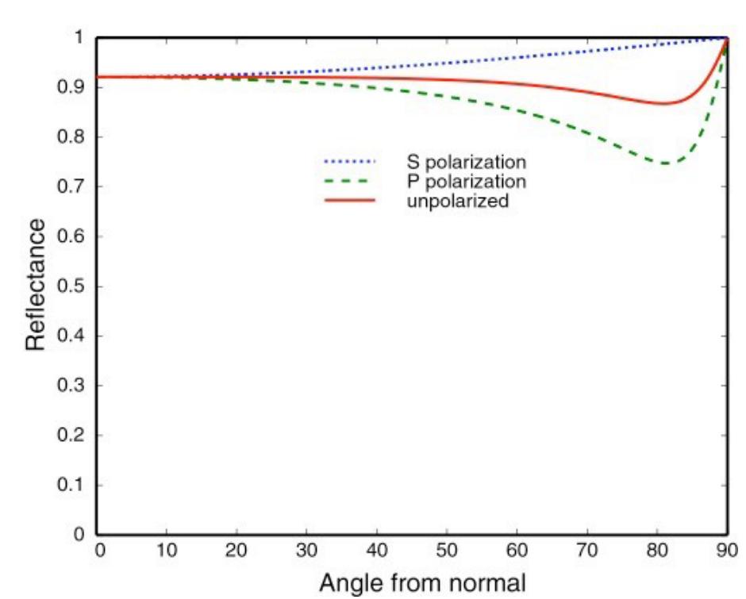{:height 333, :width 402}
		- ### 计算菲尼尔项
			- 极化特性的不同会导致不同的反射率
				- 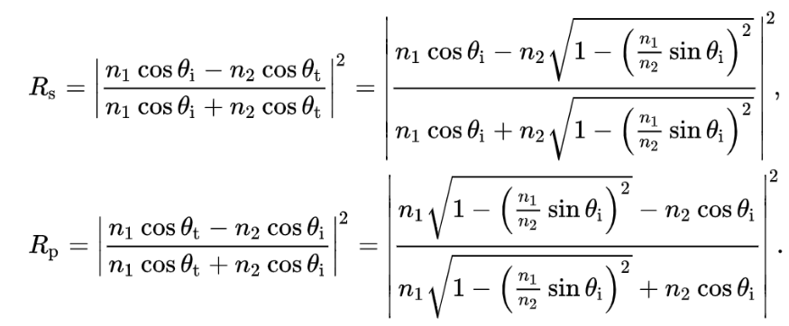{:height 167, :width 393}
			- 如果不考虑极化特性，则直接将两种极化特性的反射率求平均即可
				- $R_{eff} = \frac{1}{2} (R_s+R_p)$
			- 不过还是过于复杂，总的来讲，菲尼尔项就是和入射光的入射角有关，因此可以做简单的**近似**：
				- 又称**Schlick's Approsdimation**
				- 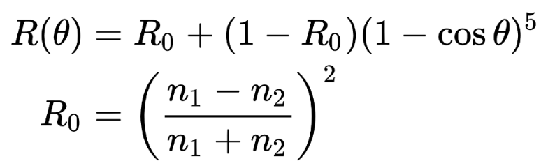{:height 110, :width 323}
				- 本质上就是拟合那条从**基准反射率**($R_0$)随着角度上升的曲线，到90度时为1
				- 近似出来的效果非常不错，得到了广泛的应用
- # 微表面材质(Microfacet Material)
	- ## 微表面理论