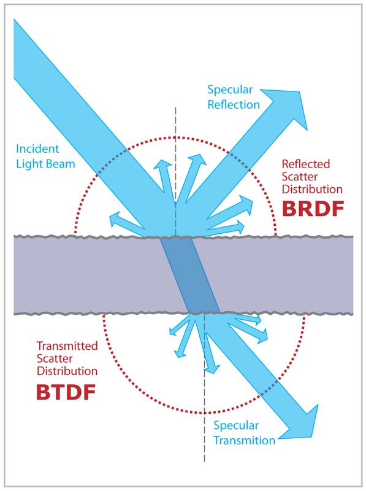
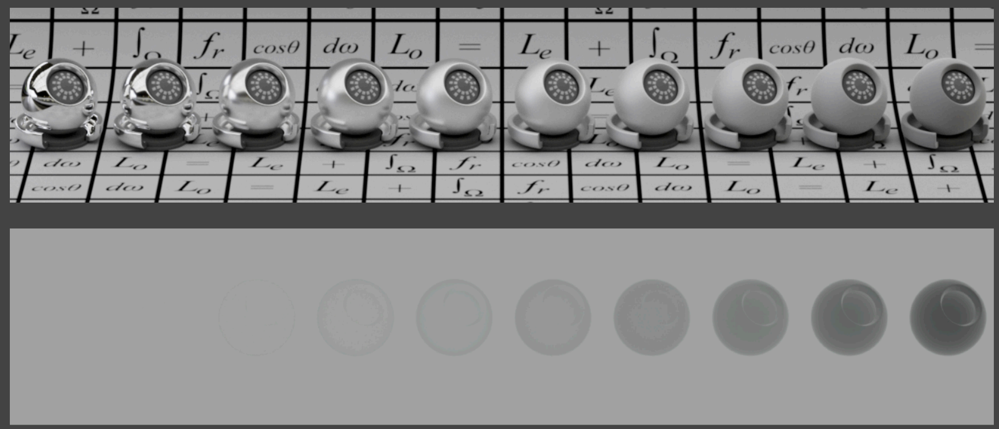

- 材质：Material
- 外观：Appearance
- 外观是光线和材质共同作用的结果
- 在计算机图形学中：
	- **[[$red]]==材质 = BRDF==**
	- 因为BRDF定义了光线会被如何反射
- # 一些常见的材质
	- ## 漫反射(Diffuse / Lambertian)
		- {:height 268, :width 404}
		- 漫反射材质就是光线会被向四周均匀反射
		- 由于漫反射的折射光线是均匀分布，因此可以认为其BRDF为一个常数，即$f_r = c$
		- 又如果假设入射的光线也是均匀分布的，那么对入射光的积分最终会变为在$\cos$上的积分，最终得到：
			- {:height 158, :width 329}
		- 又如果我们认为反射不消耗能量，即入射的强度之和等于出射的强度之和，那么就有$fr = \frac{1}{\pi}$
		- 又可引入颜色的概念albedo，其值$0\le \rho \le 1$，最终的$f_r = \frac{\rho}{\pi}$，albedo可以是单通道，也可以是多通道
	- ## 毛反射/金属光泽(Glossy)
		- {:height 344, :width 539}
	- ## 理想折射(Ideal reflective / refractive)
		- 一部分光发生镜面反射，另一部分发生折射
		- {:height 341, :width 507}
		- 常用于玻璃和水
		- 此处：**BSDF** = BRDF+BTDF
			- S=Scatteirng
			- T=Transmitted
			- 即散射=反射+折射
			- {:height 435, :width 319}
	- ## 完美镜面反射(Perfect Specular Reflection)
		- {:height 261, :width 344}
		- ### 根据入射方向求解出射方向
			- 假设入射方向为$\omega_i$，初设方向为$\omega_o$，均使用一个单位向量表示
			- {:height 195, :width 171}
			- 完美镜面反射的入射角$\theta_i$等于出射角$\theta_o$，则根据平行四边形法则有：
				- $\omega_o+\omega_i = 2\cos\theta \vec{n} = 2(\omega_i\cdot\vec{n})\vec{n}$
				- $\omega_o = -\omega_i + 2(\omega_i\cdot \vec{n})\vec{n}$
			- 从另外一个角度来说，任何一个立体角都可以拆成两个平面角$\theta$和$\phi$
				- {:height 214, :width 181}
				- $\phi_o$和$\phi_i$相差180度，刚好反向
	- ## 折射(Specular)
		- 不发生镜面反射，而是描述光从一个介质进入另一种介质时发生的光路变形
		- {:height 287, :width 407}
		- ### 折射定律(Snell's Law)
			- 折射发生在入射面上
			- {:height 252, :width 223}
			- 入射角和出射角的正弦值满足：$\eta_i\sin\theta_i = \eta_t \sin\theta_t$
				- 不同的材质有不同的$\eta$值，即折射率，也称**Index of Refraction, [[$red]]==IOR==**
				- {:height 176, :width 216}
			- 同样，$\varphi_i$和$\varphi_t$相差一个$\pi$
				- {:height 242, :width 187}
		- ### 计算出射角的余弦
			- {:height 193, :width 285}
			- 可以看到，当$1-(\frac{\eta_i}{\eta_t})^2(1-\cos^2\theta_i)<0$时，不存在实数解
				- 又因为当一般折射都是从密度小的介质进入密度大的介质，因此$\frac{\eta_i}{\eta_t}>1$
				- 所以得出结论，当入射角大到一定程度之后，**折射不再发射**，即光线不再能走出介质，也称全反射现象
				- 这也会导致所谓**Snell's Window / Circle**现象，即在水下看向水面时，只能看到一块锥形区域
					- 
	- ## 菲涅尔项(Fresnel Reflection / Term)
		- 反射程度和入射角度有关
		- 
		- 一般认为，入射角度**越接近表面的法线方向**，就越容易被反射
			- {:height 389, :width 490}
			- 其中蓝绿虚线表示**极化**的光，在图形学中一般不考虑
			- 此图反映的是一个$\eta=1.5$的**绝缘体(Dielectric)**的菲尼尔项
		- **导体(Conductor)**有着不同的菲尼尔项，例如金属
			- {:height 333, :width 402}
		- ### 计算菲尼尔项
			- 极化特性的不同会导致不同的反射率
				- {:height 167, :width 393}
			- 如果不考虑极化特性，则直接将两种极化特性的反射率求平均即可
				- $R_{eff} = \frac{1}{2} (R_s+R_p)$
			- 不过还是过于复杂，总的来讲，菲尼尔项就是和入射光的入射角有关，因此可以做简单的**近似**：
				- 又称**Schlick's Approsdimation**
				- {:height 110, :width 323}
				- 本质上就是拟合那条从**基准反射率**($R_0$)随着角度上升的曲线，到90度时为1
				- 近似出来的效果非常不错，得到了广泛的应用
- # 微表面材质(Microfacet Material)
	- ## 微表面理论
		- {:height 168, :width 658}
		- 表面是凹凸不平的，但是从远处看是一个**粗糙的平面**
		- 因为每一个微小的凹凸不平的面会把光反射到各个方向
		- 总的来说：
			- **从远处看**，看到的是**材质**
			- **从近处看**，看到的是**几何特征**
		- ### 微表面与法线
			- 每一个微表面的法线的分布都会影响整个平面最终的法线
			- {:height 333, :width 476}
			- 如上图中，若微表面的法线整体朝上，方向差别不明显，那么其反射的光源就更加集中，看起来更像金属；若微表面的方向差异过大，则会导致法线分布更大，导致光源被反射地更加不均匀，看起来更粗糙
				- 因此，**集中的法线分布带来金属光泽，分散的发现分布带来漫反射效果**
		- ### 微表面BRDF
			- {:height 338, :width 472}
			- 注意$h$是半程向量，即入射方向和初设方向的中间向量
			- 关于$D(h)$
				- 因为每一个微表面都能够如同镜子一样做到完全反射，因此有多少法线在半程向量上的微表面，就能有多少光线的能量能够被反射
					- 即，只有法线和$h$相同的微表面才能反射光线
				- $D(h)$就是能够求出以后多少微表面的法线分布在半程向量附近
				- 有两种常用的可以用于描述发现分布的模型
				- 在**Beckmann-Spizzichino模型**下：
					- 各项同性版本的NDF为
						- $$D(\omega_h)=\frac{e^{-\frac{\tan^2\theta_h}{\alpha^2}}}{\pi\alpha^2\cos^4\theta_h}$$
					- 各项异性版本为：
						- $$D(\omega_h) = \frac{e^{-\tan^2\theta_h(\frac{\cos^2\phi_h}{\alpha_x^2}+\frac{\sin^2\phi_h}{\alpha^2_y})}}{\pi\alpha_x\alpha_y\cos^4\theta_h}$$
					- 其中$\theta_h$是$\omega_h$和法线的夹角
						- 注意此处的法线指的是着色点的表面法线，而法线分布函数所使用的$\omega_h$仅作为一个参数，一般是入射方向和观察方向的**半程向量**
					- 长得很像高斯函数，高斯函数使用$\sigma$控制分部情况，此模型使用$\alpha$控制分布
						- $\alpha$在此处可以被理解为粗糙度(Roughness)，越大表面效果越接近diffuse，越小越光滑
					- 此模型下的NDF定义在**坡度空间(Slope Space)**
						- 定义在坡度空间上的好处有二
							- 其一是可以确保定于在负无穷到正无穷上
							- 其二是可以确保在如此的定域上，每一个取值都对应一个-90°到+90°的角，确保不会有朝下的微表面
				- 在**Trowbridge-Reitz(GGX)模型**下
					- 各向同性版本：
						- $$D(\omega_h)=\frac{1}{\pi\alpha^2\cos^4\theta_h(1+\frac{\tan^2\theta_h}{\alpha^2})^2}=\frac{\alpha^2}{\pi(\alpha^2\cos^2\theta_h+\sin^2\theta_h)^2}$$
					- 各向异性版本
						- $$D(\omega_h) = \frac{1}{\pi \alpha_x\alpha_y\cos^4\theta_h(1+\tan^2\theta_h(\frac{\cos^2\phi_h}{\alpha_x^2}+\frac{\sin^2\phi_h}{\alpha_y^2}))}$$
					- GGX相较于Beckmann的一大优势是其具有一个“**长尾巴**”，即不会立即衰减到0，使得可以呈现出“光晕”效果
						- {:height 205, :width 449}
					- GGX NDF的一个改进是**GTR(Generalized Trowbridge-Reitz)**
						- 引入一个$\gamma$参数用于进一步扩展尾巴长度，$\gamma$越小尾巴越长，越大越接近BeckMann
						- 
			- 关于$G(i,o,h)$
				- 也叫**Shadowing-Masking**
				- 微表面因为杂乱无章，因此可能会出现互相遮挡
					- 尤其是在光线和表面几乎平行，和法线垂直的情况下，微表面之间的互相遮挡更容易发生
					- {:height 168, :width 628}
				- 发生这种互相遮挡之后，有一些微表面会丧失反射的作用，哪怕他们本来是可以完美反射光线
				- 这种几乎平行于表面的角度叫做**grazing angle**，加上这一项就是为了修正在这种大入射角情况下的光照效果
					- 
					- 在grazing angle下，分母会趋近于0，使得整体值变得无限大，致使周围一圈看起来是白色，这显然是不对的，因此需要引入$G$函数进行修正
					- {:height 221, :width 290}
					- 修正方式就是在接近90°时进行剧烈的缩小
	- ## Multiple Bounces与能量缺失
		- {:height 266, :width 596}
		- 随着roughness的增大，渲染出来的物体会越来越暗
		- ### 成因
			- 本质上是因为出现了shadowing-masking项导致的能量丢失，对于被遮挡的反射光线直接去除
				- 实际上这部分能量可能会在多次弹射之后在此溢出，而不应该直接丢失
		- ### 解决方案
			- 有可以准确描述多次弹跳的模型，但是开销过大，并不常用于RTR中
			- 解决的核心思路就是，如果被遮挡，那么就再发生一次弹跳
			-
- # 各项同质(Isotropic)/各项异性(Anisotropic)材质
	- {:height 339, :width 419}
	- 可以看到各向同性材质的法线分布在各个方向上是相同的，而各向异性则不同
	- 如果在方位角上旋转得到的BRDF不同，则说明此材质是各项异性的
		- $f_r(\theta_i\phi_i;\theta_r,\phi_r) \ne f_r(\theta_i,\theta_r;\phi_r-\phi_i)$
	- 一个典型的各向异性材质效果图：
		- {:height 281, :width 593}
- # BRDF的属性
	- ## 非负性(Non-Negativity)
		- $f_r(\omega_i\rightarrow \omega_r)\ge 0$
	- ## 线性(Linearity)
		- {:height 180, :width 417}
		- 分开计算各个项，把各个加过加起来可以得到总的正确结果
	- ## 可逆性(Reciprocity Principle)
		- {:height 199, :width 382}
		- 交换出射和入射的角色，得到的值相同
	- ## 能量守恒(Energy Conservation)
		- {:height 78, :width 350}
		- BRDF绝不会让能量变多
	- ## 各向同性和各向异性
		- {:height 146, :width 334}
		- ### 各向同性
			- 有：$f_r(\theta_i,\phi_i;\theta_r,\phi_r) = f_r(\theta_i,\theta_r,\phi_r - \phi_i)$，又根据可逆性，有：
				- {:height 39, :width 515}
- # BRDF的测量(Measuring)
	- {:height 270, :width 389}
	- 通过不同的方向去测量入射和出射的关系
	- 测量算法就是枚举所有的入射方向，然后再枚举所有的出射方向，去测量radiance
		- 也就是两重循环
	- 测量是四维的，因为入射方向是二维的(球面)，出射方向也是二维的，即二维*二维=四维
	- 但如果材质是各向同性的，那么可以将测量从四维讲到三维
	- 再根据可逆性，又可以砍掉一半的测量
	- 测量之后的BRDF数据**如何存储**也是个问题，也是目前研究的热门和重点
	- 有一个BRDF库叫做**MERL BRDF Database**
	-