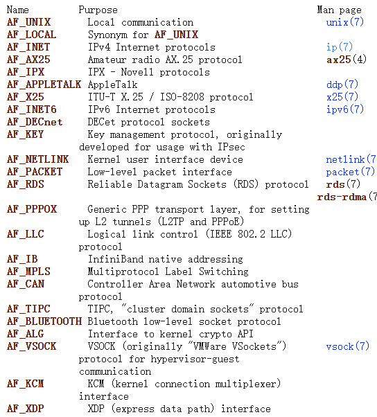

- # 分配给套接字的IP地址与端口号
	- ## IP地址
		- 由于网络层目前基本上只有IP协议被广泛使用，因此IP地址和**“网络地址(Internet Address)”**的代名词
		- IPv4地址长度为4字节，IPv6地址长度为16字节
		- 
		- [[$red]]==**此分类缺乏灵活性，已经被CIDR(无类别域间路由)取代**==
		- 
	- ## 端口
		- IP地址区分电脑，端口区分应用程序
		- 端口号长度**为16位**，范围从0到65535
			- **0-1023**是**[[$red]]==知名端口==(well-know PORT)**，一般保留给特定应用程序
			- TCP套接字和UDP套接字不会共用端口号，所以允许重复端口，但相同协议内不允许重复端口号
- # 地址信息的表示
	- ## 表示IPv4地址的结构体
		- 经常用到的地址结构体``sockaddr_in``，一般会采取如下顺序填写地址信息
			- 指定地址族
			- 指定IP地址
			- 指定端口号
		- 
		- 
	- ## 结构体sockaddr_in成员分析
		- ### sin_family
			- 
		- ### sin_port
			- 16位端口号，**字节序为网络字节序**，因此使用和填写时都需要用到转换函数
		- ### sin_addr
			- 保存32位IP地址信息，也是**网络字节序**
		- ### sin_zero
			- 用于对齐占位，让大小和sockaddr保持一致，无实际含义
	- 在实际绑定socket和地址时传入的地址结构体是``sockaddr``
		- 
		- 直接填写此结构体较为麻烦，因此一般情况都会先使用sockaddr_in结构体填写地址，在bind时再转换为sockaddr
- # 网络字节序和地址变换
	- 网络字节序是**大端序**
	- 使用`htons,htonl,ntohl,ntohs`函数进行主机和网络数据之间的字节序转换
	- 实际上很多数据传输过程中，主机和网络数据之间的字节序转换是**自动完成**的，只有在向sockaddr_in这样的地址结构体填充数据时需要程序员手动调用函数转换
- # 网络地址的初始化与分配
	- 使用``in_addr_t``函数将一个**点分十进制IP地址字符串**转变为整型IP地址
		- **头文件**：``<arpa/inet.h>``
		- **参数**：``const char * string``
		- **返回值**：成功时返回32位大端序整型，失败返回INADDR_NONE
	- 使用``inet_aton``函数可以直接把用字符串表示的IP地址填入一个in_addr结构体
		- **头文件**：同上
		- **参数**：``const char * string, struct in_addr* addr``
		- **返回值**：成功返回1，否则0
		- [[$red]]==**注意：**==windows中不存在此函数
	- 使用``inet_ntoa``函数将一个网络字节序整型IP地址转变为一个字符串
		- **参数**：``struct in_addr addr``
		- **返回值**：成功返回字符串地址，否则-1
		- **[[$red]]==注意：==**返回的地址是函数内部地址，若要长期使用，应该将返回字符串的值复制到程序员自己掌握的内存空间中。再次调用此函数之后新的值可能会直接覆盖上一次调用的结果
	- ## 网络地址初始化
		- 结合前述，网络地址信息初始化的方法如下
			- 声明一个sockaddr_in结构体变量
			- 用memset将sockaddr_in置零(为了将sin_zero部分初始化为0)
			- 填写地址族信息
			- 填写地址信息(inet_addr或inet_aton函数)
			- 填写端口信息(htons)
		- ### 服务器端
			- 服务器端一般来说完全不需要在bind时指定IP地址，因此可以将自身sock的地址设置为``INADDR_ANY``，则会让库函数自行分配可用IP地址
			- ``addr.sin_addr.s_addr = htol(INADDR_ANY)``
			- 若是安装了多个网卡的机器，在需要指定监听的IP地址时，需要手动指定IP地址
- # 基于Windows的实现
	- windows下[[$red]]==没有==inet_aton函数
	- windows下的Winsock2增加了两个转换函数，在功能上和inet_ntoa和inet_addr完全相同，分别是 ：
		- **WSAStringToAddress**
			- **头文件**：`<winsock2.h>`
			- **参数**：``LPTSTR AddressString, INT AddressFamily, LPWSAPROTOCOL_INFO lpProtocolINFO, LPSOCKADDR lpAddress, LPINT lpAddressLength``
				- 分别代表：
					- 含有IP和端口号的字符串地址
					- 第一个参数中地址所属的地址族信息
					- 设置协议提供者(provider)，默认为NULL
					- 保存地址信息的结构体变量地址(指针)
					- 第四个参数中传递的结构体长度所在的变量地址
			- **返回值**：成功0，否则SOCKET_ERROR
		- **WSAAddressToString**
			- **参数：**``LPSOCKADDR lpsaAddress, DWORD dwAddressLength, LPWSAPROTOCOL_INFO lpProtocolInfo, LPSTR lpszAddressString, LPDWORD lpdwAddressStringLength``
				- 分别代表：
					- 需要转换的地址信息结构体变量的指针
					- 第一个参数中结构体的长度
					- 同上一个函数的解释
					- 保存转换结果的字符串地址
					- 第四个参数中存有地址信息的字符串长度
	- [[$red]]==**注意**==：如果使用的是**visual c++**编译器，使用这两个函数之前要``#undef UNICODE``和``#undef _UNICODE``
		- 不然这两个函数的转换结果会出现错误
		- 这两个宏是visual C++自动定义的
	-