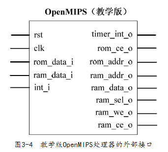

- **MIPS: Microprocessor without interlocked pipelined stages**
- # 设计目标
	- ## 五级流水
		- **[[$blue]]==取指阶段：==** 从指令存储器**[[$red]]==读出指令==**，同时**[[$red]]==确定==**下一条**[[$red]]==指令地址==**。
		- **[[$blue]]==译码阶段==：** 对指令进行[[$red]]==译码==，从通用寄存器中[[$red]]==读出==要使用的[[$red]]==寄存器的值==，如果指令中含有立即数，那么还要将立即数进行[[$red]]==符号扩展或无符号扩展==。如果是转移指令，并且满足转移条件，那么[[$red]]==给出转移目标==，作为新的指令地址。
		- **[[$blue]]==执行阶段：==** 按照译码阶段给出的操作数、运算类型，[[$red]]==进行运算==，给出运算结果。如果是Load/Store指令，那么还会[[$red]]==计算Load/Store的目标地址==。
		- **[[$blue]]==访存阶段：==** 如果是Load/Store指令，那么在此阶段会[[$red]]==访问数据存储器==，反之，只是将执行阶段的结果[[$red]]==向下传递到回写阶段==。同时，在此阶段还要[[$red]]==判断是否有异常==需要处理，如果有，那么会清除流水线，然后转移到异常处理例程入口地址处继续执行。
		  **[[$blue]]==回写阶段：==** 将运算结果[[$red]]==保存到目标寄存器==。
	- ## 指令执行周期
		- {:height 162, :width 430}
		- 除法采用**试商法**实现
- # 接口描述
	- 
	- 
- # 文件
	- 流水线各个阶段的模块都对应一个文件
	- 
	- ## 取指阶段
		- ### PC模块
			- 实现指令指针寄存器PC
			- 对应pc_reg.v文件
		- ### IF/ID模块
			- 实现取指与译码阶段之间的**寄存器**
			- 将结果在下一个时钟**传递**到译码阶段
	- ## 译码阶段
		- ### ID模块
			- 对指令进行译码
		- ### Regfile
			- 实现了32个32位通用整数寄存器
			- 可以**同时进行两个**寄存器的读操作和一个寄存器的写操作
		- ### ID/EX模块
			- 译码与执行阶段之间的寄存器
	- ## 执行阶段
		- ### EX模块
			- 依据译码阶段的结果，进行指定的运算
		- ### DIV模块
			- 进行除法运算的模块
		- ### EX/MEM模块
			- 执行与访存阶段之间的寄存器
	- ## 访存阶段
		- ### MEM模块
			- 若为加载、存储指令，那么会对数据存储器进行访问
			- 进行异常判断
		- ### MEM/WB模块
			- 访存与回写阶段之间的寄存器
	- ## 回写阶段
		- ### CP0模块
			- 对应MIPS架构中的协处理器CP0
		- ### LLbit模块
			- 实现寄存器LLbit
			- 用于链接加载指令ll，条件存储指令sc的处理
		- ### HILO模块
			- 实现寄存器HI、LO
			- 用于乘法，出发指令的处理
	- ## CTRL模块
		- 控制整个流水线的暂停，清除等动作
		- 不属于流水线中的某个阶段
- # 实现方法
	- 使用**[[$red]]==增量开发==**模型
	- 先考虑最简单的情况，给出代码，然后考虑稍微多一点的情况，修改、补充代码，随着考虑情况的增多，不停地修改、补充代码，最终，使代码实现需求