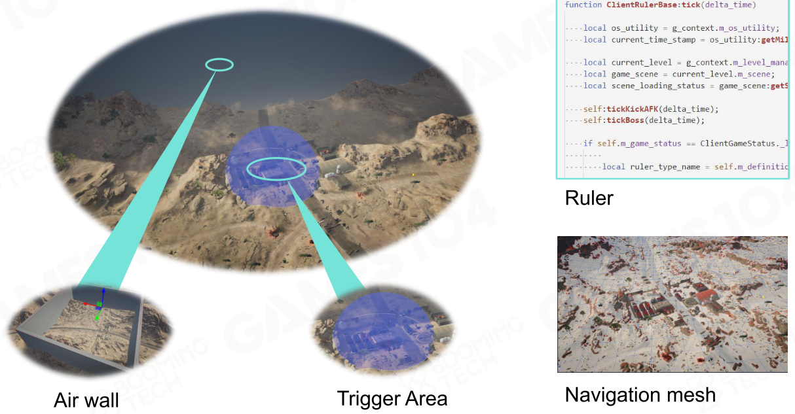
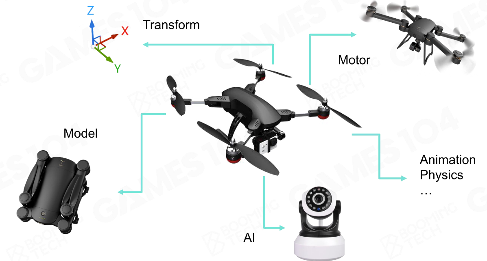
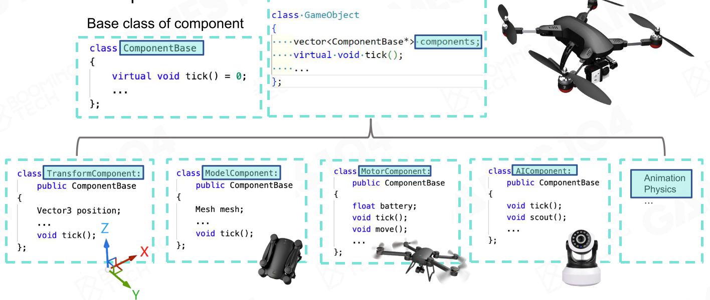
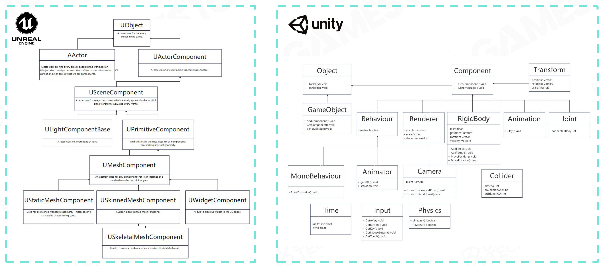
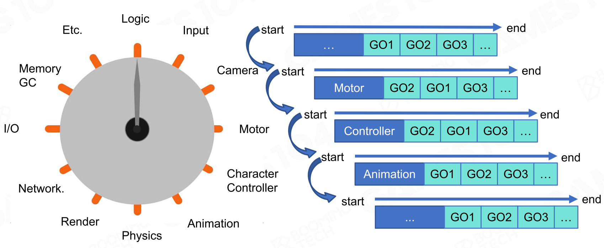
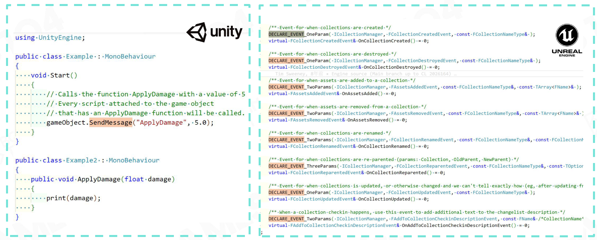

- 一个游戏世界可以认为由**四部分**构成：
	- ## 动态对象(Dynamic Game Objects)
		- 可移动，可操作，可交互的物体，背后往往有脚本控制
	- ## 静态对象(Static Game Objects)
		- 不可移动的，不可交互的物体，例如石头，建筑等
	- ## 环境(Environment)
		- 地形，天空，植被等
	- ## 其他对象(Other Game Objects)
		- 服务于游戏逻辑的一些不可见物体，例如空气墙，触发区域等
		- {:height 275, :width 506}
- 所以一个游戏世界里的所有物体，不管可见还是不可见，都会被抽象为一个**游戏对象(Game Object)**，方便统一管理
- # GO的结构
	- 一个GO会有若干的**属性(Property)**和**行为(Behavior)**
	- 使用传统的OO思想来编写GO类时，会遇到一个难题，即如何抽象出合理的父类，子类
	- 现代游戏引擎一般使用**组件(Component)**思想来创建和管理GO
	- 例如，对于一个无人机GO，其可能拥有如下组件
		- {:height 249, :width 436}
		- **模型(Model)**组件指明此GO在游戏中所使用的模型
		- **位置(Transform)**组件指明此GO在游戏世界中的位置
		- **AI**组件代表无人机可能的行为
		- **发动机(Motor)**组件表示无人机运动能力，例如最大加速度等
		- 此外还可能包含动画，物理等组件
	- 在组件思路下，每一个组件都会有自己的tick函数，如此一来，**引擎的tick会转换到关卡的tick，关卡再去tick关卡内的每一个GO，每一个GO再去tick自己身上的每一个组件**
		- {:height 233, :width 524}
	- 基于组件的思路可以很方便地组合出自己需要的GO，添加，删除，修改功能快速且简单
		- 一个无人机只要添加一个combat组件就可以变成一个攻击无人机
	- 现行的商业及游戏引擎几乎都实现了自己的组件系统
		- {:height 236, :width 516}
- # tick游戏世界
	- 在tick时，一般会把GO根据它们身上的组件进行分组，一次tick时，分别去tick每一个分组
		- 这叫做component-based tick
	- 
	- 所以在每次tick时，并不是某一个GO先把自己身上的组件tick完再tick下一个，而是形成一种类似于流水线的流程
	- 如此一来，可以把相同种类的组件在内存中集中在一起，提高效率
	- ## GO组件之间的互相联系-事件系统
		- 在一次tick中，某些GO的状态更新方式可能和其他GO的组件更新的状态有关
		- 例如一个角色被另一个角色射出的子弹击中，该角色的血量需要有所变化
		- 因此引擎需要提供**事件(Event)系统**，来帮助不同组件之间的联系
		- 商业级游戏引擎基本都实现了自己的事件系统
			- 
		- 实际的消息传递机制会比较复杂，需要仔细处理以免出现时序上的逻辑混乱
			- 例如，人在车上，需要先tick车，传递新的位置信息给人，人根据车的信息tick自身的transform
			- 一般会引入注入消息队列之类的机制
- # GO管理
	- GO一般都按**场景(Scene)**进行分组管理，因此管理GO更多的时候就是管理场景
	- 一般来说，一个GO通过GUID去查询，但是更多时候，为了找出一个事件需要发送给哪些GO，我们需要哦通过在场景中的位置来查询GO
	- 这种范围查询一把需要一些加速结构来支撑，例如BVH,BSP，Octree，Scene Graph等