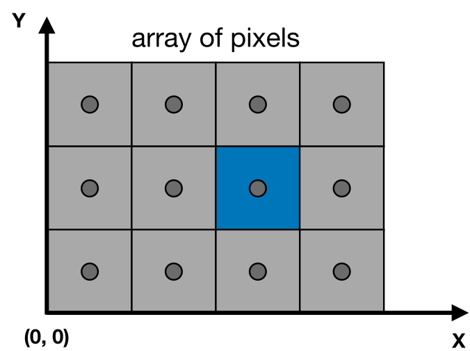

- 经过**观测变换**之后，所有的物体都已经处在了合适的position上，下一步就是需要**成像**，这就是**光栅化**要做的事
- 通过垂直方向视角和aspect获取l,r,b,t
- # 复习MVP变换
	- Model transformation，布置模型
	- View transformation，放置相机
	- Projection transformation
		- orthographic projection（cuboid to canonical cube）
		- perspective projection（frustum(台体) to canonical cube）
	- 完成MVP变换之后？
		- 画到屏幕上
- # 视锥(frastum)相关定义
	- {:height 158, :width 174}
	- 视锥就是相机(源点)和远平面组合起来得到的一个锥型
	- 我们**需要定义近平面的l(left)，r(ight)，b(ottom)，t(op)**
		- 实际上，由于相机放置于源点，因此近平面实际上就是最后成像的画面大小
		- 不过由于相似的原因，近平面前移后移并不影响实际能看到的画面中的内容，因此人们对于期望看到的画面，往往使用来**[[$red]]==FoV==(Field of View，可视角度)**和**[[$red]]==Aspect Ration(长宽比)==**定义
		- {:height 186, :width 305}
		- 如果已经定义好了近平面，那么FoV和Aspect Ratio可以通过简单的计算得到
			- {:height 150, :width 326}
			- **FoV是一个角度**，分为水平(FoVx)和垂直(FoVy)可视角度之分
				- $\tan\frac{fov Y}{2}=\frac{t}{|n|}$
			- **长宽比**：$aspect = \frac{r}{t}$
- # 正交立方体到屏幕
	- 
	- 在经过MVP变换之后，我们得到了一个**正交立方体(Canonical Cube)**，接下来要做的就是把这个正角立方体绘制到屏幕上
	- ## 什么是屏幕
		- 一个像素的(二维)数组
		- 像素数组的大小就是分辨率
			- 如1920*1080
		- 一个典型的光栅成像设备
	- ## 光栅（raster）的定义
		- 德语中表示显示器
		- rasterize等价于将东西划到屏幕上的过程
		- 现实中有很多机器都能够作图，而光栅化就是为了让那些**光栅显示设备**能绘制出图像
			- 示波器
			- LCD
			- LED
			- 电子墨水
	- ## 像素(Pixel)的定义
		- **[[$red]]==Pic==ture [[$red]]==el==ement的简称**
		- 一个像素就是一个显示**单个颜色**的小方块（按目前的课程进度如此理解）
			- 也可理解为图像的最小单位
		- 颜色是[[$red]]==R==[[$green]]==G==[[$blue]]==B==的混合
	- **定义一个屏幕空间**
		- {:height 216, :width 277}
		- 实际上就是**一套坐标系**
		- 任何像素都有一个坐标
		- 坐标原点在**左下角**（行业默认是**左上角**）
		- 一个像素的宽度和高度都是1
			- 因此像素的中心的坐标实际上是x.5,y.5
		- 因此光栅化的过程就是在xy平面发生的把正交立方体$[-1,1]^2$平面转换到[0,width] $\times$ [0,height]平面的过程
			- {:height 178, :width 332}
			- 目前与Z无关
	- ## 视口变换(Viewport transformation)
		- 只在xy平面上进行转换，z轴目前不考虑
		- 先把正交立方体拉伸到和屏幕相同的长宽，再将中心移动到(width/2,height/2)
			- 因为正交立方体的中心在原点，而屏幕空间的原点在左下角
		- 转换矩阵为：
			- $M_{viewport}=\begin{bmatrix}\frac{width}{2}&0&0&\frac{width}{2}\\0&\frac{height}{2}&0&\frac{heigth}{2}\\0&0&1&0\\0&0&0&1\end{bmatrix}$
- # 三角形
	- 为什么图形学中广泛使用三角形作为光栅化的图形？
		- **最基础的多边形**
			- 可以组成其他的多边形
		- **特殊的性质**
			- 确保是平面
				- 其他多边形可以沿对角线翻折，三角形不行
			- 内外部定义清晰
				- 使用向量叉积可以轻松判明内外，而某些多边形由于凹凸的原因，内外不好辨别
			- 顶点插值方法定义清晰
				- barycenter 重心
	- ## 如何用像素点来近似显示三角形？
		- {:height 191, :width 312}
		- ### 最简单的方法**采样（sampling）**
			- **采样一个函数**
				- **带入某一个点得到函数在该点值的过程叫做一次采样**
				- 可以通过采样把一个函数[[$red]]==离散化==
				- 一个简单的采样算法：
					- ``for(int x = 0;x<xmax;++x) output[x]=f(x);``
			- 在图形学中采样十分常用，例如采样时间(1D)，面积(2D)，方向(2D)，体积(3D)等
		- ### 例子：采样一个三角形
		  collapsed:: true
			- {:height 197, :width 205}
			- 如果一个像素点的中心在三角形内，则将该像素点亮
			- 因此需要一个判断某一点是否在三角形内的函数
				- {:height 74, :width 285}
			- 遍历屏幕空间的每一个像素，将该像素的值置为此函在该像素中心点的值
				- {:height 89, :width 319}
			- 使用**叉积**判断是否都在每一条边的同一侧来判断是否在三角形内
				- {:height 209, :width 254}
			- 如果一个点在三角形的某条边上，那么该点是否在三角形内部可以自由决定
				- {:height 251, :width 253}
				- 某些图形学api可能会给出复杂的corner case的判断规则
			- 实际在决定用哪些像素点绘制三角形时，**[[$red]]==不用遍历整个屏幕==**，遍历一个正方形区域就可以了
				- 这个区域叫**包围盒（bounding box）**
				- {:height 276, :width 299}
				- 此处的包围盒实际上是一个**轴对称包围盒(Axis-Aligned Bounding Box，[[$red]]==AABB==)**
			- **增量三角形遍历(Incremental Triangle Traversal)**
				- {:height 274, :width 270}
				- 一种理论上比包围盒更快的采样方式，但是由于其实现难度和计算量大，过程复杂，并不是所有三角形都适用
				- 主要适用于**长条形，且被旋转了一定角度**，即**包围盒和三角形实际面积[[$red]]==差异过大==**的情况
- # 光栅化的问题：失真（aliasing）
	- {:height 362, :width 387}
	- 单纯地使用函数采样的方式所得到显式效果往往会有严重的失真，一个典型的体现就是：**锯齿(jaggies)**
	- 具体如何解决详见下一课分解
- # 反走样(Antialiasing)
	- 图形学中有一个词，**Artifacts**，指一切Errors，Mistakes，Inaccuracies等不期望的效果
	- 而由采样导致的artifacts就是**走样(Aliasing)**
	- 针对不同的对象和不同的采样方法会产生不同的走样：
		- **锯齿(Jaggies)**，在空间中采样时产生
		- **摩尔纹(Moire)**，下采样图像时产生
		- **马车轮效应(Wagon Wheel Effect)**，在时间上采样
		- $\cdots\cdots\cdots$
	- 而走样产生的**核心原因**便是：**[[$red]]==信号变化的频率过快，高于采样的速度==**
		- 所以反走样的**核心思路**是：**[[$blue]]==在采样前先做模糊(Blurring)处理，即预过滤(Pre-Filtering)==**
		- {:height 227, :width 612}
		- 可以看到越接近三角形中心的点越红，越处于边缘(被模糊化的边界)的点越白(偏粉红)
		- **效果对比：**
		  collapsed:: true
			- 模糊前：
				- {:height 217, :width 426}
			- 模糊后：
				- {:height 217, :width 426}
	- 需要注意：一定是**[[$red]]==先模糊，再采样==**
		- 如果先采样再模糊，得不到想要的效果
		- {:height 251, :width 428}
	- ## 频域(Frequency Domain)
		- 以$\cos2\pi fx$函数为例，其定义系数$f$为此函数的**频率**，代表函数值在$x$上变化的速度
		- $f$越大，变化越快，周期$T$和频率$f$互成倒数，周期表示函数每隔多久会**重复自己**一次
		- {:height 264, :width 398}
		-