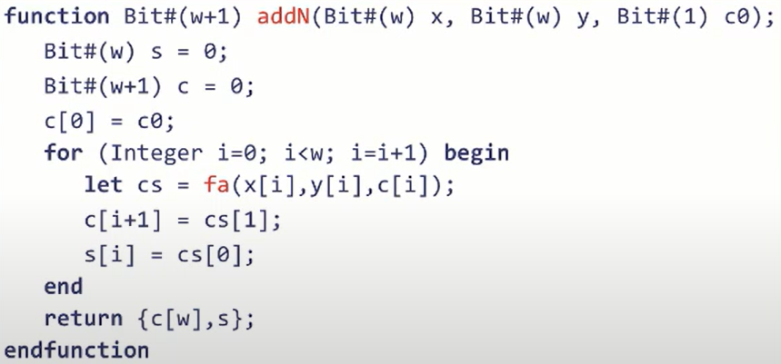
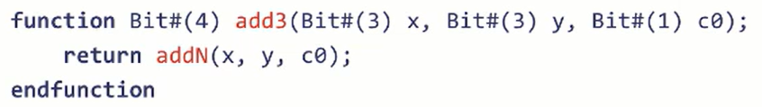

- 虽然硬件描述语言和现代软件编程语言极其相似，时刻谨记硬件描述语言是在描述电路
- HDL的综合过程类似于软件编程语言的编译过程，该过程会把所有描述的结构展开，去除所欲不具备直接硬件含义的结构，将其使用门级别电路实现，包括：
	- 将所有的数据结构转换为位向量
	- 展开循环
		- 因此写的所有循环都必须能够被展开
	- 所有函数变为inline函数
		- 所以不存在动态函数调用，所有的函数调用最后都会变为静态
	- 最后只会剩下布尔门之间的无环图
- BSV不会直接编译为门电路，而是会先生成Verilog，再利用verilog的生态完成综合和门电路编译
- # w位连续进位（Ripple-Carry）加法器
	- 
	- BSV可以不显示地给出位数参数，在实际实现时，可以通过实参地位数隐含地退出要返回地参数，例如：
		- 
	-
	-