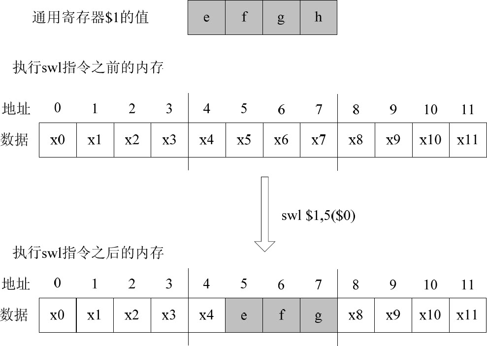

- # 补充：为什么地址一定要对齐？
	- 内存的实际设计是多块并发读取写入
	- 一个逻辑内存块可能是多个实际块同时贡献若干个位，一旦该地址收到存储或读取指令，则所有的块同时读取若干位，组成实际的数据的各个位
- # 内存操作指令
	- ## 加载指令
		- 
	- ## 储存指令
		- 
	- ## 内存操作的示例
		- OpenMIPS按照字节寻址，使用大端模式，数据的高位保存在储存器的低地址中，低位保存在储存器的高地址中。
		- 如图所示在0x58处存储0x84838281
			- 
		- 使用不同的读取指令的不同效果：
			- （1）使用指令lbu从0x58处加载一个字节，读出的字节就是0x84，经无符号扩展至32位是0x00000084。
			- （2）使用指令lb从0x58处加载一个字节，读出的字节就是0x84，经符号扩展至32位是0xffffff84。
			- （3）使用指令lhu从0x58处加载一个半字，读出的半字就是0x8483，经无符号扩展至32位是0x00008483。
			- （4）使用指令lh从0x58处加载一个半字，读出的半字就是0x8483，经符号扩展至32位是0xffff8483。
			- （5）使用指令lh从0x59处加载一个半字，不满足地址对齐要求，会出现异常。
			- （6）使用指令lhu从0x5a处加载一个半字，读出的半字就是0x8281，经无符号扩展至32位是0x00008281。
			- （7）使用指令lh从0x5a处加载一个半字，读出的半字就是0x8281，经符号扩展至32位是0xffff8281。
			- （8）使用指令lw从0x58处加载一个字，读出的字就是0x84838281。
	- ## 加载指令lwl和lwr
		- 
		- ### LWL
			- 非对齐加载，向左加载（即加载出的字节放到寄存器的高地址）
			- 允许加载地址不和4对齐，但是加载时仍然会先对地址进行对齐操作再加载
			- 
			- {:height 191, :width 686}
		- ### LWR
			- 非对其加载，向右对齐
			- 
			- 
		- ## LWL和LWR的目的
			- 可以方便地从一个非对齐地址读取一个字
			- 当不适用lwl和lwr时从0x7处读取一个字需要：
			- ```
			  lw  $1, 4($0)           # 取得地址0x4处的字，保存在$1中 
			  lw  $2, 8($0)           # 取得地址0x8处的字，保存在$2中 
			  sll $1, $1, 24          # $1左移24位 
			  slr $2, $2, 8           # $2右移8位 
			  or  $1, $1, $2          # $1与$2进行逻辑“或”运算，得到最终结果 
			  ```
			- 如果使用lwl和lwr则只需要：
			- ```
			  lwl $1, 7($0) 
			  lwr $1,10($0) 
			  ```
	- ## 存储指令swl和swr
		- 
		- ### SWL
			- 非对齐存储，向左存储
			- 
			- ### SWR
				- 
		- 引入SWL和SWR的目的也是仅使用两条指令完成非对其存储操作
- # 实现思路
	- ## 数据流图修改
		- 
	- ## 电路图修改
		- {:height 387, :width 716}
- # LL和SC指令
	- 
	- 
	-
	-